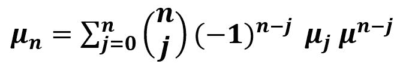

# scipy stats.moment()函数| Python

> 原文:[https://www . geesforgeks . org/scipy-stats-moment-function-python/](https://www.geeksforgeeks.org/scipy-stats-moment-function-python/)

`**scipy.stats.moment(array, axis=0)**`函数计算样本平均值的第 n <sup>次</sup>矩，即沿着数组指定轴的数组元素(python 中的列表)。

 **其公式–**


> **参数:**
> **阵:**输入阵或物体所具有的元素来计算力矩。
> **轴:**计算力矩的轴。默认情况下，轴= 0。
> **时刻:**返回的中心时刻顺序。
> 
> **根据设定的参数返回:**数组元素的第 n 个中心矩。

**代码#1:**

```
# Moment
from scipy import stats
import numpy as np 

arr1 = np.array([[1, 31, 27, 13, 21, 9],
                [8, 12, 8, 4, 7, 10]]) 

print("Oth moment : \n", stats.moment(arr1, moment = 0)) 
```

**输出:**

```
Oth moment : 
 [1\. 1\. 1\. 1\. 1\. 1.]
```

**代码#2:** 有多维数据

```
# Moment 
from scipy import stats
import numpy as np 

arr1 = [[1, 3, 27], 
        [3, 4, 6], 
        [7, 6, 3], 
        [3, 6, 8]]  

print("Oth moment : \n", stats.moment(arr1, moment = 0))

print("\n6th moment : \n", stats.moment(arr1, moment = 6))

print("\n9th moment : \n", stats.moment(arr1, moment = 9, axis = None))

print("\n12th moment : \n", stats.moment(arr1, moment = 12, axis = 1))

print("\n10th moment : \n", stats.moment(arr1, moment = 10, axis = 1))
```

**输出:**

```
Oth moment : 
 [1\. 1\. 1.]

6th moment : 
 [5.20609375e+02 9.13256836e+00 4.26392850e+06]

9th moment : 
 55265909588.26437

12th moment : 
 [1.53284936e+14 1.63654317e+02 8.83474172e+03 5.17842143e+04]

10th moment : 
 [5.53094361e+11 6.10464868e+01 1.64971407e+03 7.65588508e+03]
```