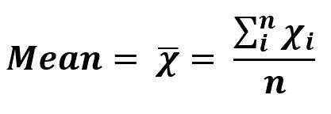

# sciPy stats.nanmean()函数| Python

> 原文:[https://www . geesforgeks . org/scipy-stats-nan mean-function-python/](https://www.geeksforgeeks.org/scipy-stats-nanmean-function-python/)

`**scipy.stats.nanmean(array, axis=0)**`函数通过忽略沿数组指定轴的数组元素的 Nan(不是数字)值来计算算术平均值。

是公式–


> **参数:**
> **数组:**输入数组或对象中具有的元素，包括 Nan 值，来计算算术平均值。
> **轴:**计算平均值的轴。默认情况下，轴= 0。
> 
> **根据设定的参数返回:**数组元素的算术平均值(忽略 Nan 值)。

**代码#1:**

```
# Arithmetic Mean 
import scipy
import numpy as np

arr1 = [1, 3, np.nan, 27] 

print("Arithmetic Mean using nanmean :", scipy.nanmean(arr1))

print("Arithmetic Mean without handling nan value :", scipy.mean(arr1)) 
```

**输出:**

```
Arithmetic Mean using nanmean : 10.333333333333334
Arithmetic Mean without handling nan value : nan
```

**代码#2:** 多维数据

```
# Arithmetic Mean 
from scipy import mean
from scipy import nanmean
import numpy as np

arr1 = [[1, 3, 27], 
        [3, np.nan, 6], 
        [np.nan, 6, 3], 
        [3, 6, np.nan]] 

print("Arithmetic Mean is :", mean(arr1)) 
print("Arithmetic Mean handling nan :", nanmean(arr1)) 

# using axis = 0
print("\nArithmetic Mean is with default axis = 0 : \n", 
      mean(arr1, axis = 0))
print("\nArithmetic Mean handling nan with default axis = 0 : \n", 
      nanmean(arr1, axis = 0))

# using axis = 1
print("\nArithmetic Mean is with default axis = 1 : \n", 
      mean(arr1, axis = 1))  
print("\nArithmetic Mean handling nan with default axis = 1 : \n", 
      nanmean(arr1, axis = 1))  
```

**输出:**

```
Arithmetic Mean is : nan
Arithmetic Mean handling nan : 6.444444444444445

Arithmetic Mean is with default axis =0 : 
 [nan nan nan]

Arithmetic Mean handling nan with default axis =0 : 
 [ 2.33333333  5\.         12\.        ]

Arithmetic Mean is with default axis =1 : 
 [10.33333333         nan         nan         nan]

Arithmetic Mean handling nan with default axis =1 : 
 [10.33333333  4.5         4.5         4.5       ]
```