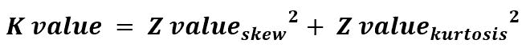

# scipy stats.normaltest()函数| Python

> 原文:[https://www . geesforgeks . org/scipy-stats-normal test-function-python/](https://www.geeksforgeeks.org/scipy-stats-normaltest-function-python/)

`**scipy.stats.normaltest(array, axis=0)**`功能测试样本是否不同于正态分布。这个函数测试样本来源的总体的零假设。

> **参数:**
> **数组:**输入数组或有元素的对象。
> **轴:**轴，正态分布测试将沿着该轴计算。默认情况下，轴= 0。
> 
> **返回:**数据集假设检验的 k2 值和 P 值。



**代码#1:**

```
# Performing normaltest
from scipy.stats import normaltest
import numpy as np 
import pylab as p 

x1 = np.linspace( -5, 5, 1000 )
y1 = 1./(np.sqrt(2.*np.pi)) * np.exp( -.5*(x1)**2  )

p.plot(x1, y1, '.')

print( '\nNormal test for given data :\n', normaltest(y1))
```

**输出:**

```

Normal test for given data :
 NormaltestResult(statistic=146.08066794511544, pvalue=1.901016994532079e-32)

```

**代码#2:**

```
# Performing normaltest
from scipy.stats import normaltest
import numpy as np 
import pylab as p 

x1 = np.linspace( -5, 12, 1000 )
y1 = 1./(np.sqrt(2.*np.pi)) * np.exp( -.5*(x1)**2  )

p.plot(x1, y1, '.')

print( '\nNormal test for given data :\n', normaltest(y1))
```

**输出:**

```

Normal test for given data :
 NormaltestResult(statistic=344.05533061429884, pvalue=1.9468577593501764e-75)

```