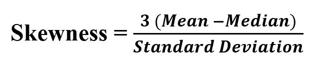

# scipy stats.skew() | Python

> 原文:[https://www.geeksforgeeks.org/scipy-stats-skew-python/](https://www.geeksforgeeks.org/scipy-stats-skew-python/)

`**scipy.stats.skew(array, axis=0, bias=True)**`函数计算数据集的偏斜度。

```py
skewness = 0 : normally distributed.
skewness > 0 : more weight in the left tail of the distribution.
skewness < 0 : more weight in the right tail of the distribution. 

```

**其公式–**


> **参数:**
> **数组:**输入数组或有元素的对象。
> **轴:**测量偏斜值的轴。默认情况下，轴= 0。
> **偏差:**Bool；如果设置为假，计算将针对统计偏差进行校正。
> 
> **沿轴返回:**数据集的偏斜度值。

**代码#1:**

```py
# Graph using numpy.linspace() 
# finding Skewness

from scipy.stats import skew
import numpy as np 
import pylab as p 

x1 = np.linspace( -5, 5, 1000 )
y1 = 1./(np.sqrt(2.*np.pi)) * np.exp( -.5*(x1)**2  )

p.plot(x1, y1, '*')

print( '\nSkewness for data : ', skew(y1))
```

**输出:**

```py

Skewness for data : 1.1108237139164436

```

**代码#2:**

```py
# Graph using numpy.linspace() 
# finding Skewness

from scipy.stats import skew
import numpy as np 
import pylab as p 

x1 = np.linspace( -5, 12, 1000 )
y1 = 1./(np.sqrt(2.*np.pi)) * np.exp( -.5*(x1)**2  )

p.plot(x1, y1, '.')

print( '\nSkewness for data : ', skew(y1))
```

**输出:**

```py

Skewness for data : 1.917677776148478

```

**代码#3:** 随机数据

```py
# finding Skewness

from scipy.stats import skew
import numpy as np 

# random values based on a normal distribution
x = np.random.normal(0, 2, 10000)

print ("X : \n", x)

print('\nSkewness for data : ', skew(x))
```

**输出:**

```py
X : 
 [ 0.03255323 -6.18574775 -0.58430139 ...  3.22112446  1.16543279
  0.84083317]

Skewness for data :  0.03248837584866293

```