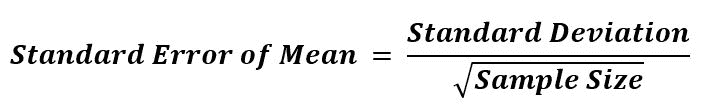

# sciPy stats.tsem()函数| Python

> 原文:[https://www . geesforgeks . org/scipy-stats-tsem-function-python/](https://www.geeksforgeeks.org/scipy-stats-tsem-function-python/)

`**scipy.stats.tsem(array, limits=None, inclusive=(True, True))**`计算沿数组指定轴的数组元素平均值的修剪标准误差。

其公式:-


> **参数:**
> **数组:**输入数组或对象中具有计算修剪后的标准误差平均值的元素。
> **轴:**轴，沿该轴计算平均值的修剪标准误差。默认情况下，轴= 0。
> **限值:**数组的下限和上限要考虑，小于下限或大于上限的值将被忽略。如果限制为无[默认值]，则使用所有值。
> 
> **返回:**根据设置的参数，对数组元素的平均值的标准误差进行修剪。

**代码#1:**

```
# Trimmed Standard error 

from scipy import stats
import numpy as np 

# array elements ranging from 0 to 19
x = np.arange(20)

print("Trimmed Standard error :", stats.tsem(x)) 

print("\nTrimmed Standard error by setting limit : ", 
      stats.tsem(x, (2, 10)))
```

**Output:**

```
Trimmed Standard error : 1.32287565553

Trimmed Standard error by setting limit :  0.912870929175

```

**代码#2:** 多维数据，轴()工作

```
# Trimmed Standard error 

from scipy import stats
import numpy as np 

arr1 = [[1, 3, 27], 
        [5, 3, 18], 
        [17, 16, 333], 
        [3, 6, 82]] 

# using axis = 0
print("\nTrimmed Standard error is with default axis = 0 : \n", 
      stats.tsem(arr1, axis = 1))
```

**Output:**

```
Trimmed Standard error is with default axis = 0 : 
 27.1476974115

```