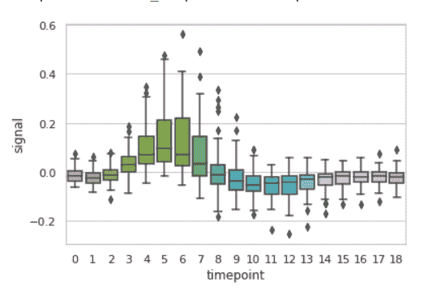

# 使用 Python 中的 Seaborn 绘制箱线图

> 原文:[https://www . geesforgeks . org/box plot-use-seaborn-in-python/](https://www.geeksforgeeks.org/boxplot-using-seaborn-in-python/)

Seaborn 是一个用 Python 绘制统计图形的惊人可视化库。它提供了漂亮的默认样式和调色板，使统计图更有吸引力。它建立在 matplotlib 库的顶部，也与熊猫的数据结构紧密结合。

## 箱线图

箱线图有助于保持定量数据的分布，便于变量之间或分类变量之间的比较。显示四分位数和中位数置信区间(如果启用)的箱线图主体。中线在每个方框的中线处有水平线，而胡须的垂直线延伸到最末端，非异常数据点和帽是胡须末端的水平线。

> **语法:**seaborn . box plot(x =无，y =无，色相=无，数据=无，顺序=无，色相 _ 顺序=无，方向=无，颜色=无，调色板=无，饱和度=0.75，宽度=0.8，减淡=真，飞度=5，线宽=无，whis=1.5，ax =无，**kwargs)
> 
> **参数:**
> **x，y，色相:**用于绘制长格式数据的输入。
> **数据:**用于绘图的数据集。如果 x 和 y 不存在，这被解释为宽形。
> **颜色:**所有元素的颜色。
> 
> **返回:**返回绘制了绘图的坐标轴对象。

**示例 1:** 使用 violinplot()对“fmri”数据集进行基本可视化

## 蟒蛇 3

```py
import seaborn

seaborn.set(style='whitegrid')
fmri = seaborn.load_dataset("fmri")

seaborn.boxplot(x="timepoint",
                y="signal",
                data=fmri)
```

**输出:**



**示例 2:** 使用 boxplot()对“tips”数据集进行基本可视化

## 蟒蛇 3

```py
import seaborn

seaborn.set(style='whitegrid')
tip = seaborn.load_dataset('tips')

seaborn.boxplot(x='day', y='tip', data=tip)
```