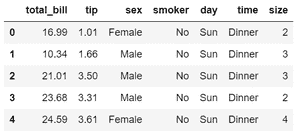
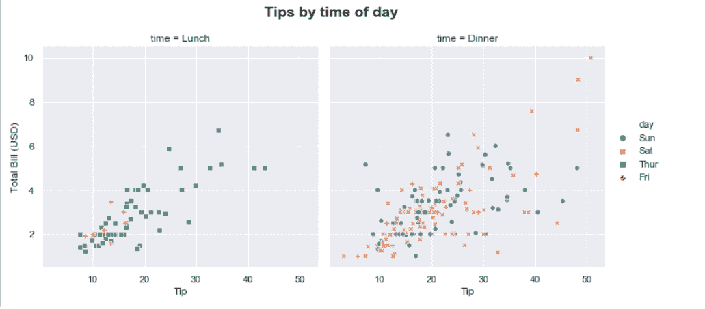

# 更改轴标签，将标题和图形大小设置为带有“海伯恩”的地块

> 原文:[https://www . geesforgeks . org/change-axis-labels-set-title-and-figure-size-to-plot-with-seaborn/](https://www.geeksforgeeks.org/change-axis-labels-set-title-and-figure-size-to-plots-with-seaborn/)

[Seaborn](https://www.geeksforgeeks.org/introduction-to-seaborn-python/) 是 Python 的可视化库，作为 [Matplotlib](https://www.geeksforgeeks.org/python-introduction-matplotlib/) 的扩展而构建。Seaborn 有**轴级功能**(散点图、regplot、boxplot、kdeplot 等)。)以及**图形级功能** (lmplot、factorplot、jointplot、relplot 等)。).轴级函数返回带有绘图的 Matplotlib 轴对象，而图形级函数包括总是以有意义的方式组织的轴。图形需要理解的基本定制是设置标题、设置轴标签和调整图形大小。任何定制都是在轴级功能的轴对象和图形级功能的图形对象上进行的。

**注:**以上解释中的坐标轴是指图形的一部分或图形的顶层，不是一个以上坐标轴的数学术语。考虑一个人物的情节。这个图是坐标轴。现在，考虑一个图形上的多个支线剧情。这些支线剧情每一个都是一个轴。

让我们看一些例子来更好地理解 Seaborn 的定制。

## 计算机编程语言

```
# Import required libraries
import matplotlib.pyplot as plt
import seaborn as sns

# Load data set
tips = sns.load_dataset( "tips" )
tips.head()
```

**输出:**



**示例 1:使用轴对象自定义绘图**

对于轴级函数，将 figsize 参数传递给 PLT . sub flots()函数来设置图形大小。函数 plt.subplots()返回图形和轴对象。这些对象是提前创建的，稍后会在其上绘制绘图。我们使用 set_title()、set_xlabel()、和set_ylabel()函数来更改轴标签和设置图的标题。我们可以用 size 属性设置文本的大小。确保在创建地块时指定轴级对象。该对象用于设置标题和标签，如下所示。

## 计算机编程语言

```
# Set figure size (width, height) in inches
fig, ax = plt.subplots(figsize = ( 5 , 3 ))

# Plot the scatterplot
sns.scatterplot( ax = ax , x = "total_bill" , y = "tip" , data = tips )

# Set label for x-axis
ax.set_xlabel( "Total Bill (USD)" , size = 12 )

# Set label for y-axis
ax.set_ylabel( "Tips (USD)" , size = 12 )

# Set title for plot
ax.set_title( "Bill vs Tips" , size = 24 )

# Display figure
plt.show()
```

**输出:**


**示例 2:使用 pyplot 对象自定义散点图**

我们还可以使用 xlabel()、ylabel()和 title()函数，使用 matplotlib.pyplot 对象更改轴标签并设置绘图标题。类似于上面的例子，我们可以用 size 属性设置文本的大小。函数 plt.figure()创建一个 figure 实例，figsize 参数允许设置 Figure 大小。

## 计算机编程语言

```
# Set figure size (width, height) in inches
plt.figure(figsize = ( 5 , 3 ))

# Plot scatterplot
sns.scatterplot( x = "total_bill" , y = "tip" , data = tips )

# Set label for x-axis
plt.xlabel( "Total Bill (USD)" , size = 12 )

# Set label for y-axis
plt.ylabel( "Tips (USD)" , size = 12 )

# Set title for figure
plt.title( "Bill vs Tips" , size = 24 )

# Display figure
plt.show()
```

**输出:**


**示例 3:在同一图中自定义多个地块**

Seaborn 的 relplot 函数返回一个 FacetGrid 对象，它是一个图形级别的对象。该对象允许方便地管理子情节。为了给包含多个子情节的完整图形命名，我们使用 suptitle()方法。subtracts _ adjust()方法用于通过指定子图的顶部、底部、左侧和右侧边缘位置来避免子图标题和图形标题重叠。若要设置图形大小，请在 set()方法中传递一个带有键“fig . fig size”的字典。set()方法允许在一个步骤中设置多个主题参数。

## 计算机编程语言

```
# Set figure size
sns.set( rc = {'figure.figsize' : ( 20, 20 ), 
               'axes.labelsize' : 12 })

# Plot scatter plot
g = sns.relplot(data = tips , x = "total_bill" , 
                y = "tip" , col = "time" , 
                hue = "day" , style = "day" , 
                kind = "scatter" )

# Title for the complete figure
g.fig.suptitle("Tips by time of day" ,
               fontsize = 'x-large' , 
               fontweight = 'bold' )

# Adjust subplots so that titles don't overlap
g.fig.subplots_adjust( top = 0.85 )

# Set x-axis and y-axis labels
g.set_axis_labels( "Tip" , "Total Bill (USD)" )

# Display the figure
plt.show()
```

**输出:**

