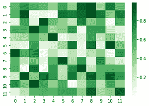
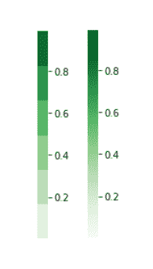
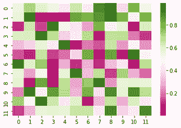

# 海底热图中的彩色地图

> 原文:[https://www . geesforgeks . org/color maps-in-seaborn-heat maps/](https://www.geeksforgeeks.org/colormaps-in-seaborn-heatmaps/)

彩色地图用于有效且轻松地可视化热图。人们可能会对不同种类的热图使用不同种类的颜色图。在本文中，我们将了解如何在使用 seaborn 热图时使用色彩图。

**顺序颜色图:**当数据值(数值)从高到低，并且其中只有一个对分析很重要时，我们使用顺序颜色图。

顺序色彩映射示例:

```
sns.palplot(sns.color_palette("Greens",12))

```


顺序调色板

```
sns.palplot(sns.color_palette("Blues",12))

```


顺序调色板

请注意，我们已经使用 sns.color_palette()构建了一个颜色图，并使用 SNS . palette()显示了颜色图中的颜色。以下示例显示了如何在海底热图上实现顺序色彩图。

**示例:**

## 蟒蛇 3

```
import seaborn as sns
import numpy as np

np.random.seed(0)

# generates random values
data = np.random.rand(12, 12)

# creating a colormap
colormap = sns.color_palette("Greens")

# creating a heatmap using the colormap
ax = sns.heatmap(data, cmap=colormap)
```

**输出:**


带有连续颜色图的热图

由于“绿色”在 seaborn 中是一个内置的颜色映射，也可以直接将“绿色”传递给 cmap 参数:

## 蟒蛇 3

```
import seaborn as sns
import numpy as np

np.random.seed(0)

data = np.random.rand(12, 12)
ax = sns.heatmap(data, cmap="Greens")
```

**输出:**



带有连续颜色图的热图

请注意，我们的颜色图现在有一个连续的颜色强度，不像以前的颜色图有一个离散的绿色强度值范围。以下是对上述热图中生成的两种颜色图的详细观察:



离散(左)和连续(右)色图

**发散颜色图:**它们用于表示从高到低(反之亦然)的数值，高值和低值都令人感兴趣。

以下是一些在海鸟身上呈现的不同颜色图:

```
sns.palplot(sns.color_palette("PiYG", 12))

```


发散调色板

```
sns.palplot(sns.color_palette("coolwarm", 12))
```


**示例:**以下示例显示了如何在海底热图上实现发散颜色图。

## 蟒蛇 3

```
import seaborn as sns
import numpy as np

np.random.seed(0)

data = np.random.rand(12, 12)
ax = sns.heatmap(data, cmap="PiYG")
```

**输出:**

