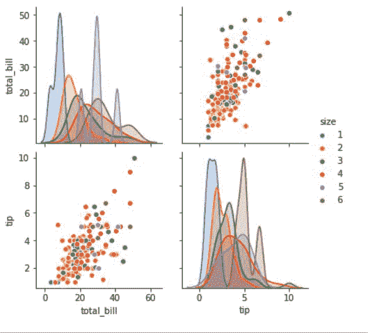

# 用成对绘图海鸟和熊猫进行数据可视化

> 原文:[https://www . geesforgeks . org/data-visualization-with-pair plot-seaborn-and-pandas/](https://www.geeksforgeeks.org/data-visualization-with-pairplot-seaborn-and-pandas/)

数据可视化是以图片形式呈现数据。这对于数据分析极其重要，主要是因为以数据为中心的 Python 包的奇妙生态系统。它有助于理解数据，无论数据多么复杂，通过以简单易懂的格式总结和呈现大量数据来理解数据的意义，并有助于清晰有效地交流信息。


**熊猫和海鸟** 就是其中之一，它让数据的导入和分析变得更加容易。在本文中，我们将使用 Pandas 和[**pair plot**](https://www.geeksforgeeks.org/python-seaborn-pairplot-method/)Seaborn 来分析数据。

## **熊猫**

[**【熊猫】**](https://www.geeksforgeeks.org/python-pandas-dataframe/) 提供清理和处理数据的工具。它是最流行的用于数据分析的 Python 库。在熊猫中，数据表被称为数据框。

**那么，让我们从创建** **熊猫数据框开始:**

**例 1:**

## 蟒蛇 3

```py
# Python code demonstrate creating 

import pandas as pd

# initialise data of lists.
data = {'Name':[ 'Mohe' , 'Karnal' , 'Yrik' , 'jack' ],
        'Age':[ 30 , 21 , 29 , 28 ]}

# Create DataFrame
df = pd.DataFrame( data )

# Print the output.
display(df)
```

**输出:**


**例 2:** 从系统加载 [CSV](https://media.geeksforgeeks.org/wp-content/uploads/nba.csv) 数据，通过熊猫显示。

## 蟒蛇 3

```py
# import module
import pandas

# load the csv
data = pandas.read_csv("nba.csv")

# show first 5 column
data.head()
```

**输出:**


## seaborn . pairplot()

要绘制数据集中的多个成对二元分布，可以使用 pairplot()函数。这将数据框中(n，2)个变量组合的关系显示为一个矩阵图，对角线图是单变量图。

> **语法:** seaborn.pairplot(数据，*\*kwargs)
> 
> **参数:**
> 
> **数据:**整齐(长格式)的数据框，其中每一列是一个变量，每一行是一个观察值。
> 
> **色调:**变量在“数据”中，将图面映射到不同的颜色。
> 
> **调色板:**迪克特或海鸟调色板
> 
> **{x，y}_vars:** 变量名列表，可选
> 
> **滴答声:**布尔型，可选

**例 1:**

## 蟒蛇 3

```py
# importing packages
import seaborn
import matplotlib.pyplot as plt

# loading dataset using seaborn
df = seaborn.load_dataset('tips')

# pairplot with hue sex
seaborn.pairplot(df, hue ='size')
plt.show()
```

**输出:**



## 用成对绘图海鸟和熊猫进行数据可视化

我们看到如何创建熊猫数据框和配对图。我们将使用熊猫来可视化数据

**例 1:**

在这个例子中，我们将简单地用熊猫数据框绘制一个配对图。在这里，我们只是加载 nba.csv 数据并创建一个数据框，虽然在 pairplot 中作为参数传递。

## 蟒蛇 3

```py
# importing packages
import seaborn
import pandas

# load the csv
data = pandas.read_csv("nba.csv")

# pairplot
seaborn.pairplot(data)
```