# 使用 Python Seaborn 进行数据可视化

> 原文:[https://www . geesforgeks . org/data-visualization-with-python-seaborn/](https://www.geeksforgeeks.org/data-visualization-with-python-seaborn/)

数据可视化是以图像形式呈现数据。这对于数据分析极其重要，主要是因为以数据为中心的 Python 包的奇妙生态系统。它有助于理解数据，无论数据多么复杂，通过以简单易懂的格式总结和呈现大量数据来理解数据的意义，并有助于清晰有效地交流信息。

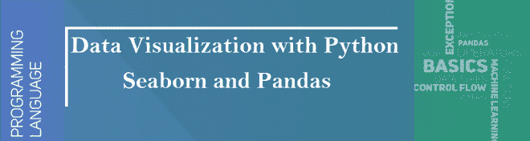

**熊猫和海鸟**就是其中的一个包，让导入和分析数据变得更加容易。在本文中，我们将使用熊猫和海鸟来分析数据。

## **熊猫**

[**【熊猫】**](https://www.geeksforgeeks.org/python-pandas-dataframe/) 提供清理和处理数据的工具。它是最流行的用于数据分析的 Python 库。在熊猫中，数据表被称为数据框。

**那么，让我们从创建熊猫数据框开始:**

**例 1:**

## 蟒蛇 3

```py
# Python code demonstrate creating

import pandas as pd

# initialise data of lists.
data = {'Name':[ 'Mohe' , 'Karnal' , 'Yrik' , 'jack' ],
        'Age':[ 30 , 21 , 29 , 28 ]}

# Create DataFrame
df = pd.DataFrame( data )

# Print the output.
df
```

**输出:**

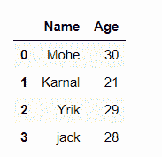

**例 2:** 从系统加载 [CSV](https://media.geeksforgeeks.org/wp-content/uploads/nba.csv) 数据，通过熊猫显示。

## 蟒蛇 3

```py
# import module
import pandas

# load the csv
data = pandas.read_csv("nba.csv")

# show first 5 column
data.head()
```

**输出:**

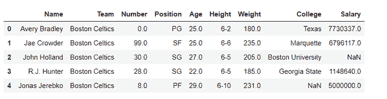

## **海伯恩**

Seaborn 是一个用 Python 绘制统计图形的惊人可视化库。它建立在 [matplotlib](https://www.geeksforgeeks.org/python-introduction-matplotlib/) 库的基础上，也与[熊猫](https://www.geeksforgeeks.org/introduction-to-pandas-in-python/)的数据结构紧密结合。

**安装**

对于 python 环境:

```py
pip install seaborn
```

对于 conda 环境:

```py
conda install seaborn
```

**让我们用海鸟来创建一些基本的地块:**

## 蟒蛇 3

```py
# Importing libraries
import numpy as np
import seaborn as sns

# Selecting style as white,
# dark, whitegrid, darkgrid 
# or ticks
sns.set( style = "white" )

# Generate a random univariate 
# dataset
rs = np.random.RandomState( 10 )
d = rs.normal( size = 50 )

# Plot a simple histogram and kde 
# with binsize determined automatically
sns.distplot(d, kde = True, color = "g")
```

**输出:**

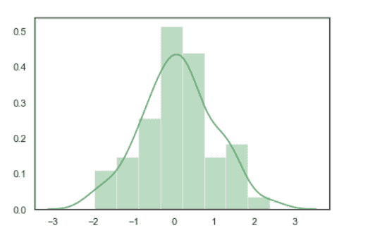

## Seaborn:统计数据可视化

Seaborn 有助于可视化统计关系，为了理解数据集中的变量如何相互关联，以及这种关系如何依赖于其他变量，我们执行统计分析。这种统计分析有助于可视化趋势并识别数据集中的各种模式。

这些情节将有助于形象化:

*   线图
*   散点图
*   箱线图
*   点图
*   计数图
*   小提琴情节
*   群体图
*   条形图
*   KDE 情节

### 线图:

[Lineplot](https://www.geeksforgeeks.org/lineplot-using-seaborn-in-python/) 是最流行的绘制 x 和 y 之间关系的图，可能有几个语义分组。

> ***语法:**SNS . line plot(x =无，y =无)*
> 
> ***参数:***
> 
> ***x，y:** 输入数据变量；必须是数字。可以直接传递数据或引用数据中的列。*

**让我们用线图和熊猫来可视化数据:**

**例 1:**

## 蟒蛇 3

```py
# import module
import seaborn as sns
import pandas

# loading csv
data = pandas.read_csv("nba.csv")

# ploting lineplot
sns.lineplot( data['Age'], data['Weight'])
```

**输出:**

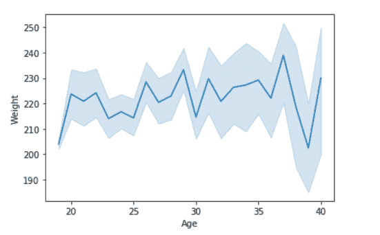

**示例 2:** 使用色调参数绘制图形。

## 蟒蛇 3

```py
# import module
import seaborn as sns
import pandas

# read the csv data
data = pandas.read_csv("nba.csv")

# plot
sns.lineplot(data['Age'],data['Weight'], hue =data["Position"])
```

**输出:**

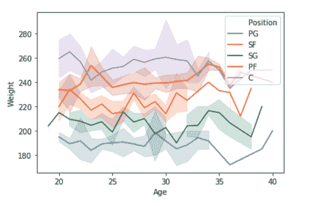

### 散点图:

[散点图](https://www.geeksforgeeks.org/scatterplot-using-seaborn-in-python/)可以与几个语义分组一起使用，这有助于根据连续/分类数据很好地理解图形。它可以画一个二维图形。

> ***语法:** seaborn .散点图(x =无，y =无)*
> 
> ***参数:***
> ***x，y:** 输入应该是数值的数据变量。*
> 
> ***返回:**该方法返回绘制了绘图的坐标轴对象。*

**让我们用散点图和熊猫来可视化数据:**

**例 1:**

## 蟒蛇 3

```py
# import module
import seaborn
import pandas

# load csv
data = pandas.read_csv("nba.csv")

# plotting
seaborn.scatterplot(data['Age'],data['Weight'])
```

**输出:**


**示例 2:** 使用色调参数绘制图形。

## 蟒蛇 3

```py
import seaborn
import pandas
data = pandas.read_csv("nba.csv")

seaborn.scatterplot( data['Age'], data['Weight'], hue =data["Position"])
```

**输出:**


### 箱线图:

一个[方框图](https://www.geeksforgeeks.org/boxplot-using-seaborn-in-python/)(或方框-触须图)s 是通过连续/分类数据的四分位数描绘数字数据组的视觉表示。

方框图由 5 个部分组成。

*   最低限度
*   第一个四分位数或 25%
*   中位数(第二四分位数)或 50%
*   第三个四分位数或 75%
*   最高的

> **语法:**
> 
> seaborn . box plot(x =无，y =无，色调=无，数据=无)
> 
> **参数:**
> 
> *   **x，y，色调:**用于绘制长格式数据的输入。
> *   **数据:**用于绘图的数据集。如果 x 和 y 不存在，这被解释为宽形。
> 
> **返回:**返回绘制了绘图的坐标轴对象。

**用熊猫画方框图:**

**例 1:**

## 蟒蛇 3

```py
# import module
import seaborn as sns
import pandas

# read csv and ploting
data = pandas.read_csv( "nba.csv" )
sns.boxplot( data['Age'] )
```

**输出:**

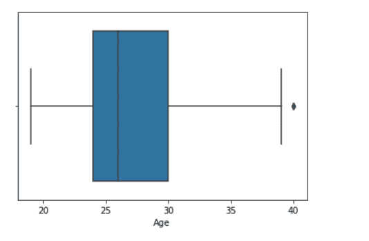

**例 2:**

## 蟒蛇 3

```py
# import module
import seaborn as sns
import pandas

# read csv and ploting
data = pandas.read_csv( "nba.csv" )
sns.boxplot( data['Age'], data['Weight'])
```

**输出:**

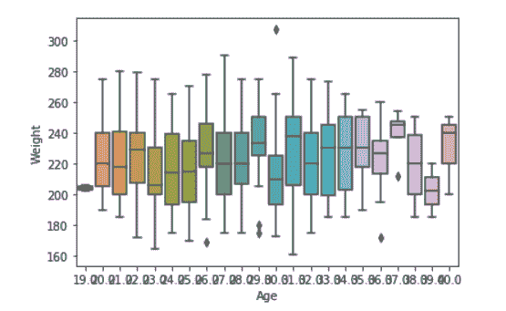

### Voilin 情节:

沃伊林情节类似于盒子情节。它显示了跨越一个或多个分类变量的几个定量数据，以便可以比较这些分布。

> ***语法:**seaborn . violinplot(x =无，y =无，色相=无，数据=无)*
> 
> ***参数:***
> 
> *   ***x，y，色调:**用于绘制长格式数据的输入。*
> *   ***数据:**用于标绘的数据集。*

**用熊猫画小提琴剧情:**

**例 1:**

## 蟒蛇 3

```py
# import module
import seaborn as sns
import pandas

# read csv and plot
data = pandas.read_csv("nba.csv")
sns.violinplot(data['Age'])
```

**输出:**

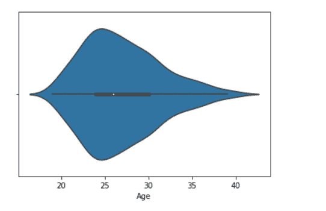

**例 2:**

## 蟒蛇 3

```py
# import module
import seaborn

seaborn.set(style = 'whitegrid')

# read csv and plot
data = pandas.read_csv("nba.csv")
seaborn.violinplot(x ="Age", y ="Weight",data = data)
```

**输出:**

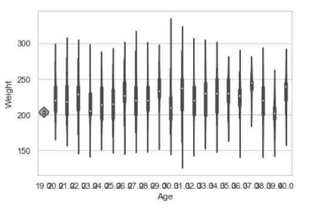

### 群体图:

群体图类似于带状图，我们可以针对分类数据绘制具有非重叠点的群体图。

> ***语法:**海鸟群图(x =无，y =无，色相=无，数据=无)*
> 
> ***参数:***
> 
> *   ***x，y，色调:**用于绘制长格式数据的输入。*
> *   ***数据:**用于标绘的数据集。*

**用熊猫画蜂群图:**

**例 1:**

## 蟒蛇 3

```py
# import module
import seaborn

seaborn.set(style = 'whitegrid')

# read csv and plot
data = pandas.read_csv( "nba.csv" )
seaborn.swarmplot(x = data["Age"])
```

**输出:**

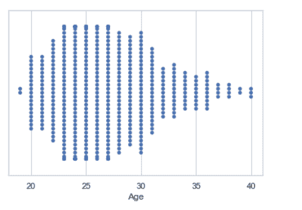

**例 2:**

## 蟒蛇 3

```py
# import module
import seaborn

seaborn.set(style = 'whitegrid')

# read csv and plot
data = pandas.read_csv("nba.csv")
seaborn.swarmplot(x ="Age", y ="Weight",data = data)
```