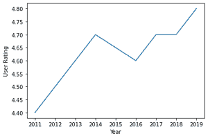
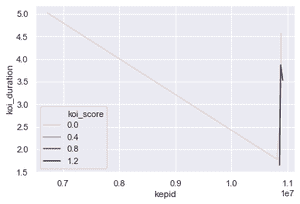

# 用海底线图进行数据可视化

> 原文:[https://www . geesforgeks . org/data-visualization-with-seaborn-line-plot/](https://www.geeksforgeeks.org/data-visualization-with-seaborn-line-plot/)

**先决条件:**

*   [海伯恩](https://www.geeksforgeeks.org/introduction-to-seaborn-python/)
*   [Matplotlib](https://www.geeksforgeeks.org/python-introduction-matplotlib/)

以图形方式呈现数据以发出一些信息被称为数据可视化。它基本上是一个图像，帮助一个人解释数据代表什么，并详细研究它及其性质。逐行处理大规模数据是一项极其繁琐的任务，因此数据可视化是一种理想的选择。

Seaborn 是一个基于 matplotlib 的 Python 库，用于数据可视化。它提供了一种以统计图形式呈现数据的媒介，作为一种提供信息和吸引人的媒介来传递一些信息。

### 装置

像任何其他 python 库一样，seaborn 可以使用 pip 轻松安装:

```py
pip install seaborn

```

该库是 Anaconda 发行版的一部分，如果您的 IDE 受 Anaconda 支持，通常只需导入即可，但也可以通过以下命令安装:

```py
conda install seaborn

```

## 单线图

单线图使用连接数据点的线在 x-y 轴上显示数据。为了获得图形，Seaborn 附带了一个内置函数来绘制一个名为 line plot()的线图。

> **语法:**线图(x，y，数据)
> 
> 哪里，
> 
> **x**–x 轴的数据变量
> 
> **y-**y 轴的数据变量
> 
> **数据-** 要绘制的数据

**示例:**

**使用的数据集-** [畅销书](https://drive.google.com/file/d/1KhtJuBtO73gItNku98y5ekCRWobzBify/view?usp=sharing)(图为亚马逊畅销书小说相关数据。)

## 蟒蛇 3

```py
# import modules
import seaborn as sn
import matplotlib.pyplot as plt
import pandas as pd

# import data
data = pd.read_csv("C:\\Users\\Vanshi\\Desktop\\gfg\\bestsellers.csv")

# selcting required rows and columns
data = data.iloc[2:10, :]

# plotting a single line graph
sn.lineplot(x="Year", y="User Rating", data=data)

# displaying the plot
plt.show()
```

**输出:**



## 设置不同的样式

还可以使用 seaborn 模块本身提供的 set()功能以不同的背景样式显示线图。

**语法:**

```py
set()

```

**属性:**

*   **上下文:**绘制上下文参数
*   **风格**:定义风格
*   **调色板:**设置调色板
*   字体
*   **字体大小**:设置字体大小
*   **颜色代码:**如果设置为真，则调色板被激活，颜色的简写符号可以从调色板中重新映射。
*   **rc** :超越上述参数的参数

**示例:**

使用的数据集- [累计](https://drive.google.com/file/d/1pAPwPDyz0Zi1paKrr81WOfsA_TACz4fl/view?usp=sharing)(数据显示美国宇航局汇编的系外行星空间研究数据集。)

## 计算机编程语言

```py
import seaborn as sn
import matplotlib.pyplot as plt
import pandas as pd

data = pd.read_csv("C:\\Users\\Vanshi\\Desktop\\gfg\\cumulative.csv")

data = data.iloc[2:10, :]

sn.lineplot(x="kepid", y="koi_duration", data=data, hue="koi_score")
sn.set(style="darkgrid")

plt.show()
```

**输出:**



## 多线绘图

功能有时要求数据相互比较，在这种情况下，可以绘制多个图。多线图有助于区分数据，以便可以相对于其他数据来研究和理解数据。每个线图基本上遵循单线图的概念，但在屏幕上呈现的方式不同。每个数据的线图可以通过改变其颜色、线型、大小或所有列出的内容而变得不同，并且可以使用刻度来读取它。

> **根据颜色进行区分**
> 
> lineplot(x、y、data、Hu)
> 
> 其中，色调决定了数据应该基于哪个变量来显示

**示例:**

**使用的数据集-** [累计](https://drive.google.com/file/d/1pAPwPDyz0Zi1paKrr81WOfsA_TACz4fl/view?usp=sharing)(数据显示 nasa 编制的系外行星空间研究数据集。)

## 蟒蛇 3

```py
# import modules
import seaborn as sn
import matplotlib.pyplot as plt
import pandas as pd

# import data
data = pd.read_csv("C:\\Users\\Vanshi\\Desktop\\gfg\\cumulative.csv")

# select required data
data = data.iloc[2:10, :]

# plot data with different color scheme
sn.lineplot(x="kepid", y="koi_period", data=data, hue="koi_score")

# display plot
plt.show()
```