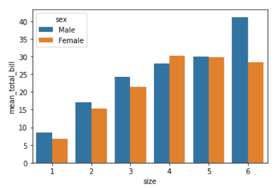
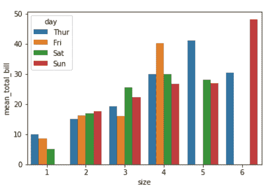
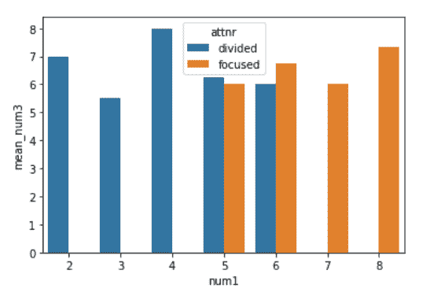

# 用蟒蛇皮和海狮皮分组的长条图

> 原文:[https://www . geesforgeks . org/group-bar plots-in-python-with-seaborn/](https://www.geeksforgeeks.org/grouped-barplots-in-python-with-seaborn/)

**先决条件** : [海伯恩](https://www.geeksforgeeks.org/introduction-to-seaborn-python/)

在本文中，我们将讨论使用 Python 中的 Seaborn 制作分组条形图的方法。在此之前，有一些概念必须熟悉:

*   **柱状图:**当你有两个变量时，柱状图很棒，一个是数值变量，因此另一个可能是分类变量。酒吧情节可以揭示他们之间的关系。
*   **分组条形图:**当您有多个分类变量时，分组条形图是有益的。Python 的 Seaborn 绘图库可以轻松形成分组条形图。
*   **group by:**Pandas[data frame . group by()](https://www.geeksforgeeks.org/python-pandas-dataframe-groupby/)函数用于根据一些标准将数据分成组。熊猫的物体可以在它们的任何一个轴上分开。分组的抽象定义是提供标签到组名的映射。

#### 程序

*   导入库。
*   加载或创建数据。
*   使用聚合函数执行 groupby。
*   用分组属性绘制条形图。

下面是实现解释相同:

**例 1:**

## 蟒蛇 3

```
# importing packages
import seaborn as sb

# load dataset
df = sb.load_dataset('tips')

# perform groupby
df = df.groupby(['size', 'sex']).agg(mean_total_bill=("total_bill", 'mean'))
df = df.reset_index()

# plot barplot
sb.barplot(x="size",
           y="mean_total_bill",
           hue="sex",
           data=df)
```

**输出:**



**例 2:**

## 蟒蛇 3

```
# importing packages
import seaborn as sb

# load dataset
df = sb.load_dataset('tips')

# perform groupby
df = df.groupby(['size', 'day']).agg(mean_total_bill=("total_bill", 'mean'))
df = df.reset_index()

# plot barplot
sb.barplot(x="size",
           y="mean_total_bill",
           hue="day",
           data=df)
```

**输出:**



**例 3:**

## 蟒蛇 3

```
# importing packages
import seaborn as sb

# load dataset
df = sb.load_dataset('anagrams')

# perform groupby
df = df.groupby(['num1', 'attnr']).agg(mean_num3=("num3", 'mean'))
df = df.reset_index()

# plot barplot
sb.barplot(x="num1",
           y="mean_num3",
           hue="attnr",
           data=df)
```

**输出:**

