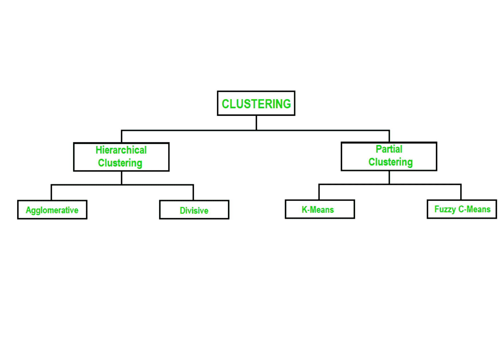
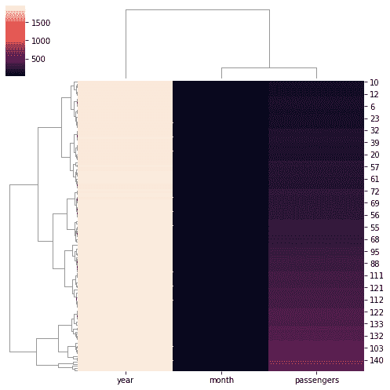
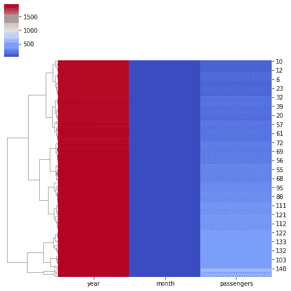

# Python 中的分层聚类热图，带有海鸟聚类图

> 原文:[https://www . geeksforgeeks . org/分层次聚类-python 中的热图-带 seaborn-clustermap/](https://www.geeksforgeeks.org/hierarchically-clustered-heatmap-in-python-with-seaborn-clustermap/)

[Seaborn](https://www.geeksforgeeks.org/introduction-to-seaborn-python/) 是一个神奇的可视化库，用于在 Python 中绘制统计图形。它提供了漂亮的默认样式和调色板，使统计图更有吸引力。它建立在 [matplotlib](https://www.geeksforgeeks.org/python-introduction-matplotlib/) 库的基础上，也与[熊猫](https://www.geeksforgeeks.org/introduction-to-pandas-in-python/)的数据结构紧密结合。

## 什么是集群？

聚类基本上是根据数据中变量之间的关系对数据进行分组。聚类算法有助于在无监督学习中获得结构化数据。最常见的集群类型如下所示。



聚类类型

这里我们将看到层次聚类，特别是凝聚(自下而上)层次聚类。在凝聚聚类中，我们从将每个数据点视为一个聚类开始，然后重复地将两个最近的聚类合并成更大的聚类，直到只剩下一个聚类。我们在对数据进行聚集聚类后绘制的图称为树图。

## 绘制分层聚类热图

热图是数据的图形表示，其中值用颜色表示。颜色强度的变化描述了数据是如何聚集或在空间上变化的。

*海底*的*聚类图()*功能绘制给定矩阵数据集的分层聚类热图。它返回一个聚集网格索引。

**以下是一些描述数据集的分层聚类热图的示例:**

在[航班](https://github.com/mwaskom/seaborn-data/blob/master/flights.csv)数据集中，数据(乘客数量)根据月份和年份进行聚类:

**例 1:**

## 蟒蛇 3

```
# Importing the library
import seaborn as sns
from sunbird.categorical_encoding import frequency_encoding

# Load dataset
data = sns.load_dataset('flights')

# Categorical encoding
frequency_encoding(data, 'month')

# Clustering data row-wise and
# changing color of the map.
sns.clustermap(data, figsize=(7, 7))
```

**输出:**



集群地图左侧的图例表示关于集群地图的信息，例如，亮色表示乘客较多，深色表示乘客较少。

**例 2:**

## 蟒蛇 3

```
# Importing the library
import seaborn as sns
from sunbird.categorical_encoding import frequency_encoding

# Load dataset
data = sns.load_dataset('flights')

# Categorical encoding
frequency_encoding(data, 'month')

# Clustering data row-wise and
# changing color of the map.
sns.clustermap(data, cmap='coolwarm', figsize=(7, 7))
```

**输出:**



这里我们已经改变了集群地图的颜色。