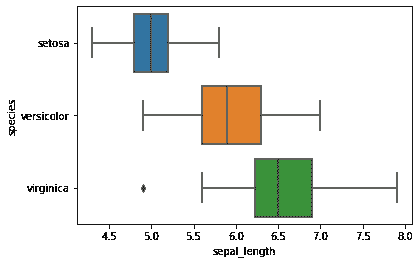
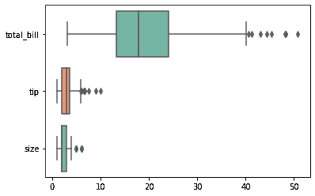

# 蟒蛇皮水平方块图

> 原文:[https://www . geesforgeks . org/horizontal-box plots-with-seaborn-in-python/](https://www.geeksforgeeks.org/horizontal-boxplots-with-seaborn-in-python/)

**先决条件:** [海鸟](https://www.geeksforgeeks.org/introduction-to-seaborn-python/)

箱线图用于可视化数据分布，这在需要比较数据时非常有用。有时，箱线图也被称为盒须图。该框显示了数据集的四分位数，晶须延伸以显示分布的其余部分。在本文中，我们将使用 python 用 seaborn 实现水平箱线图。

## 水平方框图

Seaborn 使用 boxplot()方法绘制 boxplot。我们可以通过两种方法将 boxplot 变成水平 boxplot 首先，我们需要切换 x 和 y 属性并将其传递给 boxplot()方法，另一种是使用 orient="h "选项并将其传递给 boxplot()方法。

**方法 1:** 切换 x 和 y 属性

## 蟒蛇 3

```
# import library & dataset
import seaborn as sns

df = sns.load_dataset('iris')

# Just switch x and y
sns.boxplot(y=df["species"], x=df["sepal_length"])
```

**输出:**



水平箱线图

**方法 2:** 使用 orient = h

## 蟒蛇 3

```
# import library & dataset
import seaborn as sns

tips = sns.load_dataset("tips")
ax = sns.boxplot(data=tips, orient="h", palette="Set2")
```

**输出:**



水平箱线图