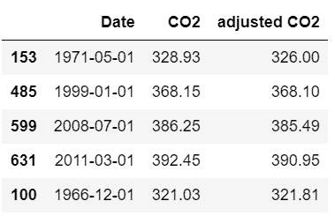
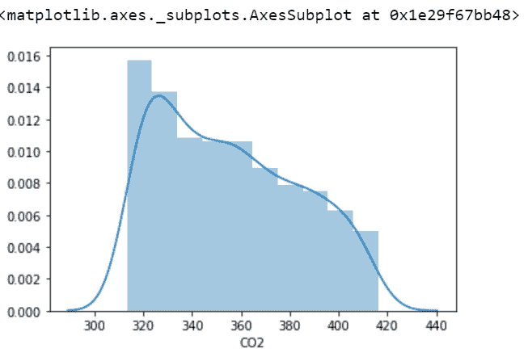
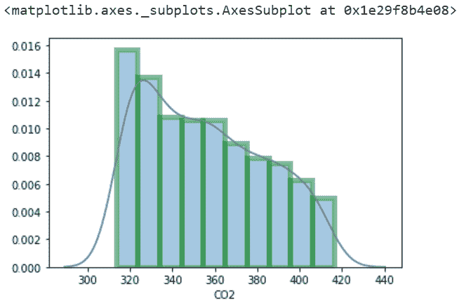
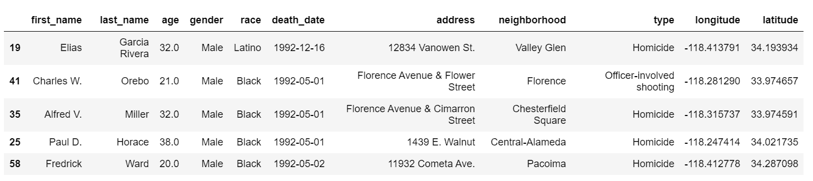
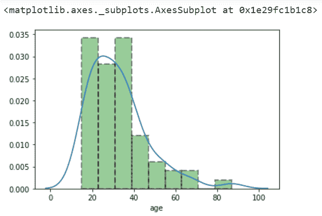
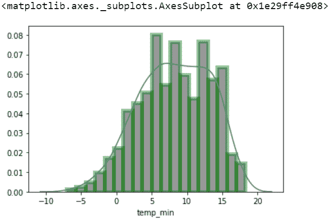

# 如何在 Seaborn 中给直方图添加轮廓或边缘颜色？

> 原文:[https://www . geesforgeks . org/如何将轮廓或边缘颜色添加到海底直方图中/](https://www.geeksforgeeks.org/how-to-add-outline-or-edge-color-to-histogram-in-seaborn/)

[Seaborn](https://www.geeksforgeeks.org/introduction-to-seaborn-python/) 是一个神奇的可视化库，用于在 Python 中绘制统计图形。它提供了漂亮的默认样式和调色板，使统计图更有吸引力。它建立在 [matplotlib](https://www.geeksforgeeks.org/python-introduction-matplotlib/) 库的基础上，也与[熊猫](https://www.geeksforgeeks.org/introduction-to-pandas-in-python/)的数据结构紧密结合。
*Seaborn* 旨在使探索和理解数据的中心部分可视化。它提供了面向数据集的 API，因此我们可以在相同变量的不同视觉表示之间切换，以便更好地理解数据集。

在本文中，我们将向直方图添加轮廓或边缘颜色。可以使用 *seaborn.distplot()* 方法完成任务。

> **语法:** seaborn.distplot(aSeries)
> 
> **参数**
> 
> *   **系列、一维阵列或列表:**观察到的数据。如果这是一个带有名称属性的系列对象，该名称将用于标记数据轴。
> *   【matplotlib hist()的 binsargument 或 None，可选:hist bin 的规格。如果未指定，则使用引用规则来尝试查找有用的默认值。
> *   **colormatplotlib 颜色，可选:**颜色用于绘制除拟合曲线以外的所有内容。
> *   **标签，可选:**绘图相关组件的图例标签。
> *   **axmatplotlib 轴，可选:**如果提供，在此轴上绘图。
> 
> **返回**
> 
> *   **axmatplotlib 轴:**返回带有绘图的轴对象，以便进一步调整。

我们主要使用这个方法的 *hist_kws* 参数，比如*边缘颜色、颜色、线宽等等*，因为它处理直方图的轮廓和边缘，所以它取一个字典值。

### 以下是一些描述如何向直方图添加轮廓或边缘颜色的示例:

**例 1:**

下面是用来说明直方图的数据集:

## 蟒蛇 3

```
# import required modules
import seaborn
from vega_datasets import data

# assign dataset
dataset = data.co2_concentration()

# display dataset
dataset.sample(n=5)
```

**输出:**



现在说明一个直方图，并添加一个轮廓。

## 蟒蛇 3

```
# depict illustration
seaborn.distplot(dataset['CO2'])
```

**输出:**



此外，说明直方图并添加边缘颜色。

## 蟒蛇 3

```
# depict illustration
sns.distplot(dataset['CO2'],
             hist_kws=dict(edgecolor="green", linewidth=5))
```

**输出:**



**例 2:**

下面是另一个数据集，通过它可以绘制直方图:

## 蟒蛇 3

```
# import required modules
import seaborn
from vega_datasets import data

# assign dataset
dataset = data.la_riots()

# display dataset
dataset.sample(n=5)
```



下图是:

## 蟒蛇 3

```
# depict illustration
sns.distplot(dataset['age'],
             hist_kws={'color':'green', 'edgecolor':'black',
                       'linewidth':2, 'linestyle':'--'})
```

**输出:**



**例 3:**

下面是向直方图添加轮廓或边缘颜色的另一个示例。

## 蟒蛇 3

```
# import required modules
import seaborn
from vega_datasets import data

# assign dataset
dataset = data.seattle_weather()

# display dataset
dataset.sample(n=5)

# depict illustration
sns.distplot(dataset['temp_min'],
             hist_kws={'color': 'black', 'edgecolor': 'green',
                       'linewidth': 5})
```

**输出:**

