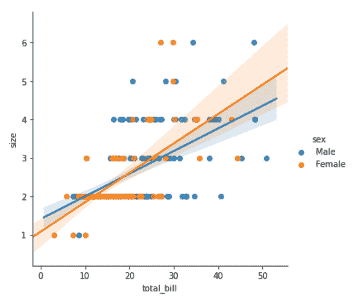
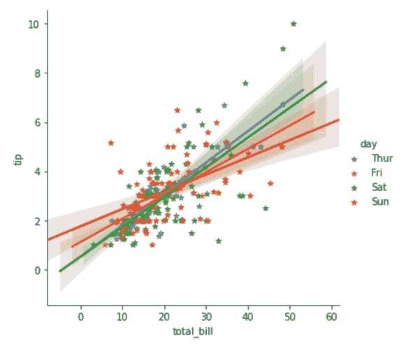
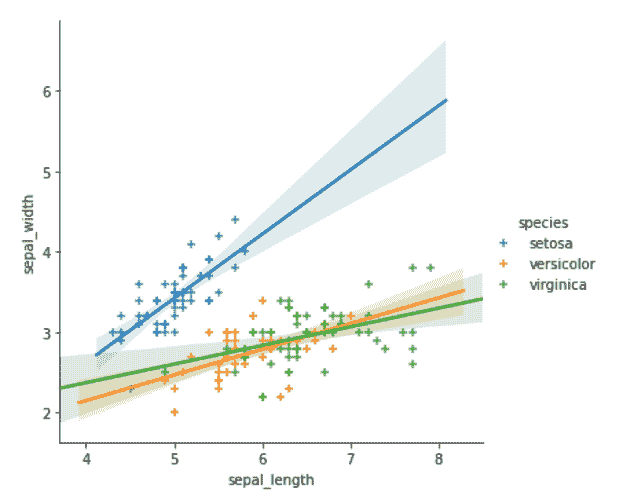

# 如何用 Python 中的 Seaborn 添加每组回归线？

> 原文:[https://www . geesforgeks . org/如何添加每组回归线-带 python 中的 seaborn/](https://www.geeksforgeeks.org/how-to-add-regression-line-per-group-with-seaborn-in-python/)

在本文中，我们将学习如何使用 Python 中的 Seaborn 为每个组添加一条回归线。Seaborn 具有多种功能，可以在两个定量变量之间形成散点图。例如，我们可以使用 lmplot()函数进行所需的绘图。

## **什么是回归线？**

回归线只是最符合信息的一条线(从道路到点的最小总距离来看)。统计学家称这种寻找最佳拟合线的系统为使用最小数量平方方法的简单直线回归分析。

### 所需步骤

1.  导入库。
2.  导入或创建数据。
3.  使用 lmplot 方法。此方法用于通过简单地添加带有分类变量名的色调参数来添加每组的回归线。
4.  使用不同的参数以获得更好的可视化效果。

**例 1:**

## 蟒蛇 3

```
# import libraries
import seaborn

# load data
tip = seaborn.load_dataset('tips')

# use lmplot
seaborn.lmplot(x="total_bill",
               y="size",
               hue="sex",
               data=tip)
```

**输出:**



**例 2:**

## 蟒蛇 3

```
# import libraries
import seaborn

# load data
tip = seaborn.load_dataset('tips')

# use lmplot
seaborn.lmplot(x="total_bill",
               y="tip",
               hue="day",
               markers='*',
               data=tip)
```

**输出:**



**例 3:**

## 蟒蛇 3

```
# import libraries
import seaborn

# load data
iris = seaborn.load_dataset('iris')

# use lmplot
seaborn.lmplot(x="sepal_length",
               y="sepal_width",
               hue="species",
               markers='+',
               data=iris)
```

**输出:**

