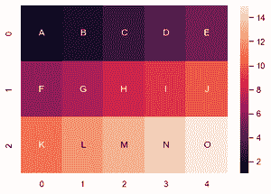
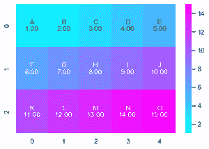

# 如何在 Python 中使用 seaborn 在热图单元格注释中添加文本？

> 原文:[https://www . geesforgeks . org/how-add-text-in-a-heat map-cell-annotations-use-seaborn-in-python/](https://www.geeksforgeeks.org/how-to-add-text-in-a-heatmap-cell-annotations-using-seaborn-in-python/)

**先决条件:** [海鸟热图](https://www.geeksforgeeks.org/seaborn-heatmap-a-comprehensive-guide/)

**热图** 被定义为使用颜色来可视化矩阵值的数据的图形表示。在这种情况下，为了表示更常见的值或更高的活动，使用更亮的颜色，基本上是红色，为了表示不太常见的值或活动值，更暗的颜色是优选的。热图也由阴影矩阵的名称定义。可以使用 seaborn.heatmap()函数绘制 Seaborn 中的热图。

> ***语法:** seaborn.heatmap(data，* vmin =无，vmax =无，cmap =无，center =无，annot _ kws =无，线宽=0，linecolor='white '，cbar=True，**kwargs)*
> 
> ***重要参数:***
> 
> *   ***数据:** 2D 数据集，可以强制到数组中。*
> *   ***【vmin】****VMAX:**值锚定颜色映射，否则它们是从数据和其他关键字参数中推断出来的。*
> *   ***cmap:** 从数据值到颜色空间的映射。*
> *   ***中心:**绘制发散数据时颜色图的中心值。*
> *   ***注释:**如果为真，则在每个单元格中写入数据值。*
> *   ***fmt:** 添加注释时使用的字符串格式代码。*
> *   ***线宽:**将划分每个单元格的线条宽度。*
> *   ***线条颜色:**将分割每个细胞的线条的颜色。*
> *   ***cbar:** 是否绘制彩条。*
> 
> *除数据外的所有参数都是可选的。*
> 
> ***返回:****matplotlib . axes . _ 子场景类型的对象。axesssubplot*T7】

热图注释是显示热图中行和列的附加信息的好方法。一般来说，为了在热图上显示数据值，我们将**注释**参数设置为**真**，但是如果您想在单元格注释中添加文本，可以通过以下方式完成–

**方法 1:**

*   导入模块
*   创建数据或加载数据集
*   创建另一个类似数组的数据，其中包含要在热图上显示的文本值(形状与数据相同)
*   将类似数组的数据作为热图的注释参数的值。
*   如果要添加非数值，热图的 **fmt 参数**是必需的。此参数用于添加字符串格式代码，以便在添加注释时使用。
*   绘制热图
*   显示图

**示例:**

## 蟒蛇 3

```py
# importing libraries
import numpy as np
import seaborn as sns
import matplotlib.pyplot as plt

# creating random data
data = np.array([[1, 2, 3, 4, 5], [6, 7, 8, 9, 10],
                [11, 12, 13, 14, 15]])

# creating array of text
text = np.array([['A', 'B', 'C', 'D', 'E'], ['F', 'G', 'H', 'I', 'J'],
                 ['K', 'L', 'M', 'N', 'O']])

# creating subplot
fig, ax = plt.subplots()

# drawing heatmap on current axes
ax = sns.heatmap(data, annot=text, fmt="")
```

**输出:**



如果您想显示文本和数据值，您必须通过连接这两个值来创建一个自定义注释。

**方法 2:**

*   导入模块
*   创建或加载数据
*   声明数据数组
*   使用 NP . flat()将数据数组和文本数组重塑为 1D。
*   然后将它们压缩在一起，对文本和值进行迭代。
*   使用格式化字符串创建自定义的新值。
*   返回包含自定义值的相同大小的重塑数组。
*   创建热图
*   显示图

**示例:**

## 蟒蛇 3

```py
# importing libraries
import numpy as np
import seaborn as sns
import matplotlib.pyplot as plt

# creating random data
data = np.array([[1, 2, 3, 4, 5], [6, 7, 8, 9, 10], 
                 [11, 12, 13, 14, 15]])
text = np.array([['A', 'B', 'C', 'D', 'E'], 
                 ['F', 'G', 'H', 'I', 'J'], ['K', 'L', 'M', 'N', 'O']])

# combining text with values
formatted_text = (np.asarray(["{0}\n{1:.2f}".format(
    text, data) for text, data in zip(text.flatten(), data.flatten())])).reshape(3, 5)

# drawing heatmap
fig, ax = plt.subplots()
ax = sns.heatmap(data, annot=formatted_text, fmt="", cmap="cool")
```

**输出:**

