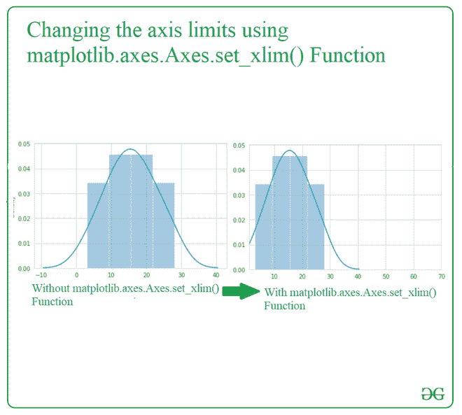
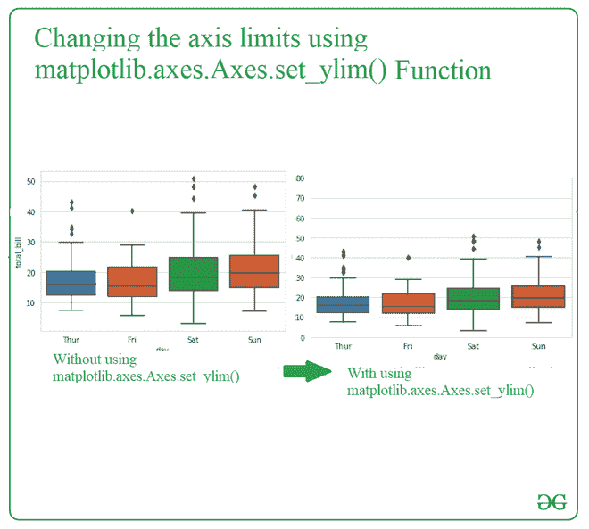

# 如何在 Seaborn 中更改轴限制？

> 原文:[https://www . geeksforgeeks . org/如何更改-axes-in-seaborn 限制/](https://www.geeksforgeeks.org/how-to-change-axes-limits-in-seaborn/)

[**Seaborn**](https://www.geeksforgeeks.org/python-seaborn-tutorial/) 是基于 [matplotlib](https://www.geeksforgeeks.org/matplotlib-tutorial/) 的 Python 数据可视化库。它提供了一个高级界面，用于绘制吸引人且信息丰富的统计图形。**轴**类包含了大部分的图形元素:轴、刻度、线 2D、文本、多边形等。，并设置坐标系。在[轴](https://www.geeksforgeeks.org/matplotlib-axes-class/)模块中有两种方法可用于改变限制:

1.  [**matplotlib . axes . Axes . set _ xlim():**](https://www.geeksforgeeks.org/matplotlib-axes-axes-set_xlim-in-python/)matplotlib 库的 Axes 模块用于设置 x 轴视图限制。
2.  [**matplotlib . axes . Axes . set _ ylim():**](https://www.geeksforgeeks.org/matplotlib-axes-axes-set_ylim-in-python/)matplotlib 库的 Axes 模块用于设置 y 轴视图限制。

**语法:**

> Axes.set_xlim(self，左=无，右=无，发射=真，自动=假，* xmin =无，xmax =无)
> 
> Axes.set_ylim(self，底部=无，顶部=无，发射=真，自动=假，* ymin =无，ymax =无)
> 
> **参数:**
> 
> *   底部:此参数是数据坐标中的底部 xlim/ylim
> *   top:此参数是数据坐标中的顶级 xlim/ylim
> *   发出:该参数用于通知观察者极限变化。
> *   自动:此参数用于打开 x 轴/y 轴的自动缩放。
> *   xmin、xmax、ymin、ymax:这些参数等同于底部和顶部，同时传递 xmin/ymin 和底部或 xmax/ymax 和顶部是错误的。
> 
> **返回:-**
> 
> 底部，顶部:这将返回数据坐标中新的 x 轴/y 轴限制。

**例 1:**

## 蟒蛇 3

```py
# Import module
import matplotlib.pyplot as plt
import seaborn as sns

# assign data
data = [3, 7, 9, 11, 12, 14,
        15, 16, 18, 19, 20,
        23, 25, 28]

# depict visualization
fig, ax = plt.subplots()
sns.distplot(data, ax=ax)
ax.set_xlim(1, 70)
plt.show()
```

**输出:**



**例 2:**

## 蟒蛇 3

```py
# import module
import seaborn as sns
sns.set_style("whitegrid")

# assign dataset
tips = sns.load_dataset("tips")

# depict visualization
gfg = sns.boxplot(x="day", y="total_bill",
                  data=tips)
gfg.set_ylim(0, 80)
```

**输出:**

