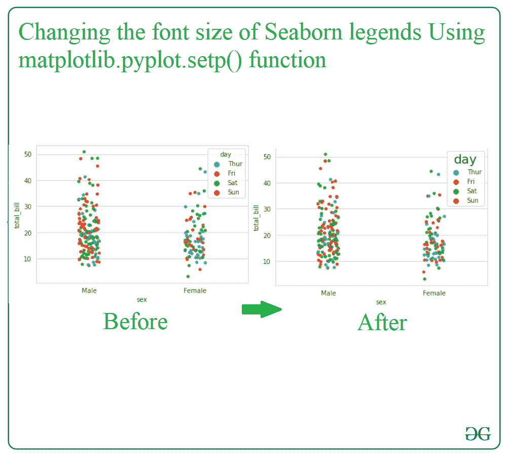
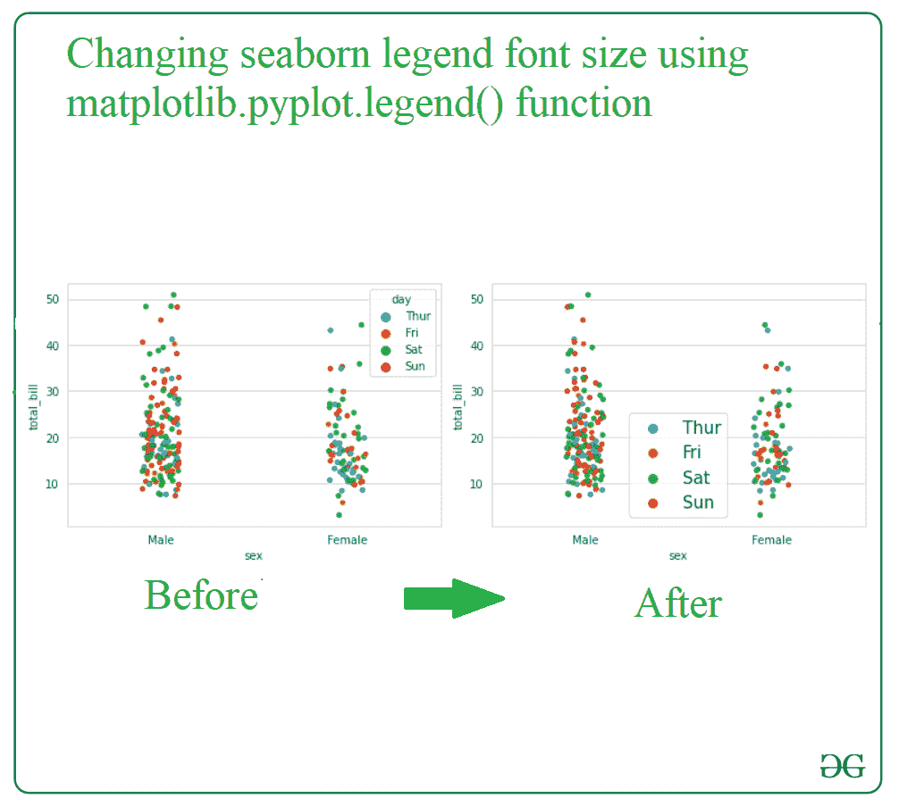
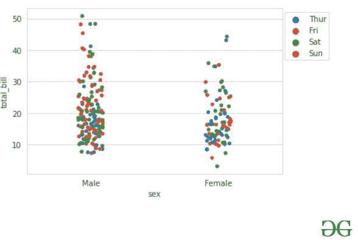
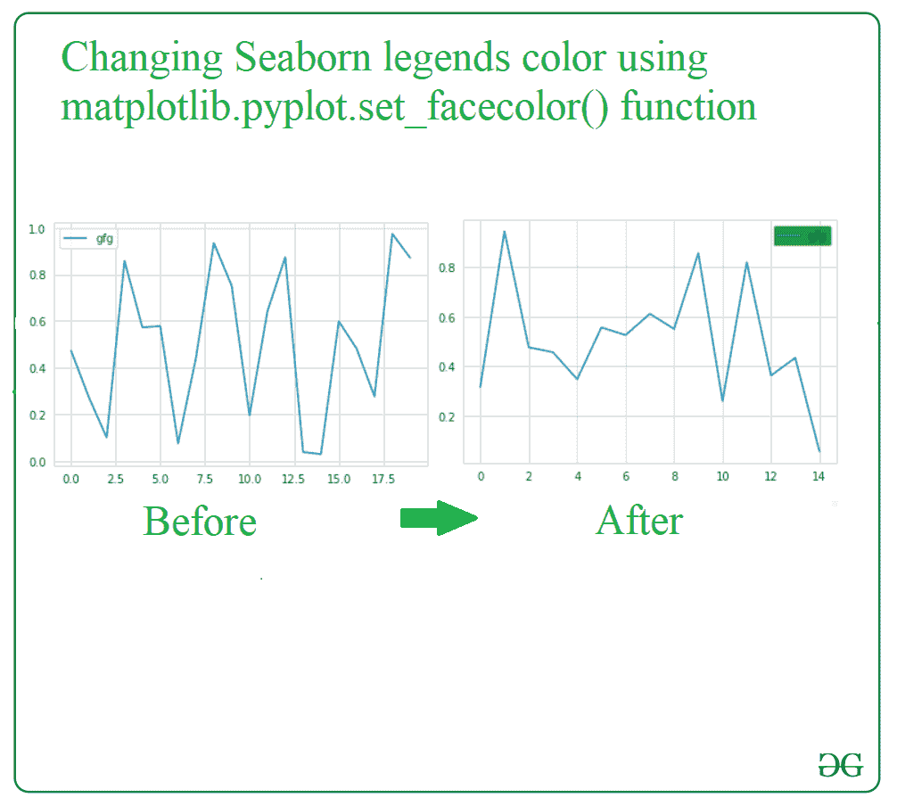

# 如何更改 Seaborn 传说字体大小、位置和颜色？

> 原文:[https://www . geesforgeks . org/how-change-seaborn-legends-font-size-location-color/](https://www.geeksforgeeks.org/how-to-change-seaborn-legends-font-size-location-and-color/)

**Seaborn** 是一个在 matplotlib 上制作统计图形的库，python 中有熊猫的数据结构。 **Seaborn 图例**是位于图表上的对话框，其中包括不同属性的描述以及它们在图表中的相应颜色。我们可以很容易地改变海底传说的属性，包括字体大小，位置，背景颜色，以及许多其他属性。

在这里，我们将学习如何改变字体大小，位置和颜色的海鸟传说。

## **更改海底传说的字体大小**

要更改 Seaborn 图例的字体大小，有两种不同的方法，如下所示:

1.  使用 matplotlib 库中的[**matplotlib . pyplot . setp()**](https://www.geeksforgeeks.org/matplotlib-pyplot-setp-function-in-python/)函数。
2.  使用 matplotlib 库中的[**matplotlib . pyplot . legend()**功能。](https://www.geeksforgeeks.org/matplotlib-pyplot-legend-in-python/)

*   **使用 matplotlib 库中的 matplotlib.pyplot.setp()函数:**

在这种方法的帮助下，用户可以通过指定特定的字体大小、图形和主题(用户是否必须更改图例中标题文本的字体大小)来轻松更改 seaborn 图例的字体大小。

## 蟒蛇 3

```py
# import modules
import seaborn as sns
import matplotlib.pylab as plt
sns.set_style("whitegrid")

# load dataset
tips = sns.load_dataset("tips")

# depict illustration
gfg = sns.stripplot(x="sex", y="total_bill",
                    hue="day", data=tips, jitter=True)

# for legend text
plt.setp(gfg.get_legend().get_texts(), fontsize='10') 

# for legend title
plt.setp(gfg.get_legend().get_title(), fontsize='20') 
plt.show()
```

**输出:**



*   **使用 matplotlib 库中的 matplotlib.pyplot.legend()函数:-**

这是更改任何 Seaborn 图例字体大小的最简单方法之一，在这种情况下，我们只需传递 **fontsize** 的参数，该参数允许我们传递字体大小值，它将更改字体大小。

## 蟒蛇 3

```py
# import modules
import seaborn as sns
import matplotlib.pylab as plt
sns.set_style("whitegrid")

# load dataset
tips = sns.load_dataset("tips")

# depict illustration
gfg = sns.stripplot(x="sex", y="total_bill",
                    hue="day", data=tips, jitter=True)
gfg.legend(fontsize=5)
plt.show()
```

**输出:**



## **改变海伯恩传说的位置**

我们使用 matplotlib 库中的 matplotlib.pyplot.legend()函数，并传递 **bbox_to_anchor** 参数，该参数允许我们传递一个(x，y)元组，该元组具有更改 seaborn legends 位置所需的偏移量。

## 蟒蛇 3

```py
# import modules
import seaborn as sns
import matplotlib.pylab as plt
sns.set_style("whitegrid")

# load dataset
tips = sns.load_dataset("tips")

# depict illustration
fg = sns.stripplot(x="sex", y="total_bill",
                   hue="day", data=tips, jitter=True)

# to change the legends location
gfg.legend(bbox_to_anchor= (1.2,1))
plt.show()
```

**输出:**



## **改变海伯恩传说的颜色**

只需使用 matplotlib 库中的**matplotlib . pyplot . set _ face color()**函数，在 seaborn 图例中传递用户想要的颜色名称。

## 蟒蛇 3

```py
# import modules
import matplotlib.pyplot as plt
import numpy as np

# depict illustration
g = np.random.rand(20,1)
plt.plot(g, label='gfg')
legend = plt.legend()
frame = legend.get_frame()
frame.set_facecolor('green')
plt.show()
```

**输出:**

