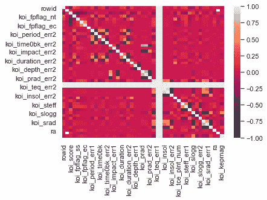

# 如何用 Python 创建一个海底相关热图？

> 原文:[https://www . geesforgeks . org/how-to-create-a-seaborn-correlation-heat map-in-python/](https://www.geeksforgeeks.org/how-to-create-a-seaborn-correlation-heatmap-in-python/)

Seaborn 是一个基于 matplotlib 的 Python 库，用于数据可视化。它提供了一种以统计图形式呈现数据的媒介，作为一种提供信息和吸引人的媒介来传递一些信息。热图是 seaborn 支持的组件之一，其中相关数据的变化使用调色板来描绘。本文主要关注**相关热图**，以及如何将海鸟与熊猫和 matplotlib 结合使用来生成数据帧。

### 装置

像任何其他 Python 库一样，seaborn 可以使用 pip 轻松安装:

```
pip install seaborn

```

该库是 Anaconda 发行版的一部分，如果您的 IDE 受 Anaconda 支持，通常只需导入即可，但也可以通过以下命令安装:

```
conda install seaborn

```

## 相关热图

相关热图是一种热图，它显示了两个离散维度之间的 2D 相关矩阵，使用彩色单元格来表示通常是单色比例的数据。第一维度的值显示为表格的行，而第二维度的值显示为列。单元格的颜色与尺寸值匹配的测量数量成比例。这使得相关热图非常适合数据分析，因为它使模式易于阅读，并突出了同一数据中的差异和变化。像常规热图一样，相关热图由一个颜色条辅助，使数据易于阅读和理解。

以下步骤显示了如何生成相关热图:

*   首先导入所有必需的模块
*   导入存储数据的文件
*   出图至热图
*   使用 matplotlib 显示它

为了绘制热图，将使用海底模块的方法。

> **语法:**热图(数据、vmin、vmax、中心、cmap、………………………………………………)

除了数据之外，所有其他属性都是可选的，数据显然是要绘制的数据。这里的数据必须通过 corr()方法传递，以生成相关热图。此外，corr()本身会在生成相关热图时删除无用的列，并选择可以使用的列。

**例 1:**

对于下面给出的例子，这里使用的是从 kaggle.com 下载的数据集。剧情展示了亚马逊上与畅销小说相关的数据。

**使用的数据集–**[畅销书](https://drive.google.com/file/d/1KhtJuBtO73gItNku98y5ekCRWobzBify/view?usp=sharing)

## 蟒蛇 3

```
# import modules
import matplotlib.pyplot as mp
import pandas as pd
import seaborn as sb

# import file with data
data = pd.read_csv("C:\\Users\\Vanshi\\Desktop\\bestsellers.csv")

# prints data that will be plotted
# columns shown here are selected by corr() since
# they are ideal for the plot
print(data.corr())

# plotting correlation heatmap
dataplot = sb.heatmap(data.corr(), cmap="YlGnBu", annot=True)

# displaying heatmap
mp.show()
```

**输出:**


上面的例子处理的是小数据。以下示例描述了大型数据集的输出情况，

**例 2:**

本例中使用的数据集是由美国宇航局汇编的系外行星空间研究数据集。

**使用的数据集–**[累计](https://drive.google.com/file/d/1pAPwPDyz0Zi1paKrr81WOfsA_TACz4fl/view?usp=sharing)

## 蟒蛇 3

```
# import modules
import matplotlib.pyplot as mp
import pandas as pd
import seaborn as sb

# import file with data
data=pd.read_csv("C:\\Users\\Vanshi\\Desktop\\cumulative.csv")

# plotting correlation heatmap
dataplot=sb.heatmap(data.corr())

# displaying heatmap
mp.show()
```

**输出:**

