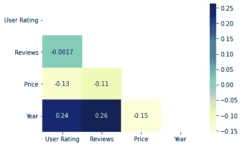
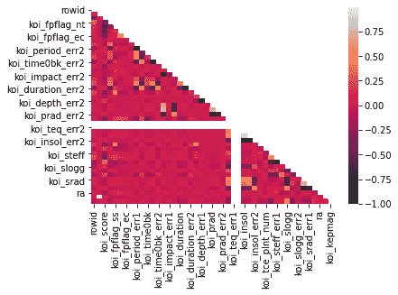

# 如何用海伯恩 Python 创建三角形关联热图？

> 原文:[https://www . geeksforgeeks . org/如何创建三角形-相关性-热图-在海底-python/](https://www.geeksforgeeks.org/how-to-create-a-triangle-correlation-heatmap-in-seaborn-python/)

Seaborn 是一个基于 matplotlib 的 Python 库，用于数据可视化。它提供了一种以统计图形式呈现数据的媒介，作为一种提供信息和吸引人的媒介来传递一些信息。热图是 seaborn 支持的组件之一，其中相关数据的变化使用调色板来描绘。本文主要关注相关热图，以及如何使用 seaborn 与 pandas 和 matplotlib 相结合来生成数据帧。

### 装置

像任何其他 Python 库一样，seaborn 可以使用 pip 轻松安装:

```
pip install seaborn
```

该库是 Anaconda 发行版的一部分，如果您的 IDE 受 Anaconda 支持，通常只需导入即可，但也可以通过以下命令安装:

```
conda install seaborn
```

## 三角形相关热图

相关热图是一种热图，它显示了两个离散维度之间的 2D 相关矩阵，使用彩色单元格来表示通常是单色比例的数据。第一维度的值显示为表格的行，而第二维度的值显示为列。单元格的颜色与尺寸值匹配的测量数量成比例。这使得相关热图非常适合数据分析，因为它使模式易于阅读，并突出了同一数据中的差异和变化。像常规热图一样，相关热图由色带辅助，使数据易于阅读和理解。

相关热图是数据的矩形表示，它重复相同的数据描述两次，因为类别在计算分析的两个轴上重复。因此，同样的结果得到两次。只显示一次数据而不重复的相关热图，即类别只相关一次，称为三角形相关热图。由于数据从左上方到右下方的对角线上是对称的，因此获得三角形相关热图的想法是移除其上方的数据，使其仅被描绘一次。对角线上的元素是同一类型的类别相互关联的部分。

为了绘制热图，将使用海底模块的方法。除了这个掩码，参数也将被传递。掩码是一种热图属性，它以数据帧或布尔数组为参数，只显示那些标记为假的位置或提供为假的掩码的位置。

**语法:**

> 热图(数据、vmin、vmax、中心、cmap、……………………………………)

除了数据之外，所有其他属性都是可选的，数据显然是要绘制的数据。这里的数据必须通过 corr()方法传递，以生成相关热图。此外，corr()本身会在生成相关热图时删除无用的列，并选择可以使用的列。

为了屏蔽，这里使用 NumPy 生成了一个数组，如下所示:

```
np.triu(np.ones_like())
```

首先，NumPy 模块的 ones_like()方法将生成一个大小与我们要绘制的数据相同的数组，其中只包含数字 1。然后，NumPy 模块的 triu()方法将把这样形成的矩阵变成上三角矩阵，即对角线以上的元素为 1，对角线以下的元素为 0。屏蔽将应用于设置为 1(真)的地方。

以下步骤显示了如何生成三角形相关热图:

*   首先导入所有必需的模块
*   导入存储数据的文件
*   出图至热图
*   遮盖热图中不应该显示的部分
*   使用 matplotlib 显示它

**例 1:**

对于下面给出的例子，这里使用的是从 kaggle.com 下载的数据集。剧情展示了亚马逊畅销小说的相关数据。

**使用的数据集–**[畅销书](https://drive.google.com/file/d/1KhtJuBtO73gItNku98y5ekCRWobzBify/view?usp=sharing)

## 蟒蛇 3

```
# import modules
import matplotlib.pyplot as mp
import pandas as pd
import seaborn as sb
import numpy as np

# import file with data
data = pd.read_csv("C:\\Users\\Vanshi\\Desktop\\gfg\\bestsellers.csv")

# creating mask
mask = np.triu(np.ones_like(data.corr()))

# plotting a triangle correlation heatmap
dataplot = sb.heatmap(data.corr(), cmap="YlGnBu", annot=True, mask=mask)

# displaying heatmap
mp.show()
```

**输出:**



**例 2:**

本例中使用的数据集是美国宇航局汇编的系外行星空间研究数据集。

**使用的数据集–**[累计](https://drive.google.com/file/d/1pAPwPDyz0Zi1paKrr81WOfsA_TACz4fl/view?usp=sharing)

## 蟒蛇 3

```
# import modules
import matplotlib.pyplot as mp
import pandas as pd
import seaborn as sb
import numpy as np

# import file with data
data = pd.read_csv("C:\\Users\\Vanshi\\Desktop\\gfg\\cumulative.csv")

# applying mask
mask = np.triu(np.ones_like(data.corr()))

# plotting a triangle correlation heatmap
dataplot = sb.heatmap(data.corr(), mask=mask)

# displaying heatmap
mp.show()
```

**输出:**

