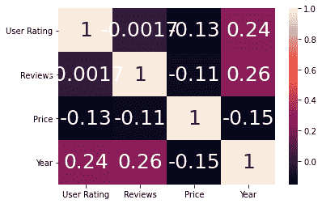

# 如何在 Python 中增加一张海底热图的标注大小？

> 原文:[https://www . geeksforgeeks . org/如何增加 python 中海洋生物热图的注释大小/](https://www.geeksforgeeks.org/how-to-increase-the-size-of-the-annotations-of-a-seaborn-heatmap-in-python/)

**先决条件** : [海伯恩](https://www.geeksforgeeks.org/introduction-to-seaborn-python/)

Seaborn 是一个基于 matplotlib 的 Python 库，用于数据可视化。它提供了一种以统计图形式呈现数据的媒介，作为一种提供信息和吸引人的媒介来传递一些信息。热图是 seaborn 支持的组件之一，其中相关数据的变化使用调色板来描绘。

注释是出现在热图单元格上的文本，代表该单元格所代表的内容。注释遵循默认字体大小，但可以使用 heatmap()函数的 annot_kws 参数进行更改，annot_kws 是一个字典类型参数，接受名为 size 的键的值。设置到该键的值定义了注释的大小，但是要增加注释的大小，必须满足某些条件:

*   热图()函数的注释参数必须设置为真。
*   annot_kws 参数必须设置为所需的大小。

> ***语法:** seaborn.heatmap(data，* vmin =无，vmax =无，cmap =无，center =无，annot _ kws =无，线宽=0，linecolor='white '，cbar=True，**kwargs)*
> 
> ***重要参数:***
> 
> *   ***数据:** 2D 数据集，可以强制到数组中。*
> *   ***【vmin】****VMAX:**值锚定颜色映射，否则它们是从数据和其他关键字参数中推断出来的。*
> *   ***cmap:** 从数据值到颜色空间的映射。*
> *   ***中心:**绘制发散数据时颜色图的中心值。*
> *   ***注释:**如果为真，则在每个单元格中写入数据值。*
> *   ***fmt:** 添加注释时使用的字符串格式代码。*
> *   ***线宽:**将划分每个单元格的线条宽度。*
> *   ***线条颜色:**将分割每个细胞的线条的颜色。*
> *   ***cbar:** 是否绘制彩条。*
> 
> *除数据外的所有参数都是可选的。*
> 
> ***返回:【matplotlib.axes. _ 子场景类型的对象。AxesSubplot***

### 方法

*   导入模块
*   创建或加载数据
*   调用热图()函数，注释设置为真。
*   将大小设置为 annot_kws 参数。
*   显示图

使用这种方法的实现如下:

**使用的数据集**–[畅销书](https://drive.google.com/file/d/1KhtJuBtO73gItNku98y5ekCRWobzBify/view?usp=sharing)

**例 1:**

## 蟒蛇 3

```
# Importing Required Libraries
import pandas as pd
import numpy as np
import seaborn as sb
import matplotlib.pyplot as mtb

data = pd.read_csv("bestsellers.csv")

sb.heatmap(data.corr(), annot=True, annot_kws={'size': 15})

mtb.show()
```

**输出:**


对于设置尺寸，在设置尺寸值时必须小心。提供一个非常大的数字会将注释放大太多，使它们难以阅读和理解，它们甚至会相互重叠，使热图不可读。

其实现如下所示:

**例 2:**

## 蟒蛇 3

```
# Importing Required Libraries
import pandas as pd
import numpy as np
import seaborn as sb
import matplotlib.pyplot as mtb

data = pd.read_csv("bestsellers.csv")

sb.heatmap(data.corr(), annot=True, annot_kws={'size': 25})

mtb.show()
```

**输出:**

