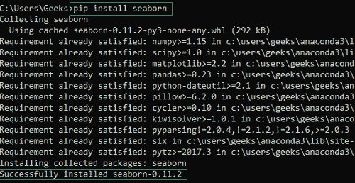
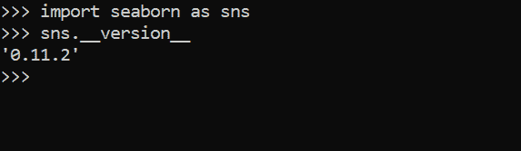
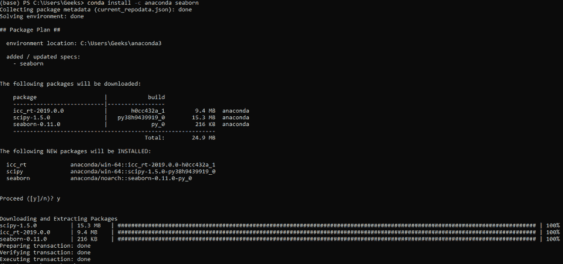
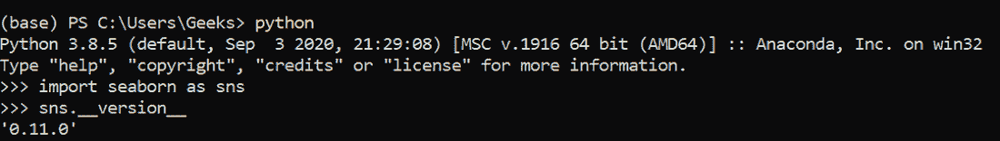

# 如何在 Windows 上安装 Seaborn？

> 原文:[https://www . geesforgeks . org/如何在 windows 上安装 seaborn/](https://www.geeksforgeeks.org/how-to-install-seaborn-on-windows/)

在本文中，我们将研究在 Windows 上安装 Python [Seaborn](https://www.geeksforgeeks.org/introduction-to-seaborn-python/) 的过程。

### 先决条件:

*   [蟒蛇](https://www.geeksforgeeks.org/how-to-download-and-install-python-latest-version-on-windows/)
*   [PIP](https://www.geeksforgeeks.org/how-to-install-pip-on-windows/) 或 [conda](https://www.geeksforgeeks.org/how-to-install-conda-in-windows/) (取决于用户偏好)

### 对于画中画用户:

PIP 用户可以打开命令提示符，运行以下命令在 Windows 上安装 Python Seaborn Package:

```py
pip install Seaborn
```

安装完成后，将显示以下消息:



要验证安装，请在 python ide 中使用以下代码:

## 蟒蛇 3

```py
import seaborn as sns
sns.__version__
```

**输出:**



### **对于康达用户:**

Conda 用户可以打开 Anaconda Power Shell 提示符，并使用以下命令在 Windows 上安装 Python Seaborn 包:

```py
conda install -c anaconda seaborn
```

安装完成后，将显示以下消息:



要验证安装，请在 python ide 中使用以下代码:

## 蟒蛇 3

```py
import seaborn as sns
sns.__version__
```

**输出:**

