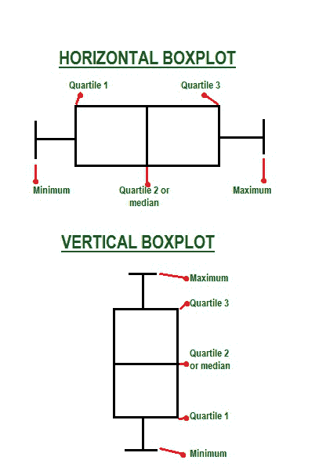
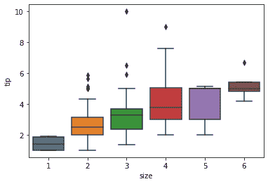

# 如何用 Python 中的 Seaborn 制作带数据点的箱线图？

> 原文:[https://www . geeksforgeeks . org/如何使用 python 中的 seaborn 制作带数据点的盒子图/](https://www.geeksforgeeks.org/how-to-make-boxplots-with-data-points-using-seaborn-in-python/)

### 先决条件:

*   [海伯恩](https://www.geeksforgeeks.org/introduction-to-seaborn-python/)
*   [Matplotlib](https://www.geeksforgeeks.org/python-introduction-matplotlib/)

箱线图或触须图是一种以图形方式可视化的统计图，通过四分位数描绘一组数字数据。此图显示了包含五个值的数据集的摘要，这五个值称为最小值、四分位数 1、四分位数 2 或中值、四分位数 3 和最大值，其中框是从第一个四分位数到第三个四分位数绘制的。



通用方框图主要关注上面提到的五个元素，为用户提供基于四分位数的数据解释，但也可以在方框图本身上显示数据点，使其更具信息性。对于这个配备了[stripe lot()](https://www.geeksforgeeks.org/stripplot-using-seaborn-in-python/)函数的海鸟，我们所要做的就是在 [boxplot()](https://www.geeksforgeeks.org/box-plot-visualization-with-pandas-and-seaborn/) 函数之后用合适的参数调用它，生成一个带有数据点的 boxplot。

带状图是自己画的。当所有的观测值都与一些潜在分布的表示一起显示时，它是箱线图或紫外图的一个很好的补充。它用于根据类别绘制散点图。

> ***语法:**seaborn . strippelot(*，x =无，y =无，色相=无，数据=无，顺序=无，色相 _ 顺序=无，抖动=真，减淡=假，方向=无，颜色=无，调色板=无，大小=5，边缘颜色= '灰色'，线宽=0，ax =无，**kwargs)*
> 
> ***参数:***
> 
> *   ***x，y，色调:**用于绘制长格式数据的输入。*
> *   ***数据:**用于标绘的数据集。*
> *   ***顺序:**这是在中绘制分类级别的顺序。*
> *   ***颜色:**它是所有元素的颜色，或者是渐变调色板*的种子
> 
> ***返回:**该方法返回绘制了绘图的坐标轴对象。*

### 方法:

*   导入库
*   创建或加载数据集。
*   使用 boxplot()绘制箱线图。
*   使用 stripplot()添加数据点。
*   显示图。

下面给出了一些帮助您更好地理解的实现

**示例 1:** 用于比较的常规方框图

## 计算机编程语言

```
# importing library
import seaborn as sns
import matplotlib.pyplot as plt

# loading seaborn dataset tips
tdata = sns.load_dataset('tips')

# creating boxplot
sns.boxplot(x='size', y='tip', data=tdata)

# display plot
plt.show()
```

**输出:**



**示例 2:** 用数据点创建箱线图

## 计算机编程语言

```
# importing library
import seaborn as sns
import matplotlib.pyplot as plt
# loading seaborn dataset tips
tdata = sns.load_dataset('tips')

# creating boxplot
sns.boxplot(x='size', y='tip', data=tdata)

# adding data points
sns.stripplot(x='size', y='tip', data=tdata)
# display plot
plt.show()
```