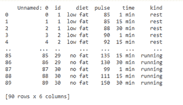
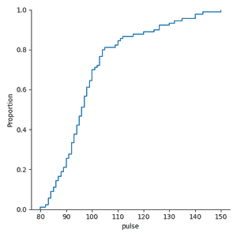
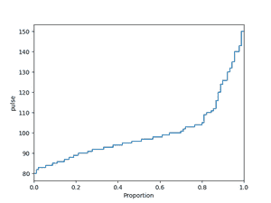
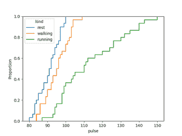
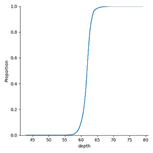

# 如何用 Python 制作 ECDF 与海伯恩的剧情？

> 原文:[https://www . geesforgeks . org/how-make-ecdf-plot-with-seaborn-in-python/](https://www.geeksforgeeks.org/how-to-make-ecdf-plot-with-seaborn-in-python/)

**先决条件:** [海伯恩](https://www.geeksforgeeks.org/introduction-to-seaborn-python/)

在这篇文章中，我们将与西伯恩图书馆制作 ECDF 情节。

## ECDF 情节

*   ECDF 代表经验交换分布。更有可能使用而不是直方图来可视化数据，因为 ECDF 图直接可视化数据集的每个数据点，这使得用户可以轻松地与图进行交互。
*   此图包含更多信息，因为它没有媒体夹大小设置，这意味着它没有任何平滑参数。
*   因为它的曲线是单调递增的，所以它非常适合同时比较多个分布。
*   在 ECDF 图中，x 轴对应于变量的值范围，而 y 轴对应于小于或等于 x 轴对应值的数据点比例。
*   我们可以使用 ecdfplot()函数直接制作 ECDF 图，也可以在新的 Seaborn 版本中使用 displot()函数制作图。

### **安装:**

要安装 Seaborn 库，请在命令提示符下编写以下命令。

```
pip install seaborn
```

此 ECDF 绘图和显示()功能仅在 0.11.0 版或更高版本的 Seaborn 中可用。如果已经安装了 Seaborn，请编写以下命令进行升级。

```
pip install seaborn==0.11.0
```

为了更好地理解 ECDF 的阴谋。让我们使用数据集绘制和做一些例子。

### 逐步方法:

*   导入海底图书馆。
*   从 seaborn 库中创建或加载数据集。
*   选择要为其绘制 ECDF 图的列。
*   对于 ECDF 阴谋的策划有以下两种方式:
*   第一种方法是使用 ecdfplot()函数直接绘制 ECDF 图，并在函数中传递您要绘制的数据和列名。

**语法:**

> seaborn.ecdfplot(数据='dataframe '，x='column_name '，y='column_name '，hue='color_column ')

*   第二种方法是使用 displot()函数，传递您正在进行绘图的数据和列，并传递 displot *kind='ecdf '的参数。*

**语法:**

> seaborn.displot(数据='dataframe '，x='column_name '，y = ' column _ name ' kind = ' type _ of _ plot '，色相='color_column '，调色板='color '

下表显示了本文中使用的参数列表。

<figure class="table">

| **参数** | **描述** |
| --- | --- |
| 数据 | 数据框或数字数组 |
| x | 进行绘图的数据或列名中的关键向量。 |
| y | 进行绘图的数据或列名中的关键向量。 |
| 色彩 | 确定绘图变量的颜色。 |
| 调色板 | 此参数用于在映射色调时选择颜色。

它可以是字符串、列表、字典。 |
| 种类 | 是 displot()的参数，用来给出我们想要的那种剧情。 |

</figure>

**方法 1:使用 ecdfplot()方法**

在这种方法中，我们使用的是由 seaborn 提供的“excerise”数据。

## 计算机编程语言

```
# importing library
import seaborn as sns

# loading exercise dataset provided by seaborn
excr = sns.load_dataset('exercise')

# printing the dataset
print(excr)
```

**输出:**



**例 1:利用海鸟提供的演习数据集制作 ECDF 地块。**

## 计算机编程语言

```
# importing libraries
import seaborn as sns
import matplotlib.pyplot as plt

# loading exercise dataset provided by seaborn
excr = sns.load_dataset('exercise')

# making ECDF plot 
sns.ecdfplot(data=excr,x='pulse')

# visualizing the plot using matplotlib.pyplot 
# show() function
plt.show()
```

**输出:**



**例 2:互换地块轴线制作 ECDF 地块。**

## 计算机编程语言

```
# importing libraries
import seaborn as sns
import matplotlib.pyplot as plt

# loading exercise dataset provided by seaborn
excr = sns.load_dataset('exercise')

# making ECDF plot 
sns.ecdfplot(data=excr,y='pulse')

# visualizing the plot using matplotlib.pyplot
# show() function
plt.show()
```

**输出:**



**例 3:当我们有多个分布时，制作 ECDF 图。**

## 计算机编程语言

```
# importing libraries
import seaborn as sns
import matplotlib.pyplot as plt

# loading exercise dataset provided by seaborn
excr = sns.load_dataset('exercise')

# making ECDF plot when we have multiple 
# distributions
sns.ecdfplot(data=excr, x='pulse', hue='kind')

# visualizing the plot using matplotlib.pyplot 
# show() function
plt.show()
```

**输出:**



上面的图显示了人的脉搏率相对于休息、行走、跑步的分布。

**方法二:使用 displot()方法**

在这种方法中，我们使用由 seaborn 提供的“钻石”数据。

## 计算机编程语言

```
# importing library
import seaborn as sns

# loading diamonds dataset provided by seaborn
diam = sns.load_dataset('diamonds')

# printing the dataset
print(diam)
```

**输出:**


**示例 1:在 seaborn 提供的企鹅数据集上使用 displot()绘制 ECDF 图。**

## 计算机编程语言

```
# importing libraries
import seaborn as sns
import matplotlib.pyplot as plt

# loading diamonds dataset provided by seaborn
diam = sns.load_dataset('diamonds')

# making ECDF plot using displot() on depth 
# of the diamonds
sns.displot(data=diam,x='depth',kind='ecdf')

# visualizing the plot using matplotlib.pyplot 
# show() function
plt.show()
```

**输出:**



**示例 2:当我们有多个默认设置的分布时，使用 displot()绘制 ECDF 图。**

## 计算机编程语言

```
# importing libraries
import seaborn as sns
import matplotlib.pyplot as plt

# loading diamonds dataset provided by seaborn
diam = sns.load_dataset('diamonds')

# making ECDF plot using displot() on depth
# of the diamond on the basis of cut
sns.displot(data=diam,x='depth',kind='ecdf',hue='cut')

# visualizing the plot using matplotlib.pyplot
# show() function
plt.show()
```