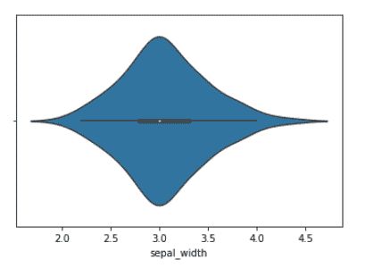

# 如何在 Python 中用 Seaborn 制作成组的小提琴曲？

> 原文:[https://www . geeksforgeeks . org/如何制作分组-violin plot-with-seaborn-in-python/](https://www.geeksforgeeks.org/how-to-make-grouped-violinplot-with-seaborn-in-python/)

本文描述了如何用 python 中的 [Seaborn](https://www.geeksforgeeks.org/introduction-to-seaborn-python/#:~:text=Seaborn%20is%20an%20amazing%20visualization,the%20data%20structures%20from%20pandas.) 制作成组的小提琴曲。Violinplot 是一种很好的可视化数据的方法，它将盒子图和内核密度图结合起来，生成一种新的图。

在本文中，我们将使用 iris 数据集来绘制数据。这是 seaborn 内置的，可以用 load_dataset 方法加载。虹膜数据集有四个特征(萼片长萼片宽花瓣长花瓣宽)都是数字，一个是包含花的名称的目标列(种类)。(弗吉尼亚、濑户、云芝)。在 seaborn 中，我们可以使用 seaborn.violinplot()方法绘制小提琴图。

> **语法:** seaborn.violinplot(x，y，色调，数据，内部，线宽，…)
> 
> **参数:**
> 
> 1. **x，y，色相**:数据或矢量数据中的变量名称，可选
> 
> 2.**数据**:数据框、数组或数组列表，可选
> 
> 3.**内部** : {“盒”、“四分位数”、“点”、“棒”、“无”)，(可选) :代表小提琴内部的数据点。
> 
> 4.**线宽**浮动，(可选):构成绘图元素的灰色线条的宽度。
> 
> **返回:**
> 
> ax: matplotlib Axes

以下示例将帮助您更好地理解:

**示例 1:** 绘制单个水平小提琴图。**T3】**

## 蟒蛇 3

```py
import seaborn as sns
import pandas as pd

datasets = sns.load_dataset('iris')

datasets.head()

sns.violinplot(datasets['sepal_length'])
```

**输出:**



在上面的图中，小白点是特征的中间值，细线代表四分位数之间的范围。

除了传递单个数值列，我们还可以传递一个分类列。在我们的例子中，物种。

**例 2:** 用 Seaborn 绘制分组小提琴图。

(使用 sepal_width 和“种类”列创建分组小提琴图。)

## 蟒蛇 3

```py
import seaborn as sns
import pandas as pd

datasets = sns.load_dataset('iris')

datasets.head()

sns.violinplot(x='species', y='sepal_width', data=datasets,
               inner="quart", linewidth=1)
```