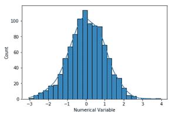
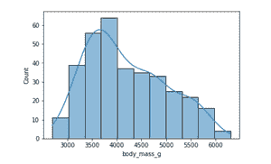
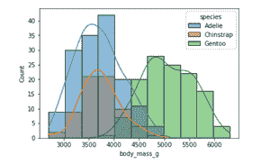
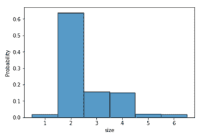

# 如何用海伯恩历史图制作密度图直方图？

> 原文:[https://www . geeksforgeeks . org/how-to-do-直方图-带密度的图-带海底的图-histplot/](https://www.geeksforgeeks.org/how-to-make-histograms-with-density-plots-with-seaborn-histplot/)

**直方图**是表示一组连续数据分布的可视化工具。在直方图中，数据被分成一组区间或**区间**(通常在 x 轴上)，落入每个区间的数据点的数量对应于该区间上方的条的高度。这些仓的宽度可以相等，也可以不相等，但它们是相邻的(没有间隙)。

**密度图**(也称为核密度图)是评估数据分布的另一个可视化工具。它可以被认为是平滑的直方图。密度图的峰值有助于显示值在区间内的集中位置。有多种平滑技术。**核密度估计** (KDE)是用于平滑直方图的技术之一。

Seaborn 是一个基于 Python 中 matplotlib 的数据可视化库。在本文中，我们将使用***seaborn . hist plot()***绘制带有密度图的直方图。

> **语法:** seaborn.histplot(data，x，y，hue，stat，bin，binwidth，discrete，kde，log_scale)
> 
> **参数:-**
> 
> *   **数据:**以 Dataframe 或 Numpy 数组形式输入数据
> *   **x，y** (可选):分别位于 x 轴和 y 轴的数据键
> *   **色调**(可选):映射确定地块元素颜色的语义数据键
> *   **stat** (可选):计数、频率、密度或概率
> 
> **返回:**该方法返回 matplotlib 轴及其上绘制的图。

**示例 1:** 我们将使用 random.randn()方法生成数据。

## 蟒蛇 3

```
# Import necessary libraries
import seaborn as sns
import numpy as np
import pandas as pd

# Generating dataset of random numbers
np.random.seed(1)
num_var = np.random.randn(1000)
num_var = pd.Series(num_var, name = "Numerical Variable")

# Plot histogram
sns.histplot(data = num_var, kde = True)
```

**输出:**



默认情况下 *seaborn.histplot* 的 *kde* 参数设置为假。因此，通过将 *kde* 设置为真，计算核密度估计以平滑分布，并绘制密度图线。

**示例 2:** 让我们使用这个示例中来自 Seaborn 库的样本数据集[企鹅](https://github.com/mwaskom/seaborn-data)。该数据集显示了不同岛屿上不同企鹅物种的特征(体重、鳍状肢长度、喙长性别)。

## 蟒蛇 3

```
# Import necessary libraries
import numpy as np
import pandas as pd
import seaborn as sns

# Load dataset
penguins = sns.load_dataset("penguins")

# Plot histogram
sns.histplot(data = penguins, x = "body_mass_g", kde = True)
```

**输出:**



我们还可以在单个图中可视化多个物种的体重分布。*色调*参数映射语义变量“物种”。

## 蟒蛇 3

```
# Plot Histogram
sns.histplot(data = penguins, x = "body_mass_g", kde = True, hue = "species")
```

**输出:**



**示例 3:** 本示例使用来自 Seaborn 库的样本数据集 [Tips](https://github.com/mwaskom/seaborn-data) ，该数据集记录了餐厅服务器收到的 Tips。它包括收到的小费总额或餐费、顾客的性别、顾客聚会的规模、日期、时间以及吸烟者是否出席聚会。这个例子中的直方图不是数据点的计数，而是归一化的，这样每个条的高度显示一个概率。

## 蟒蛇 3

```
# Import necessary libraries
import numpy as np
import pandas as pd
import seaborn as sns

# Load dataset
tips = sns.load_dataset("tips")

# Plot histogram
sns.histplot(data = tips, x = "size", stat = "probability", discrete = True)
```

**输出:**

