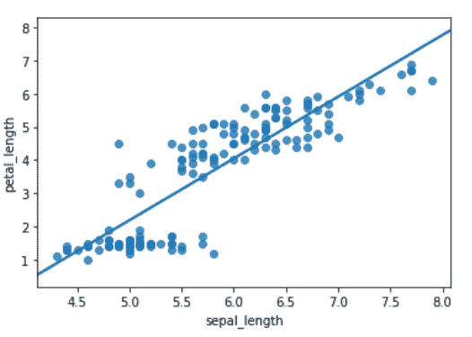
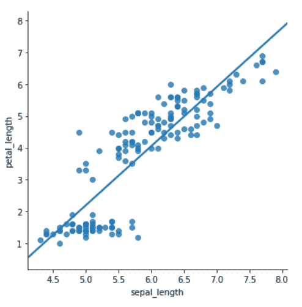

# 如何用 Python 中的 Seaborn 制作带有回归线的散点图？

> 原文:[https://www . geesforgeks . org/如何使用 python 中的 seaborn 绘制带有回归线的散点图/](https://www.geeksforgeeks.org/how-to-make-scatter-plot-with-regression-line-using-seaborn-in-python/)

在本文中，我们将学习如何使用 Python 中的 Seaborn 创建带有回归线的男性散点图。让我们讨论一些概念:

*   **Seaborn :** Seaborn 是一个巨大的可视化库，用于在 Python 中绘制统计图形。它提供了漂亮的默认样式和调色板，使统计图更有吸引力。它建立在 matplotlib 图书馆的最高层，也与熊猫的信息结构紧密结合。
*   **散点图:**散点图是用来观察变量之间的关系，用点来表示变量之间的联系。matplotlib 库中的散点图()方法用于绘制散点图。散点图通常用来表示变量之间的关系，一个变量的变化会反过来影响另一个变量。
*   **回归图:**海鸟的两个主要功能是将通过回归确定的线性关系可视化。regplot()和 lmplot()这两个函数密切相关，并且共享它们的大部分核心功能。

在两个数值变量之间的散点图中添加回归曲线是确定线性趋势的好方法。我们还将看到一个用回归曲线定制散点图的例子。

### 所需步骤

*   导入库(Seaborn)
*   导入或加载或创建数据。
*   借助 regplot()或 lmplot()方法绘制图表。

**实施例 1:** 使用 [regplot()](https://www.geeksforgeeks.org/python-seaborn-regplot-method/) 方法

该方法用于绘制数据和线性回归模型拟合。有许多互斥的选项来估计回归模型。

## 蟒蛇 3

```
# importing libraries
import seaborn as sb

# load data
df = sb.load_dataset('iris')

# use regplot
sb.regplot(x = "sepal_length",
            y = "petal_length", 
            ci = None,
            data = df)
```

**输出:**



**实施例 2:** 使用 [lmplot()](https://www.geeksforgeeks.org/python-seaborn-lmplot-method/) 方法

lmplot 是另一个最基本的情节。它显示了一条代表线性回归模型的线以及 2D 空间上的数据点，x 和 y 可以分别设置为水平和垂直标签。

## 蟒蛇 3

```
# importing libraries
import seaborn as sb

# load data
df = sb.load_dataset('iris')

# use lmplot
sb.lmplot(x = "sepal_length",
            y = "petal_length", 
            ci = None,
            data = df)
```

**输出:**

