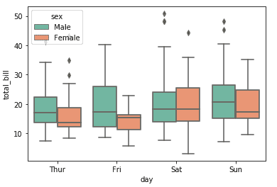
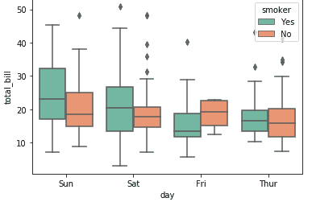
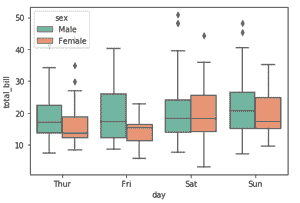
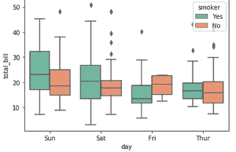
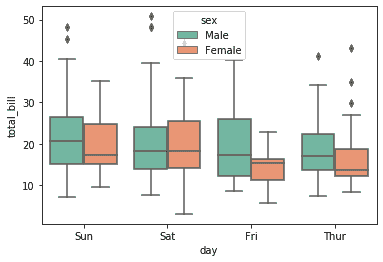
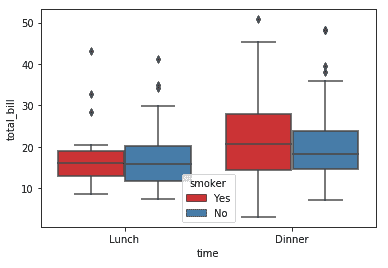
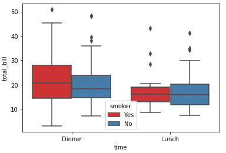

# 如何在 Seaborn 手动订购箱线图？

> 原文:[https://www . geesforgeks . org/如何手动订购-boxplot-in-seaborn/](https://www.geeksforgeeks.org/how-to-manually-order-boxplot-in-seaborn/)

[**Seaborn**](https://www.geeksforgeeks.org/introduction-to-seaborn-python/) 是一个用 Python 进行统计图形绘制的惊人可视化库。它提供了漂亮的默认样式和调色板，使统计图更有吸引力。它建立在 [matplotlib](https://www.geeksforgeeks.org/python-introduction-matplotlib/) 库的基础上，也与[熊猫](https://www.geeksforgeeks.org/introduction-to-pandas-in-python/)的数据结构紧密结合。
Seaborn 旨在使探索和理解数据的中心部分可视化。它提供了面向数据集的 API，因此我们可以在相同变量的不同视觉表示之间切换，以便更好地理解数据集。

**箱线图**是通过四分位数描绘数字数据组的视觉表示。Boxplot 也用于检测数据集中的异常值。它通过一个简单的方框和触须高效地捕获数据摘要，并允许我们轻松地跨组进行比较。Boxplot 使用第 25、50 和 75 个百分位数汇总样本数据。这些百分位数也被称为下四分位数、中位四分位数和上四分位数。

在本文中，我们将讨论如何手动订购 boxplot。

### 使用的数据集

下例中使用的数据集是[https://www.kaggle.com/ranjeetjain3/seaborn-tips-dataset](https://www.kaggle.com/ranjeetjain3/seaborn-tips-dataset)

### 逐步方法:

*   导入库

## 蟒蛇 3

```
# import required modules
import pandas as pd
import numpy as np
import matplotlib.pyplot as plt
import seaborn as sns
```

*   加载数据集

## 蟒蛇 3

```
# load dataset
tips= sns.load_dataset('tips')

# display top most rows
tips.head()                     
```

**输出:**


*   画出方框图。

## 蟒蛇 3

```
# illustrate box plot
fx = sns.boxplot(x='day', y='total_bill', data=tips, hue='sex', palette='Set2')
```

**输出:**



*   使用*海底*绘制箱线图。请看上图的顺序和根据我们的需要设置顺序后的区别。调色板将改变图形的颜色(您也可以尝试*设定 1* 和*设定 3*

## 蟒蛇 3

```
# illustrating box plot with order
fx = sns.boxplot(x='day', y='total_bill', data=tips, order=[
                 'Sun', 'Sat', 'Fri', 'Thur'], hue='sex', palette='Set2')
```

**输出:**



*   两张图一起:

 

**以下是基于上述方法的完整程序:**

**例 1**

## 蟒蛇 3

```
# import required modules
import pandas as pd
import numpy as np
import matplotlib.pyplot as plt
import seaborn as sns

# load dataset
tips= sns.load_dataset('tips')

# display top most rows
tips.head()                     

# illustrating box plot with order
sns.boxplot(x='day', y='total_bill', data=tips, order=[
                 'Sun', 'Sat', 'Fri', 'Thur'], hue='sex', palette='Set2')
```

**输出:**



**例 2**

现在，使用不同的特征绘制箱线图。遵守下图中 x 轴上的顺序:

## 蟒蛇 3

```
# import required modules
import pandas as pd
import numpy as np
import matplotlib.pyplot as plt
import seaborn as sns

# load dataset
tips = sns.load_dataset('tips')

# display top most rows
tips.head()

# plotting the boxplot taking time on x-axis
fx = sns.boxplot(x="time", y="total_bill", hue="smoker",
                 data=tips, palette="Set1")

# illustrating box plot with order
ax = sns.boxplot(x="time", y="total_bill", hue="smoker", order=['Dinner', 'Lunch'],
                 data=tips, palette="Set1")
```

**输出:**

*   在-



*   在-



这里我们已经手动订购了箱线图。