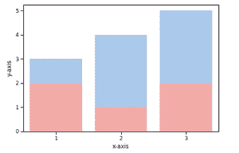
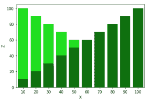

# 如何在 Seaborn 重叠两个 Barplots？

> 原文:[https://www . geeksforgeeks . org/如何重叠-seaborn 中的两个条形图/](https://www.geeksforgeeks.org/how-to-overlap-two-barplots-in-seaborn/)

[【海鸟】](https://www.geeksforgeeks.org/introduction-to-seaborn-python/) 是一个用 Python 进行统计图形绘制的惊人可视化库。它提供了漂亮的默认样式和颜色调色板，使统计图更有吸引力。它建立在 [matplotlib](https://www.geeksforgeeks.org/python-introduction-matplotlib/) 库的基础上，也紧密集成了来自 [熊猫](https://www.geeksforgeeks.org/introduction-to-pandas-in-python/) 的数据结构。

[条形图](https://www.geeksforgeeks.org/seaborn-barplot-method-in-python/)用于使用矩形条表示数据类别。我们可以通过创建支线剧情来重叠[海底](https://www.geeksforgeeks.org/introduction-to-seaborn-python/)中的两个长条剧情。

**在海底重叠两个沙洲所需的步骤:**

1.  导入*海底*和 *matplotlib* 库，*海底*用于绘图， *matplotlib* 用于使用*子图()*。
2.  正在创建数据框。
3.  在相同的轴上创建两个支线剧情。
4.  展示剧情。

以下是基于上述方法的一些示例:

**例 1:**

## 蟒蛇 3

```py
# importing all required libraries
import pandas as pd
import seaborn as sns
import matplotlib.pyplot as plt

# creating dataframe
df = pd.DataFrame({
    'X': [1, 2, 3],
    'Y': [3, 4, 5],
    'Z': [2, 1, 2]
})

# creating subplots
ax = plt.subplots()

# plotting columns
ax = sns.barplot(x=df["X"], y=df["Y"], color='b')
ax = sns.barplot(x=df["X"], y=df["Z"], color='r')

# renaming the axes
ax.set(xlabel="x-axis", ylabel="y-axis")

# visulaizing illustration
plt.show()
```

**输出:**



**例 2:**

## 蟒蛇 3

```py
#importing all required libraries
import pandas as pd
import seaborn as sns
import matplotlib.pyplot as plt

#creating dataframe
df=pd.DataFrame({
    'X':[i for i in range(10,110,10)],
    'Y':[i for i in range(100,0,-10)],
    'Z':[i for i in range(10,110,10)]
})

#creating subplots
ax=plt.subplots()

#plotting columns
ax=sns.barplot(x=df["X"],y=df["Y"],color = 'lime')
ax=sns.barplot(x=df["X"],y=df["Z"],color = 'green')

#renaming the axes
ax.set(xlabel="x-axis", ylabel="y-axis")

# visulaizing illustration
plt.show()
```

**输出:**

