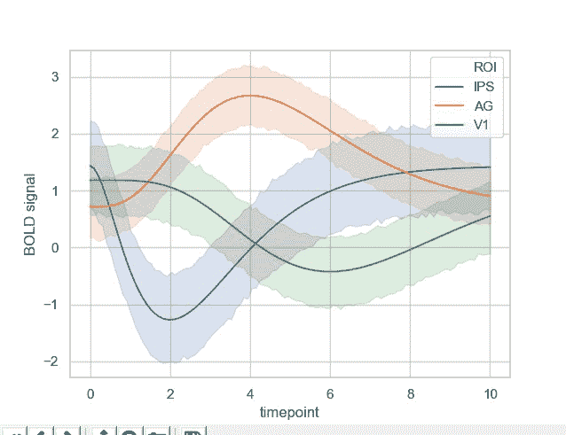

# 如何用 Python 将传说放置在有海伯恩的剧情外？

> 原文:[https://www . geesforgeks . org/how-to-place-legend-out-with-seaborn-in-python/](https://www.geeksforgeeks.org/how-to-place-legend-outside-the-plot-with-seaborn-in-python/)

**Seaborn** 是基于 matplotlib 的 Python **数据可视化库**。它提供了一个高级界面，用于绘制吸引人且信息丰富的统计图形。基本上，它帮助我们风格化我们使用 matplotlib 制作的基本情节。此外，它还为我们提供了不同的绘图技术来简化我们的**探索性数据分析(EDA)** 。有了这些情节，为特定情节提供传说也变得很重要。

在接下来的这篇文章中，我们将看到如何将我们的传奇放置在我们的剧情上，在本文的后面，我们还将看到如何使用 **Seaborn** 将传奇放置在剧情之外。

我们将从导入必要的库开始。

## 蟒蛇 3

```
import seaborn as sns 
import matplotlib.pyplot as plt
```

我们将使用 Seaborn 不仅绘制数据，而且导入我们的数据集。在这里，我们将使用由海鸟提供的**伽马数据集**。

## 蟒蛇 3

```
# set our graph style to whitegrid
sns.set(style="whitegrid")

# load the gammas dataset
ds = sns.load_dataset("gammas")  

# use seaborn's lineplot to plot our timeplot
# and BOLD signal columns
sns.lineplot(data=ds, x="timepoint", y="BOLD signal", hue = "ROI") 

plt.show()
```

**输出:**



我们可以看到，这用图例绘制了一个漂亮的线图。我们可以看到图例框在剧情上。这可能是许多剧情中的一个问题，所以我们需要将我们的传奇盒子保留在剧情之外。

我们可以通过使用 matplotlib 的图例函数并提供其必要的参数来做到这一点。

## 蟒蛇 3

```
plt.legend(bbox_to_anchor=(1, 1), loc=2)
```