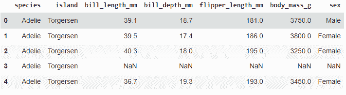
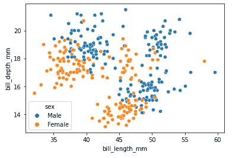

# 如何用 Python 将 Seaborn 剧情保存到文件中？

> 原文:[https://www . geeksforgeeks . org/如何保存-seaborn-plot-to-a-file-in-python/](https://www.geeksforgeeks.org/how-to-save-seaborn-plot-to-a-file-in-python/)

**Seaborn** 提供了一种以不同的期望文件格式存储最终输出的方式，如**。巴布亚新几内亚。pdf，。tiff，。eps** 等。让我们看看如何将输出图形保存为特定的文件格式。

## 逐步实施

### **第一步:**

使用内置函数 load_dataset 从 seaborn 包导入内置的**企鹅数据集**。

**语法:**

```
seaborn.load_dataset(name, cache=True, data_home=None, **kws)
```

**例**:

## 蟒蛇 3

```
# code
# Install seaborn using pip install seaborn
# Import the seaborn package
import seaborn as sns

# load the inbuilt "penguins" dataset using 
# seaborn inbuilt function load_dataset
data = sns.load_dataset("penguins")

# print the first 6 data
data.head()
```

**输出:**



### **第二步:**

对于这个例子，让我们使用**散点图**来检查雄性和雌性企鹅的喙长 mm 和喙深 mm 之间是否有任何关系。

**语法:**

```
seaborn.scatterplot(x, y, hue, style, size, data, palette,
hue_order, legend)
```

### **第三步:**

这是**将绘图**保存到所需文件类型的首要步骤。使用**获取图形功能**获取步骤 2 中绘制的图形。

**语法:**

```
figure_name.get_figure()
```

get_figure 函数将输出图形存储到变量中。将图暂时存储在变量中，如下所示

**3a:将剧情另存为。巴布亚新几内亚:**

最后，使用 **savefig 功能**并给出想要的名称和文件类型来存储该图。以下示例将绘图存储为当前工作目录中的. png 文件。

## 蟒蛇 3

```
# Install seaborn using pip install seaborn
# Import the seaborn package
import seaborn as sns

# load the inbuilt "penguins" dataset using 
# seaborn inbuilt function load_dataset
data = sns.load_dataset("penguins")

scatter_plot = sns.scatterplot(
    x=data['bill_length_mm'], y=data['bill_depth_mm'], hue=data['sex'])

# use get_figure function and store the plot i
# n a variable (scatter_fig)
scatter_fig = scatter_plot.get_figure()

# use savefig function to save the plot and give 
# a desired name to the plot.
scatter_fig.savefig('scatterplot.png')

# this will store the plot in current working directory
```

**输出:**



**3b:将海伯恩图形另存为。jpg**

## 蟒蛇 3

```
# code
# Install seaborn using pip install seaborn
# Import the seaborn package
import seaborn as sns

# load the inbuilt "penguins" dataset using
# seaborn inbuilt function load_dataset
data = sns.load_dataset("penguins")

scatter_plot = sns.scatterplot(
    x=data['bill_length_mm'], y=data['bill_depth_mm'], hue=data['sex'])

# use get_figure function and store the plot 
# in a variable (scatter_fig)
scatter_fig = scatter_plot.get_figure()

# use savefig function to save the plot and give
# a desired name to the plot.
scatter_fig.savefig('scatterplot.jpg')

# this will store the plot in current working directory
```

**输出:**


**3c:将海伯恩图形另存为。tiff**

## 蟒蛇 3

```
# code
# Install seaborn using pip install seaborn
# Import the seaborn package
import seaborn as sns

# load the inbuilt "penguins" dataset using 
# seaborn inbuilt function load_dataset
data = sns.load_dataset("penguins")

scatter_plot = sns.scatterplot(
    x=data['bill_length_mm'], y=data['bill_depth_mm'], hue=data['sex'])

# use get_figure function and store the plot 
# in a variable (scatter_fig)
scatter_fig = scatter_plot.get_figure()

# use savefig function to save the plot and give 
# a desired name to the plot.
scatter_fig.savefig('scatterplot.tiff')

# this will store the plot in current working directory
```

**输出**:


### **第四步:**

如果您希望将 seaborn 图保存到特定文件夹，请按照下面提到的步骤操作

## 蟒蛇 3

```
# Install seaborn using pip install seaborn
# Import the seaborn package
import seaborn as sns

# load the inbuilt "penguins" dataset using 
# seaborn inbuilt function load_dataset
data = sns.load_dataset("penguins")

scatter_plot = sns.scatterplot(
    x=data['bill_length_mm'], y=data['bill_depth_mm'], hue=data['sex'])

# use get_figure function and store the plot 
# in a variable (scatter_fig)
scatter_fig = scatter_plot.get_figure()

# use savefig function to save the plot and give 
# a desired name to the plot.
scatter_fig.savefig(r'C:\Users\Documents\test\Plots\scatterplot.png')

# this will store the plot in specified directory
```

**输出**:

