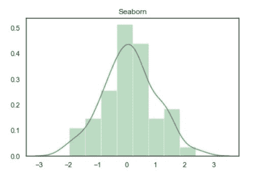
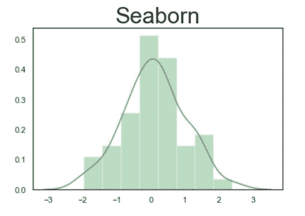
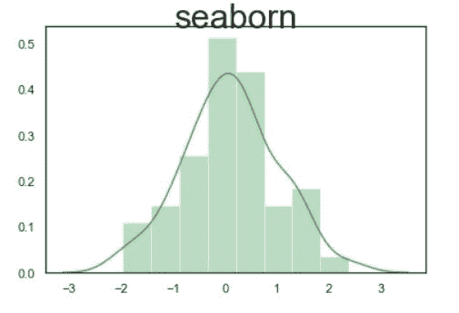
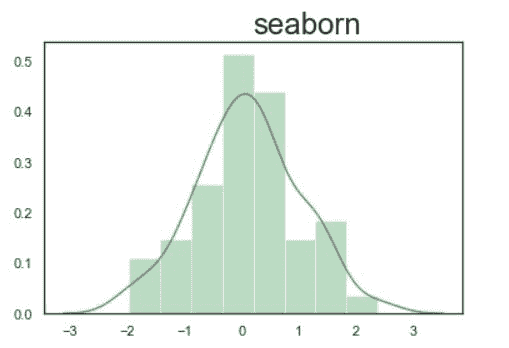
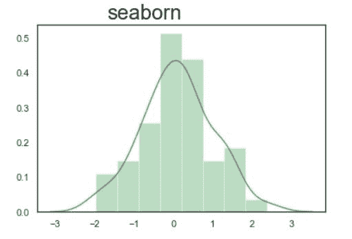

# 如何设置你的海底图表的标题和字体？

> 原文:[https://www . geeksforgeeks . org/如何设置您的海底图表的标题和字体/](https://www.geeksforgeeks.org/how-to-set-the-title-and-fonts-of-your-seaborn-chart/)

在本文中，我们将看到如何在 seaborn chart 中设置标题和字体。数据可视化是以图像形式呈现数据。它对数据分析极其重要，主要是因为以数据为中心的 Python 包的奇妙生态系统，seaborn 是一个惊人的可视化库，用于在 Python 中绘制统计图形。

**安装:**

对于 python 环境:

```py
pip install seaborn
```

对于 conda 环境:

```py
conda install seaborn
```

### 让我们使用 seaborn 创建一些基本地块:

## 蟒蛇 3

```py
# Importing libraries  
import numpy as np  
import seaborn as sns  

# Selecting style as white,  
# dark, whitegrid, darkgrid   
# or ticks  
sns.set( style = "white" )  

# Generate a random univariate   
# dataset  
rs = np.random.RandomState( 10 )  
d = rs.normal( size = 50 )  

# Plot a simple histogram and kde   
# with binsize determined automatically  
sns.distplot(d, kde = True, color = "g")
```

**输出:**


现在我们可以使用 **set_title()** 功能添加一个标题。该功能能够设置标题和字体样式。

> **语法:** Axes.set_title( *标签*， *fontdict* )
> 
> **参数:**
> 
> *   标签:字符串
> *   **字体字典:**控制标题文本外观的字典。

**示例 1:** 在海底图表中添加标题。

在本例中，我们将使用 set_title()函数设置标题。

> **语法:** set_title(“标签”)

**代码:**

## 蟒蛇 3

```py
# Importing libraries  
import numpy as np  
import seaborn as sns  

# Selecting style as white,  
# dark, whitegrid, darkgrid   
# or ticks  
sns.set( style = "white" )  

# Generate a random univariate   
# dataset  
rs = np.random.RandomState( 10 )  
d = rs.normal( size = 50 )  

# Plot a simple histogram and kde   
# with binsize determined automatically  
sns.distplot(d, kde = True, color = "g").set_title('Seaborn')
```

**输出:**



**例 2:** 增加标题字体大小。

这里我们使用 fontsize 属性来增加字体的大小。

> **语法:** set_title("Label "，fontdict={ 'fontsize : int'})

**代码:**

## 蟒蛇 3

```py
# Importing libraries  
import numpy as np  
import seaborn as sns  

# Selecting style as white,  
# dark, whitegrid, darkgrid   
# or ticks  
sns.set( style = "white" )  

# Generate a random univariate   
# dataset  
rs = np.random.RandomState( 10 )  
d = rs.normal( size = 50 )  

# Plot a simple histogram and kde   
# with binsize determined automatically  
sns.distplot(d, kde = True, color = "g").set_title(
  'Seaborn', fontdict = { 'fontsize': 30})
```

**输出:**



**示例 3:** 设置字体的垂直对齐方式。

这里我们使用**垂直对齐**属性设置字体对齐。对齐的有效**垂直对齐**值；支持的值为“顶部”、“底部”、“中心”、“基线”、“center_baseline”。

> **语法:** set_title("Label "，fontdict={ 'fontsize : int '，vertical alignment = ' top '，' bottom '，' center '，' baseline '，' center_baseline'"})

**代码:**

## 蟒蛇 3

```py
# Importing libraries  
import numpy as np  
import seaborn as sns  

# Selecting style as white,  
# dark, whitegrid, darkgrid   
# or ticks  
sns.set( style = "white" )  

# Generate a random univariate   
# dataset  
rs = np.random.RandomState( 10 )  
d = rs.normal( size = 50 )  

# Plot a simple histogram and kde   
# with binsize determined automatically  
sns.distplot(d, kde = True, color = "g").set_title(
  'seaborn', fontdict= { 'fontsize': 30, 'verticalalignment': 'bottom'})
```

**输出:**



**例 4:** 设置水平对齐。

这里我们使用**水平对齐**属性设置字体的对齐方式。**有效水平对齐**值为对齐；支持的值为“中心”、“右侧”、“左侧”。

> **语法:** set_title("Label "，fontdict={ 'fontsize : int '，horizontal alignment = ' center '，' right '，' left'"})

**代码:**

## 蟒蛇 3

```py
# Importing libraries  
import numpy as np  
import seaborn as sns      

# Selecting style as white,  
# dark, whitegrid, darkgrid   
# or ticks  
sns.set( style = "white" )  

# Generate a random univariate   
# dataset  
rs = np.random.RandomState( 10 )  
d = rs.normal( size = 50 )  

# Plot a simple histogram and kde   
# with binsize determined automatically  
sns.distplot(d, kde = True, color = "g").set_title(
  'seaborn', fontdict= { 'fontsize': 24, 'horizontalalignment': 'left'})
```

**输出:**



**现在使用水平校准检查右侧校准:“‘右侧’:**

## 蟒蛇 3

```py
# Importing libraries
import numpy as np
import seaborn as sns

# Selecting style as white,
# dark, whitegrid, darkgrid
# or ticks
sns.set(style="white")

# Generate a random univariate
# dataset
rs = np.random.RandomState(10)
d = rs.normal(size=50)

# Plot a simple histogram and kde
# with binsize determined automatically
sns.distplot(d, kde=True, color="g").set_title(
  'seaborn', fontdict={'fontsize': 24, 'horizontalalignment': 'right'})
```

**输出:**

