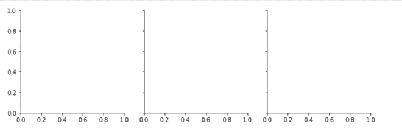
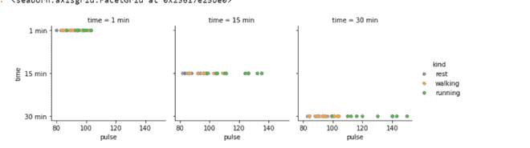
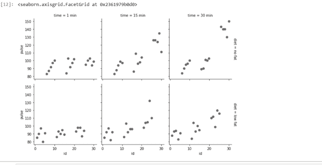

# 海伯恩多地块网格

> 原文:[https://www.geeksforgeeks.org/multi-plot-grid-in-seaborn/](https://www.geeksforgeeks.org/multi-plot-grid-in-seaborn/)

**前提条件:**[【matplot lib】](https://www.geeksforgeeks.org/python-introduction-matplotlib/)，[出生](https://www.geeksforgeeks.org/introduction-to-seaborn-python/)

在本文中，我们将看到多维图数据，在数据集的不同子集上绘制同一图的多个实例是一种有用的方法。它允许查看者快速提取关于复杂数据集的大量信息。在 Seaborn 中，我们将以两种方式在单个窗口中绘制多个图表。首先借助 Facetgrid()函数和其他由 matplotlib 帮助的隐式。

**FacetGrid:** FacetGrid 是一种基于函数绘制网格的通用方式。它有助于可视化一个变量的分布以及多个变量之间的关系。它的对象使用数据框作为输入，并使用构成网格的列、行或颜色维度的变量名称，语法如下:

> **语法:**海鸟。FacetGrid(数据，*\*kwargs)
> 
> *   **数据:**整齐的数据框，其中每一列是一个变量，每一行是一个观察值。
> *   **\*\*kwargs:** 它使用许多参数作为输入，例如行、列、色调、调色板等。

**以下是上述方法的实现:**

导入所有需要的 Python 库

## 蟒蛇 3

```py
import seaborn as sns
import numpy as np
import pandas as pd
import matplotlib.pyplot as plt
```

**示例 1:** 这里，我们像这样初始化网格，设置 matplotlib 图形和轴，但不在它们上面绘制任何东西，我们使用的是练习数据集，这是一个众所周知的数据集，可作为 seaborn 中的内置数据集。
该类的基本用法与 FacetGrid 非常相似。首先初始化网格，然后将绘图函数传递给 map 方法，它将在每个子图中被调用。

## 蟒蛇 3

```py
# loading of a dataframe from seaborn
exercise = sns.load_dataset("exercise")

# Form a facetgrid using columns
sea = sns.FacetGrid(exercise, col = "time")
```

**输出:**



**例 2:** 此功能将绘制图形并标注轴。要绘制关系图，首先要初始化网格，然后将绘图函数传递给一个 map 方法，它将在每个子图上被调用。

## 蟒蛇 3

```py
# Form a facetgrid using columns with a hue 
sea = sns.FacetGrid(exercise, col = "time", hue = "kind")

# map the above form facetgrid with some attributes   
sea.map(sns.scatterplot, "pulse", "time", alpha = .8)

# adding legend
sea.add_legend()
```

**输出:**



**示例 3:** 有几个控制网格外观的选项可以传递给类构造函数。

## 蟒蛇 3

```py
sea = sns.FacetGrid(exercise, row = "diet",
                    col = "time", margin_titles = True)

sea.map(sns.regplot, "id", "pulse", color = ".3",
        fit_reg = False, x_jitter = .1)
```

**输出:**



**示例 4:** 通过提供每个刻面的高度以及纵横比来设置图形的大小:

## 蟒蛇 3

```py
sea = sns.FacetGrid(exercise, col = "time",
                    height = 4, aspect  =.5)

sea.map(sns.barplot, "diet", "pulse",
        order = ["no fat", "low fat"])
```