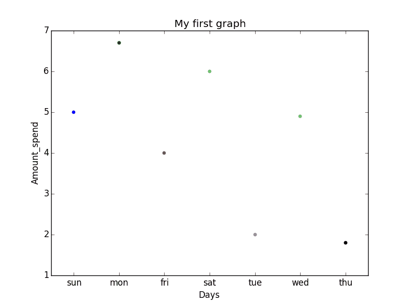
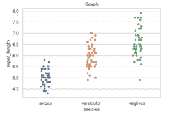
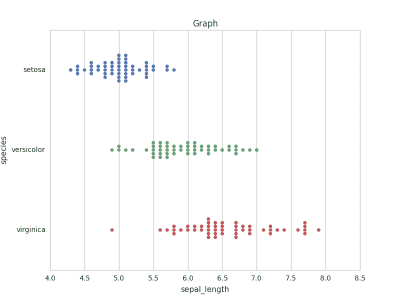
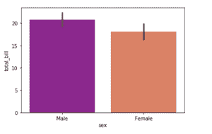

# 使用 Seaborn | Python 绘制图形

> 原文:[https://www . geesforgeks . org/绘图-图形-使用-seaborn-python/](https://www.geeksforgeeks.org/plotting-graph-using-seaborn-python/)

本文将向您介绍使用 Python 中最流行的统计可视化库 Seaborn 在 Python 中绘图。

**安装:**安装 seaborn 最简单的方法就是使用 pip。在终端中键入以下命令:

```py
pip install seaborn
```

或者，可以从[这里](https://pypi.python.org/pypi/seaborn)下载，手动安装。

**用 Seaborn 绘制分类散点图**

## **脱衣舞间**

## 蟒蛇 3

```py
# Python program to illustrate
# Plotting categorical scatter
# plots with Seaborn

# importing the required module
import matplotlib.pyplot as plt
import seaborn as sns

# x axis values
x =['sun', 'mon', 'fri', 'sat', 'tue', 'wed', 'thu']

# y axis values
y =[5, 6.7, 4, 6, 2, 4.9, 1.8]

# plotting strip plot with seaborn
ax = sns.stripplot(x, y);

# giving labels to x-axis and y-axis
ax.set(xlabel ='Days', ylabel ='Amount_spend')

# giving title to the plot
plt.title('My first graph');

# function to show plot
plt.show()
```

**输出:**



**说明:**这是一种借助于海滨的分类数据散点图。

*   分类数据在 x 轴上表示，相应的值通过 y 轴表示。
*   **。striplot()** 函数用于定义绘图的类型，并使用在画布上绘制它们。
*   **。set()** 功能用于设置 x 轴和 y 轴的标签。
*   **。title()** 函数用于给图形赋予一个标题。
*   要查看绘图，我们使用**。show()** 功能。

**使用海底给定的内置数据集的剥离批次:**

## 蟒蛇 3

```py
# Python program to illustrate
# Stripplot using inbuilt data-set
# given in seaborn

# importing the required module
import matplotlib.pyplot as plt
import seaborn as sns

# use to set style of background of plot
sns.set(style="whitegrid")

# loading data-set
iris = sns.load_dataset('iris')

# plotting strip plot with seaborn
# deciding the attributes of dataset on
# which plot should be made
ax = sns.stripplot(x='species', y='sepal_length', data=iris)

# giving title to the plot
plt.title('Graph')

# function to show plot
plt.show()
```

**输出:**



**说明:**

*   **iris** 是已经存在于 seaborn 模块中以供使用的数据集。
*   我们用**。load_dataset()** 函数以便加载数据。我们还可以通过在参数中给出文件的路径和名称来加载任何其他文件。
*   **。set(style="whitegrid")** 功能在这里也是用来定义剧情的背景。如果我们想要深色背景，我们可以用**【黑格子】**
    代替白色格子。
*   在**中。stripe lot()**函数我们必须定义数据集的哪个属性应该在 x 轴上，数据集的哪个属性应该在 y 轴上。**数据= iris** 意味着我们前面定义的属性应该取自给定的数据。
*   我们也可以用 matplotlib 绘制这个图，但是 matplotlib 的问题是它的默认参数。Seaborn 在数据框方面如此出色的原因是，例如，数据框中的标签会自动传播到图中或其他数据结构中，如上图所示，列名**物种**出现在 x 轴上，列名**步长**出现在 y 轴上，这在 matplotlib 中是不可能的。我们必须明确定义 x 轴和 y 轴的标签。

## swamplot

## 蟒蛇 3

```py
# Python program to illustrate
# plotting using Swarmplot

# importing the required module
import matplotlib.pyplot as plt
import seaborn as sns

# use to set style of background of plot
sns.set(style="whitegrid")

# loading data-set
iris = sns.load_dataset('iris')

# plotting strip plot with seaborn
# deciding the attributes of dataset on
# which plot should be made
ax = sns.swarmplot(x='species', y='sepal_length', data=iris)

# giving title to the plot
plt.title('Graph')

# function to show plot
plt.show()
```

**输出:**


**解释:**
这和脱衣舞场很像，唯一的区别是不允许标记重叠。它会导致图中标记的抖动，因此可以很容易地读取图形，而不会丢失信息，如上图所示。

*   我们用**。swarmplot()** 功能绘制 swarn 图。
*   我们在 Seaborn 和 Matplotlib 中可以注意到的另一个区别是，使用 Matplotlib 处理数据帧不太顺利，如果我们使用 Pandas 进行探索性分析，这可能会很烦人。这正是 Seaborn 容易做到的，绘图功能对包含整个数据集的数据帧和数组进行操作。

**注意:**如果我们愿意，我们也可以改变数据在特定轴上的表示。

**示例:**

## 蟒蛇 3

```py
# importing the required module
import matplotlib.pyplot as plt
import seaborn as sns

# use to set style of background of plot
sns.set(style="whitegrid")

# loading data-set
iris = sns.load_dataset('iris')

# plotting strip plot with seaborn
# deciding the attributes of dataset on
# which plot should be made
ax = sns.swarmplot(x='sepal_length', y='species', data=iris)

# giving title to the plot
plt.title('Graph')

# function to show plot
plt.show()
```

**输出:**



在 striplot 中也可以这样做。最后，我们可以说，Seaborn 是 matplotlib 的扩展版本，它试图让一组定义明确的困难变得容易。

## bar plot

A **柱状图**基本上是根据一些方法来聚合分类数据，默认为均值。它也可以被理解为通过行动对群体的可视化。为了使用这个图，我们为 x 轴选择一个分类列，为 y 轴选择一个数字列，我们看到它创建了一个为每个分类列取平均值的图。

**语法:**

```py
barplot([x, y, hue, data, order, hue_order, …])
```

## 蟒蛇 3

```py
# import the seaborn library
import seaborn as sns

# reading the dataset
df = sns.load_dataset('tips')

# change the estimator from mean to
# standard deviation
sns.barplot(x ='sex', y ='total_bill', data = df, 
            palette ='plasma')
```

**输出:**



**说明:**
看剧情可以说男性的平均总 _ 账单比女性多。

*   调色板用于设置绘图的颜色
*   该估计器被用作每个分类仓内估计的统计函数。

## 计数图

countplot 基本上对类别进行计数，并返回它们出现的次数。这是由西伯恩图书馆提供的最简单的地块之一。

**语法:**

```py
countplot([x, y, hue, data, order, …])
```

## 蟒蛇 3

```py
# import the seaborn library
import seaborn as sns

# reading the dataset
df = sns.load_dataset('tips')

sns.countplot(x ='sex', data = df)
```