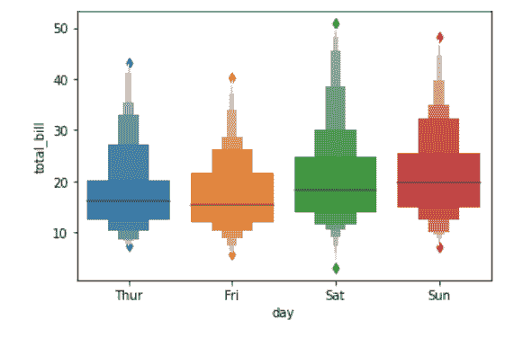
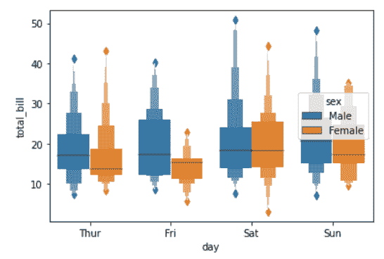
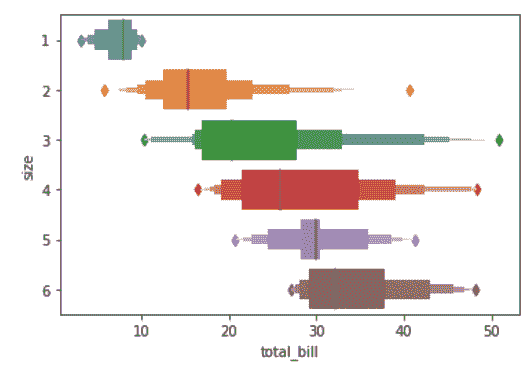

# python–seaborn . boxer()方法

> 原文:[https://www . geesforgeks . org/python-seaborn-boxen plot-method/](https://www.geeksforgeeks.org/python-seaborn-boxenplot-method/)

**先决条件:**[基本要素](https://www.geeksforgeeks.org/plotting-graph-using-seaborn-python/)

Seaborn 是基于 [matplotlib](https://www.geeksforgeeks.org/python-introduction-matplotlib/) 的 Python 数据可视化库。它提供了一个高级界面，用于绘制吸引人且信息丰富的统计图形。精心设计的可视化有一些特别之处。颜色突出，各层很好地融合在一起，轮廓贯穿始终，整体包装不仅具有良好的美学品质，而且也为我们提供了有意义的见解。

## seaborn 打印()

为较大的数据集绘制增强的方框图。这种类型的图最初被命名为“字母值”图，因为它显示了大量被定义为“字母值”的分位数。在绘制分布的非参数表示时，它类似于箱线图，其中所有特征都与实际观测值相对应。通过绘制更多的分位数，它提供了更多关于分布形状的信息，尤其是尾部。

> **语法:** seaborn.boxenplot(参数)
> 
> **参数:**
> 
> *   **x，y，色调:**用于绘制长格式数据的输入。
> *   **数据:**用于绘图的数据集。
> *   **顺序，hue_order :** 绘制分类级别的顺序，否则从数据对象推断级别。
> *   **方向:**地块的方向(垂直或水平)。
> *   **颜色:**所有元素的颜色，或者渐变调色板的种子。
> *   **调色板:**用于色调变量不同级别的颜色。
> *   **饱和度:**绘制颜色时原始饱和度的比例。
> *   **宽度:**不使用色调嵌套时整个元素的宽度，或主要分组变量一个级别的所有元素的宽度。
> *   **闪避:**使用色调嵌套时，元素是否要沿分类轴偏移。
> *   **k_depth :** 框的数量，并通过延伸数的百分位数，来绘制。
> *   **线宽:**构成绘图元素的灰色线条的宽度。
> *   **刻度:**用于字母值框宽度的方法。
> *   **异常值 _prop :** 被认为是异常值的数据比例。
> *   **显示者:**如果为假，抑制异常值的绘制。
> *   **轴:**绘制绘图的轴对象，否则使用当前轴。
> *   **kwargs :** 其他关键字参数
> 
> **返回:**返回绘制了绘图的坐标轴对象。

下面是上述方法的实现，并附有一些例子:

**例 1:**

```
# importing packages
import seaborn as sns
import matplotlib.pyplot as plt

# loading dataset
data = sns.load_dataset("tips")

# plot the boxenplot
sns.boxenplot(x = "day", y = "total_bill", 
              data = data)
plt.show()
```

**输出:**

**例 2:**

```
# importing packages
import seaborn as sns
import matplotlib.pyplot as plt

# loading dataset
data = sns.load_dataset("tips")

# plot the boxenplot
# hue by sex
# width of 0.8
sns.boxenplot(x ="day", y = "total_bill", hue = "sex", 
              data = data, width = 0.8)
plt.show()
```

**输出:**


**例 3:**

```
# importing packages
import seaborn as sns
import matplotlib.pyplot as plt

# loading dataset
data = sns.load_dataset("tips")

# plot the boxenplot
# orient to horizontal
sns.boxenplot(x = "total_bill", y = "size", 
              data = data, orient ="h")
plt.show()
```

**输出:**
