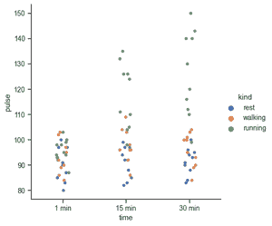

# python seaborn–cat plot

> 原文:[https://www.geeksforgeeks.org/python-seaborn-catplot/](https://www.geeksforgeeks.org/python-seaborn-catplot/)

Seaborn 是一个基于 matplotlib 的 Python 数据可视化库。它提供了一个高级界面，用于绘制吸引人且信息丰富的统计图形。Seaborn 帮助解决了 Matplotlib 面临的两大问题；问题是。

*   默认 Matplotlib 参数
*   使用数据框

随着 Seaborn 对 Matplotlib 的补充和扩展，学习曲线是相当渐进的。如果你知道 Matplotlib，你已经走过了半个 Seaborn。与其他绘图库相比，Seaborn 库具有许多优势:

*   它非常容易使用，并且需要更少的代码语法
*   非常适合“熊猫”数据结构，这正是作为数据科学家所需要的。
*   它建立在 Matplotlib 的基础上，Matplotlib 是另一个庞大而深入的数据可视化库。

> **语法:** seaborn.catplot(*，x=None，y=None，色相=None，数据=None，row=None，col=None，kind='strip '，T3】color = NonT5】e，调色板=None，**kwargs) 
> 
> **参数**
> 
> *   **x，y，色相:**数据中变量的名称
>     用于绘制长格式数据的输入。参见示例进行解释。
> *   **数据:**数据框
>     用于绘图的长格式(整齐)数据集。每一列应该对应一个变量，每一行应该对应一个观察值。
> *   **行，列:**数据中变量的名称，可选的
>     分类变量将决定网格的面。
> *   **种类:** str，可选
>     要绘制的绘图种类，对应于分类轴级别绘图功能的名称。选项有:“脱衣”、“蜂群”、“盒子”、“小提琴”、“博森”、“点”、“棒”或“计数”。
> *   **颜色:** matplotlib 颜色，可选的
>     颜色用于所有元素，或者种子用于渐变调色板。
> *   **调色板:**调色板名称、列表或字典
>     颜色，用于色调变量的不同级别。应该是 color_palette()可以解释的东西，或者是将色调级别映射到 matplotlib 颜色的字典。
> *   **kwargs:** 键、值配对
>     其他关键字参数被传递到底层绘图函数。

**示例:**

如果您处理的数据涉及任何分类变量，如调查响应，那么可视化和比较数据不同特征的最佳工具将是分类图。绘制分类图在海底很容易。在本例中，x、y 和色调采用数据中要素的名称。色调参数用相对于目标变量的不同颜色对点进行编码。

## 蟒蛇 3

```py
import seaborn as sns

exercise = sns.load_dataset("exercise")
g = sns.catplot(x="time", y="pulse",
                hue="kind",
                data=exercise)
```

**输出:**



对于计数图，我们设置了一个种类参数来计数，并使用数据参数输入数据。让我们从探索时间特征开始。我们从 catplot()函数开始，使用 x 参数来指定我们想要显示类别的轴。

## 蟒蛇 3

```py
import seaborn as sns

sns.set_theme(style="ticks")
exercise = sns.load_dataset("exercise")

g = sns.catplot(x="time",
                kind="count",
                data=exercise)
```