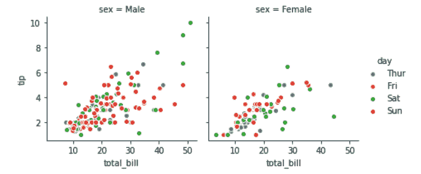
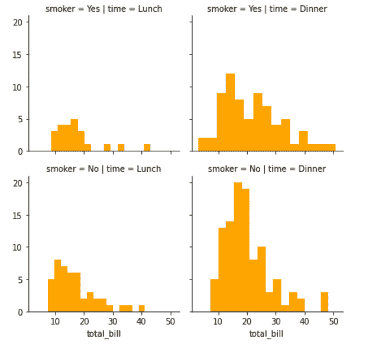
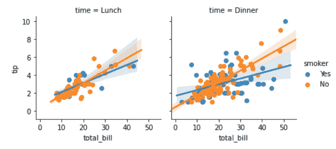

# 蟒蛇——海牛。FacetGrid()方法

> 原文:[https://www . geesforgeks . org/python-seaborn-face tgrid-method/](https://www.geeksforgeeks.org/python-seaborn-facetgrid-method/)

#### 先决条件: [<u>海鸟编程基础知识</u>](https://www.geeksforgeeks.org/plotting-graph-using-seaborn-python/)

Seaborn 是基于 [matplotlib](https://www.geeksforgeeks.org/python-introduction-matplotlib/) 的 Python 数据可视化库。它提供了一个高级界面，用于绘制吸引人且信息丰富的统计图形。Seaborn 帮助解决了 Matplotlib 面临的两大问题；问题是。

*   默认 Matplotlib 参数
*   使用数据框

随着 Seaborn 对 Matplotlib 的补充和扩展，学习曲线是相当渐进的。如果你知道 Matplotlib，你已经走过了半个 Seaborn。

### 西伯恩。FacetGrid():

*   FacetGrid 类有助于使用多个面板来可视化一个变量的分布以及数据集子集内多个变量之间的关系。
*   一个面网格最多可以绘制三个维度？行、列和色调。前两个与得到的轴阵列有明显的对应关系；把色调变量想象成沿着深度轴的第三维，不同的色阶用不同的颜色绘制。
*   FacetGrid 对象接受一个数据帧作为输入，以及将形成网格的行、列或色调维度的变量的名称。变量应该是分类的，并且变量的每一级的数据将用于沿着该轴的一个面。

```py
                        seaborn.FacetGrid( data, \*\*kwargs)

```

西伯恩。FacetGrid 使用许多参数作为输入，主要参数如下表所示:

<figure class="table">

| **参数** | **描述** | **值** |
| 数据 | 整齐的(“长格式”)数据框，其中每列是一个变量，每行是一个观察值。 | 数据帧 |
| 行、列、色调 | 定义数据子集的变量，这些数据将绘制在网格中的不同面上。请参见“*_order”参数来控制此变量的级别顺序。 | 用线串 |
| 调色板 | 用于“色调”变量不同级别的颜色。 | 调色板名称、列表或字典，可选 |

</figure>

下面是上述方法的实现:

#### 例 1:

## 蟒蛇 3

```py
# importing packages
import seaborn
import matplotlib.pyplot as plt

# loading of a dataframe from seaborn
df = seaborn.load_dataset('tips')

############# Main Section         #############
# Form a facetgrid using columns with a hue
graph = seaborn.FacetGrid(df, col ="sex",  hue ="day")
# map the above form facetgrid with some attributes
graph.map(plt.scatter, "total_bill", "tip", edgecolor ="w").add_legend()
# show the object
plt.show()

# This code is contributed by Deepanshu Rustagi.
```

#### 输出:



#### **例 2:**

## 蟒蛇 3

```py
# importing packages
import seaborn
import matplotlib.pyplot as plt

# loading of a dataframe from seaborn
df = seaborn.load_dataset('tips')

############# Main Section         #############
# Form a facetgrid using columns with a hue
graph = seaborn.FacetGrid(df, row ='smoker', col ='time')
# map the above form facetgrid with some attributes
graph.map(plt.hist, 'total_bill', bins = 15, color ='orange')
# show the object
plt.show()

# This code is contributed by Deepanshu Rustagi.
```

#### 输出:



#### 例 3:

## 蟒蛇 3

```py
# importing packages
import seaborn
import matplotlib.pyplot as plt

# loading of a dataframe from seaborn
df = seaborn.load_dataset('tips')

############# Main Section         #############
# Form a facetgrid using columns with a hue
graph = seaborn.FacetGrid(df, col ='time', hue ='smoker')
# map the above form facetgrid with some attributes
graph.map(seaborn.regplot, "total_bill", "tip").add_legend()
# show the object
plt.show()

# This code is contributed by Deepanshu Rustagi.
```

#### 输出:

