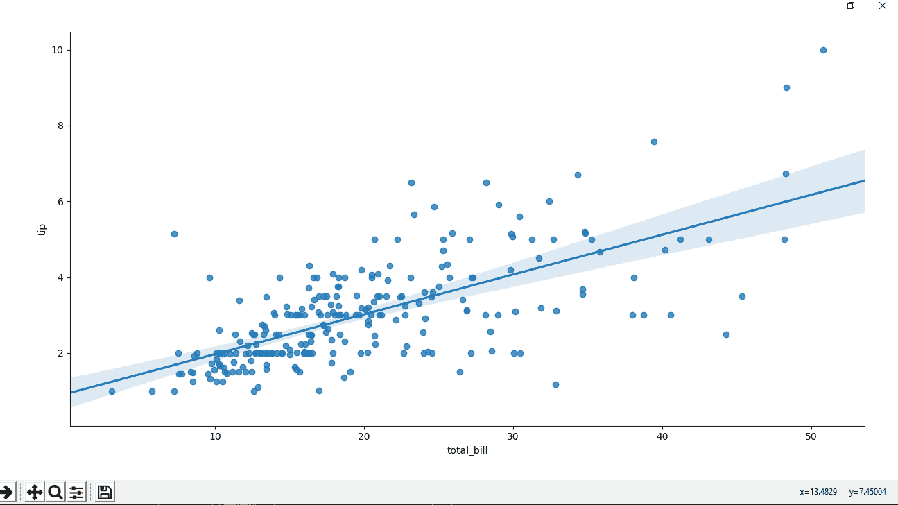
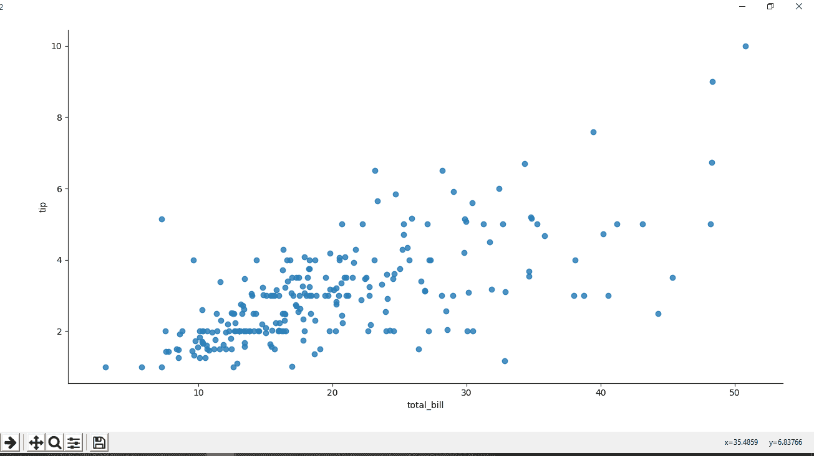
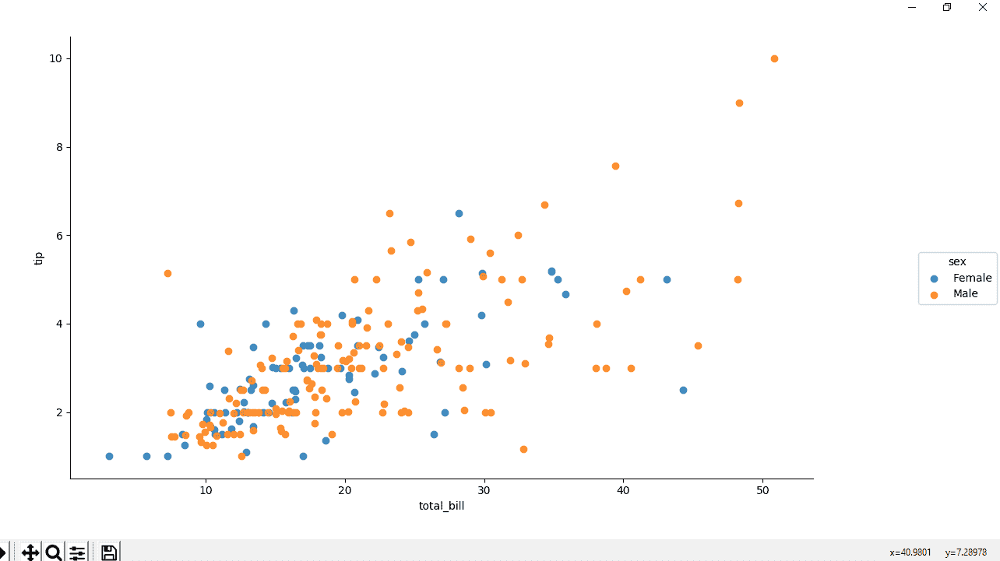

# Python–seaborn . lmplot()方法

> 原文:[https://www.geeksforgeeks.org/python-seaborn-lmplot-method/](https://www.geeksforgeeks.org/python-seaborn-lmplot-method/)

**Seaborn** 是一个神奇的可视化库，用于在 Python 中绘制统计图形。它提供了漂亮的默认样式和调色板，使统计图更有吸引力。它建立在 [matplotlib](https://www.geeksforgeeks.org/python-introduction-matplotlib/) 库的基础上，也与[熊猫](https://www.geeksforgeeks.org/introduction-to-pandas-in-python/)的数据结构紧密结合。

### 西伯恩。内爆()方法

**seaborn.lmplot()** 方法用于在 FacetGrid 上绘制散点图。

> **语法:** seaborn.lmplot(x，y，数据，色相=无，col =无，行=无，调色板=无，col _ wrap =无，高度=5，纵横比=1，标记='o '，sharex =真，sharey =真，色相 _ 顺序=无，col _ 顺序=无，行 _ 顺序=无，图例=真，图例 _ out =真，x _ estimator =无，x _ bins =无，x_ci='ci '，散布=真，fit _ reg =真，ci=95
> 
> **参数:**该方法接受以下描述的参数:
> 
> *   **x，y** :(可选)此参数为数据中的列名。
> *   **数据:**此参数为 DataFrame。
> *   **色调、颜色、行:**这些参数定义了数据的子集，这些数据将绘制在网格中的独立面上。请参见*_order 参数来控制该变量的级别顺序。
> *   **调色板**:(可选)该参数是调色板名称、列表或字典颜色，用于色调变量的不同级别。应该是 color_palette()可以解释的东西，或者是将色调级别映射到 matplotlib 颜色的字典。
> *   **col_wrap :** (可选)此参数为 int 类型，以此宽度“包装”列变量，以便列刻面跨越多行。与行方面不兼容。
> *   **高度:**(可选)该参数为每个面的高度(英寸)。
> *   **纵横比:**(可选)这个参数是每个小平面的纵横比，所以纵横比*高度给出了每个小平面的宽度，单位为英寸。
> *   **标记:**(可选)该参数是 matplotlib 标记代码或标记代码列表，散点图的标记。如果是列表，列表中的每个标记将用于色调变量的每个级别。
> *   **共享{x，y} :** (可选)该参数为布尔类型，“col”或“row”，如果为真，面将跨列共享 y 轴和/或跨行共享 x 轴。
> *   **{色相、列、行}_order :** (可选)该参数是面化变量级别的列表、顺序。默认情况下，这将是级别在数据中出现的顺序，或者，如果变量是熊猫类别，则是类别顺序。
> *   **图例:**(可选)此参数接受布尔值，如果为真且有色相变量，则添加图例。
> *   **legend_out :** (可选)此参数接受布尔值，如果为 True，则图形大小将被扩展，并且图例将被绘制在中间右侧的绘图之外。
> *   **x_estimator :** (可选)此参数是可调用的，用于映射向量- >标量，将此函数应用于 x 的每个唯一值，并绘制结果估计。当 x 是离散变量时，这很有用。如果给定 x_ci，这个估计将被引导，并且将画出一个置信区间。
> *   **x _ Bin:**(可选)此参数为 int 或 vector，将 x 变量绑定到离散 Bin 中，然后估计中心趋势和置信区间。这个宁滨只影响散点图的绘制；回归仍然适合原始数据。此参数解释为大小均匀(不需要间隔)的料箱数量或料箱中心的位置。当使用这个参数时，它意味着 x_estimator 的默认值是 numpy.mean。
> *   **x_ci :** (可选)此参数为“ci”、“sd”，int in [0，100]或 None，绘制 x 离散值的中心趋势时使用的置信区间大小。如果为“ci”，则遵从 ci 参数的值。如果为“sd”，则跳过自举并显示每个箱中观测值的标准偏差。
> *   **分散:**(可选)该参数接受布尔值。如果为真，用基础观测值(或 x 估计值)绘制散点图。
> *   **fit_reg :** (可选)此参数接受布尔值。如果为真，估计并绘制一个与 x 和 y 变量相关的回归模型。
> *   **ci :** (可选)此参数为[0，100]中的 int 或无，回归估计的置信区间大小。这将使用回归线周围的半透明带绘制。使用自举估计置信区间；对于大型数据集，建议通过将此参数设置为“无”来避免该计算。
> *   **n_boot :** (可选)此参数是用于估计 ci 的引导重采样数。默认值试图平衡时间和稳定性；对于“最终”版本的地块，您可能希望增加该值。
> *   **单位:**(可选)该参数是数据中的变量名，如果 x 和 y 观测值嵌套在采样单位中，可以在此指定。在计算置信区间时，将通过执行多级自举来考虑这一点，该自举对单位和观测值(单位内)进行重新采样。否则，这不会影响如何估计或绘制回归。
> *   **种子:**(可选)此参数为 int、numpy.random.Generator 或 numpy.random.RandomState、seed 或随机数生成器，用于可重复引导。
> *   **阶次:**(可选)该参数阶次大于 1，使用 numpy.polyfit 估计多项式回归。
> *   **逻辑:**(可选)此参数接受布尔值，如果为真，假设 y 是二进制变量，并使用 statsmodels 估计逻辑回归模型。请注意，这比线性回归计算量大得多，因此您可能希望减少引导重采样(n_boot)的数量或将 ci 设置为无。
> *   **最低:**(可选)此参数接受布尔值，如果为真，则使用 statsmodels 估计非参数最低模型(局部加权线性回归)。请注意，目前无法为这种模型绘制置信区间。
> *   **稳健:**(可选)该参数接受布尔值，如果为真，使用 statsmodels 估计稳健回归。这将降低离群值的权重。请注意，这比标准线性回归计算量大得多，因此您可能希望减少引导重采样(n_boot)的数量或将 ci 设置为无。
> *   **logx :** (可选)此参数接受布尔值。如果为真，则估计 y ~ log(x)形式的线性回归，但在输入空间中绘制散点图和回归模型。请注意，x 必须是正的，这样才能起作用。
> *   **{x，y}_partial :** (可选)此参数是数据或矩阵中的字符串，在绘图前混淆变量以回归出 x 或 y 变量。
> *   **截断:**(可选)此参数接受布尔值。如果为真，则回归线受数据限制的限制。如果为假，则延伸到 x 轴极限。
> *   **{x，y } _ 抖动:**(可选)此参数是向 x 或 y 变量添加此大小的均匀随机噪声。在拟合回归后，噪声被添加到数据的副本中，并且仅影响散点图的外观。这在绘制取离散值的变量时很有帮助。
> *   **{散点，直线}_kws :** (可选)字典
> 
> **返回:**该方法返回带有地块的 FacetGrid 对象，以便进一步调整。

**注:**下载 Tips 数据集[点击此处](https://drive.google.com/file/d/1bsDSsI2MQSc77VBKVFETWYOs6fAlNwxF/view?usp=sharing)。

下面的例子说明了 seaborn 库的 lmplot()方法。

**示例 1 :** 带有回归线的散点图(默认)。

## 蟒蛇 3

```py
# importing the required library
import pandas as pd
import seaborn as sns
import matplotlib.pyplot as plt

# read a csv file
df = pd.read_csv('Tips.csv')

# scatter plot with regression
# line(by default)
sns.lmplot(x ='total_bill', y ='tip', data = df)

# Show the plot
plt.show()
```

**输出:**



**例 2 :** 无回归线散点图。

## 蟒蛇 3

```py
# importing the required library
import pandas as pd
import seaborn as sns
import matplotlib.pyplot as plt

# read a csv file
df = pd.read_csv('Tips.csv')

# scatter plot without regression
# line.
sns.lmplot(x ='total_bill', y ='tip',
           fit_reg = False, data = df)

# Show the plot
plt.show()
```

**输出:**



**示例 3 :** 使用色调属性根据性别对点进行着色的散点图。

## 蟒蛇 3

```py
# importing the required library
import pandas as pd
import seaborn as sns
import matplotlib.pyplot as plt

# read a csv file
df = pd.read_csv('Tips.csv')

# scatter plot using hue attribute
# for colouring out points
# according to the sex
sns.lmplot(x ='total_bill', y ='tip',
          fit_reg = False, hue = 'sex',
          data = df)

# Show the plot
plt.show()
```

**输出:**

