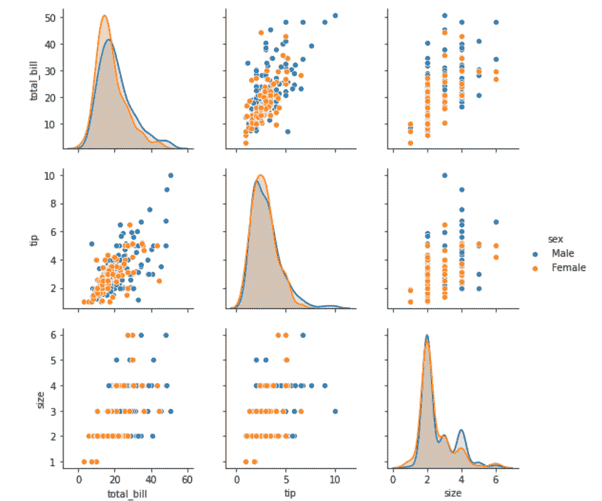
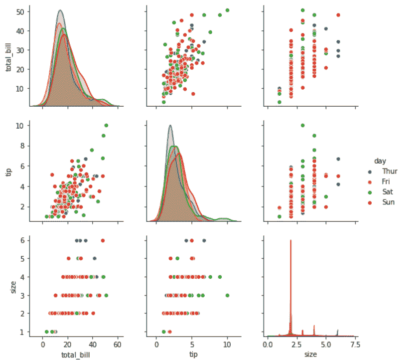

# Python–seaborn . pair plot()方法

> 原文:[https://www . geesforgeks . org/python-seaborn-pair plot-method/](https://www.geeksforgeeks.org/python-seaborn-pairplot-method/)

#### 先决条件: [<u>海鸟编程基础知识</u>](https://www.geeksforgeeks.org/plotting-graph-using-seaborn-python/)

Seaborn 是基于 [matplotlib](https://www.geeksforgeeks.org/python-introduction-matplotlib/) 的 Python 数据可视化库。它提供了一个高级界面，用于绘制吸引人且信息丰富的统计图形。Seaborn 帮助解决了 Matplotlib 面临的两大问题；问题是。

*   默认 Matplotlib 参数
*   使用数据框

随着 Seaborn 对 Matplotlib 的补充和扩展，学习曲线是相当渐进的。如果你知道 Matplotlib，你已经走过了半个 Seaborn。

### seaborn . pairplot():

要在数据集中绘制多个成对的二元分布，可以使用 pairplot()函数。这将数据框中(n，2)个变量组合的关系显示为一个矩阵图，对角线图是单变量图。

```
                        seaborn.pairplot( data, \*\*kwargs )

```

Seaborn.pairplot 使用许多参数作为输入，主要参数如下表所示:

<figure class="table">

| **论据** | **描述** | **值** |
| 数据 | 整齐的(长格式)数据框，其中每一列都是变量，每一行都是观察值。 | 数据帧 |
| 色彩 | “数据”中的变量，用于将绘图方面映射到不同的颜色。 | 字符串(变量名)，可选 |
| 调色板 | 用于映射“色调”变量的一组颜色。如果是字典，关键字应该是“色调”变量中的值。vars:变量名列表，可选 | dict 或 seaborn 调色板 |
| {x， y}_vars | “数据”中的变量分别用于图中的行和列；即制作非正方形的图。 | 变量名列表，可选 |
| 快捷批处理 | 绘图前删除数据中缺失的值。 | 布尔值，可选 |

</figure>

下面是上述方法的实现:

#### 例 1:

## 蟒蛇 3

```
# importing packages
import seaborn
import matplotlib.pyplot as plt

############# Main Section ############
# loading dataset using seaborn
df = seaborn.load_dataset('tips')
# pairplot with hue sex
seaborn.pairplot(df, hue ='sex')
# to show
plt.show()

# This code is contributed by Deepanshu Rustagi.
```

#### 输出:



#### 例 2:

## 蟒蛇 3

```
# importing packages
import seaborn
import matplotlib.pyplot as plt

############# Main Section ############
# loading dataset using seaborn
df = seaborn.load_dataset('tips')
# pairplot with hue day
seaborn.pairplot(df, hue ='day')
# to show
plt.show()

# This code is contributed by Deepanshu Rustagi.
```

#### 输出:

