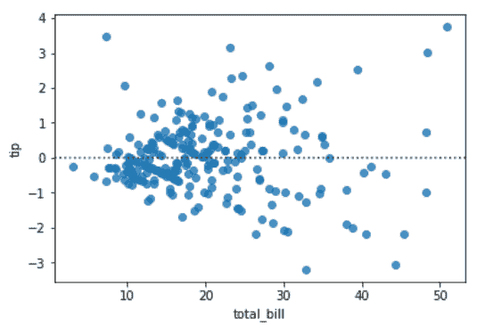
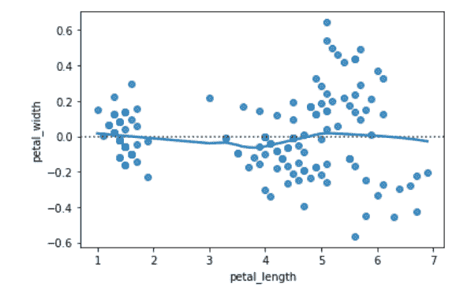

# Python–seaborn . residplot()方法

> 原文:[https://www . geesforgeks . org/python-seaborn-resid plot-method/](https://www.geeksforgeeks.org/python-seaborn-residplot-method/)

[**Seaborn**](https://www.geeksforgeeks.org/plotting-graph-using-seaborn-python/amp/) 是一个用 Python 进行统计图形绘制的惊人可视化库。它提供了漂亮的默认样式和调色板，使统计图更有吸引力。它建立在 [matplotlib](https://www.geeksforgeeks.org/python-introduction-matplotlib/) 库的基础上，也与[熊猫](https://www.geeksforgeeks.org/introduction-to-pandas-in-python/)的数据结构紧密结合。

## seaborn.residplot():

该方法用于绘制线性回归的残差。该方法将在 x 上回归 y，然后绘制残差散点图。您可以选择将较低的平滑度拟合到残差图，这有助于确定残差是否有结构。

> **语法:** seaborn.residplot(x，y，数据=无，lowess =假，x _ partial =无，y _ partial =无，顺序=1，
> robust =假，dropna =真，label =无，color =无，散点图 _ kws =无，line _ kws =无，ax =无)
> 
> **参数:**部分主要参数描述如下:
> 
> *   x:预测变量的“数据”中的数据或列名。
> *   y:响应变量“数据”中的数据或列名。
> *   数据:(可选)具有“x”和“y”的 DataFrame 是列名。
> *   下限:(可选)为剩余散点图拟合下限平滑器。
> *   dropna:(可选)该参数取布尔值。如果为真，则在拟合和打印时忽略缺少数据的观察。
> 
> **返回:**带有回归图的坐标轴。

下面是上述方法的实现:

**例 1:**

## 蟒蛇 3

```py
# importing required packages
import seaborn as sns
import matplotlib.pyplot as plt

# loading dataset
data = sns.load_dataset("tips")

# draw residplot
sns.residplot(x = "total_bill",
              y = "tip",
              data = data)

# show the plot
plt.show()

# This code is contributed
# by Deepanshu Rustagi.
```

**输出:**



**例 2:**

## 蟒蛇 3

```py
# importing required packages
import seaborn as sns
import matplotlib.pyplot as plt

# loading dataset
data = sns.load_dataset("iris")

# draw residplot
# with lowess = True
sns.residplot(x = "petal_length",
              y = "petal_width",
              data = data,
              lowess = True)

# show the plot
plt.show()

# This code is contributed
# by Deepanshu Rustagi.
```

**输出:**

