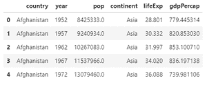
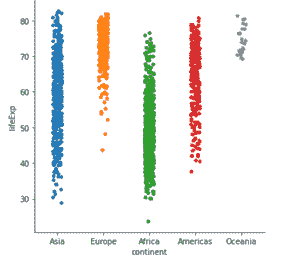

# 蟒蛇皮–使用 Catplot

绘制带状图

> 原文:[https://www . geesforgeks . org/python-seaborn-strip-plot-插画-use-catplot/](https://www.geeksforgeeks.org/python-seaborn-strip-plot-illustration-using-catplot/)

**Seaborn** 是一个基于 *matplotlib* 的数据可视化库。 *seaborn* 提供了一个高级界面，用于绘制信息丰富且有吸引力的统计图形。*海伯恩* **Catplot** 是*海伯恩*的新增功能，使绘图变得更加容易，并涉及分类变量。它用于用数值变量显示分类变量之间的关系，如*带状图、*箱线图等。

**脱衣舞**由*脱衣舞*代表，是 c *atplot()* **中的默认插图。**

**分步方法:**

*   导入所需模块。

## 蟒蛇 3

```
# importing modules
import pandas as pnd
import matplotlib.pyplot as plt
import seaborn as sbn
```

*   分配数据集并将其转换为数据框。

## 蟒蛇 3

```
# fetching data from the url
url_data='http://bit.ly/2cLzoxH'

# using pandas for reading the data file
# storing the data in input_data variable
input_data=pnd.read_csv(url_data)
```

*   显示数据框。

## 蟒蛇 3

```
# head() function helps to see the first n rows of data
# by default n is 5 in head function
input_data.head(5)
```

**输出:**



*   最后，描绘插图。

## 蟒蛇 3

```
# using seaborn module to show the relation betwwen 
# categorical variables and numerical variables
sbn.catplot(x='continent', y='lifeExp', data=input_data)
```

**输出:**



**以下是基于上述方法的完整程序:**

## 蟒蛇 3

```
# importing modules
import pandas as pnd
import matplotlib.pyplot as plt
import seaborn as sbn

# fetching data from the url
url_data='http://bit.ly/2cLzoxH'

# using pandas for reading the data file
# storing the data in input_data variable
input_data=pnd.read_csv(url_data)

# using seaborn module to show the relation betwwen 
# categorical variables and numerical variables
sbn.catplot(x='continent', y='lifeExp', data=input_data)
```

**输出:**

