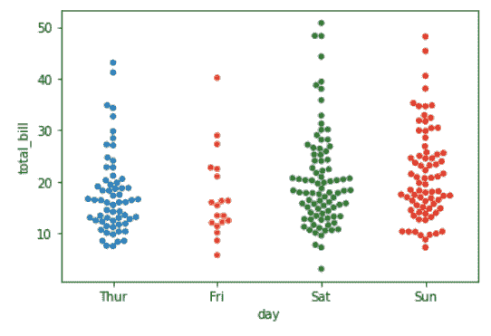
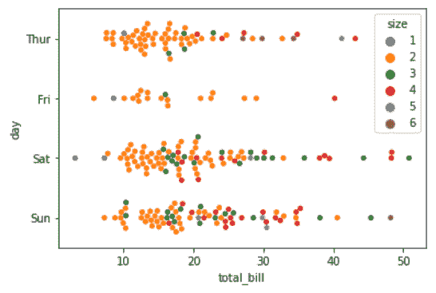
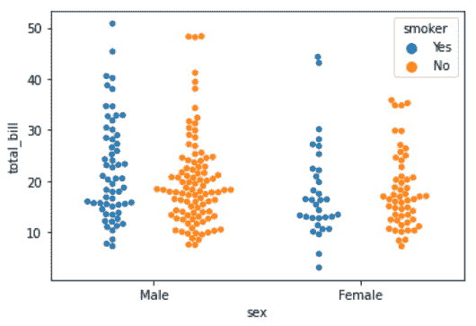

# Python–seaborn . swarmplot()方法

> 原文:[https://www . geesforgeks . org/python-seaborn-swarm plot-method/](https://www.geeksforgeeks.org/python-seaborn-swarmplot-method/)

**先决条件: [海底基础](https://www.geeksforgeeks.org/plotting-graph-using-seaborn-python/)T5】**

Seaborn 是基于 [matplotlib](https://www.geeksforgeeks.org/python-introduction-matplotlib/) 的 Python 数据可视化库。它提供了一个高级界面，用于绘制吸引人且信息丰富的统计图形。精心设计的可视化有一些特别之处。颜色突出，各层很好地融合在一起，轮廓贯穿始终，整体包装不仅具有良好的美学品质，而且也为我们提供了有意义的见解。

## seaborn . swarmplot()

用不重叠的点绘制分类散点图。群体图可以单独绘制，但如果您想要显示所有观察结果以及一些潜在分布的表示，它也是方框图或小提琴图的很好补充。正确排列点需要数据和点坐标之间的精确转换。这意味着在绘制图之前，必须设置非默认轴限制。

> **语法:**海鸟群图(参数)
> 
> **参数:**
> 
> *   **x，y，色调:**用于绘制长格式数据的输入。
> *   **数据:**用于绘图的数据集。
> *   **顺序，hue_order :** 绘制分类级别的顺序，否则从数据对象推断级别。
> *   **减淡:沿分类轴分离不同色调级别的条**
> *   **方向:**地块的方向(垂直或水平)。
> *   **颜色:**所有元素的颜色，或者渐变调色板的种子。
> *   **调色板:**用于色调变量不同级别的颜色。
> *   **大小:**标记的半径，以磅为单位。
> *   **边缘颜色:**每个点周围线条的颜色。
> *   **线宽:**构成绘图元素的灰色线条的宽度。
> *   **轴:**绘制绘图的轴对象，否则使用当前轴。
> *   **kwargs :** 其他关键字参数
> 
> **返回:**返回绘制了绘图的坐标轴对象。

下面是上述方法的实现，并附有一些例子:

**例 1 :**

```py
# importing packages
import seaborn as sns
import matplotlib.pyplot as plt

# loading dataset
data = sns.load_dataset("tips")

# plot the swarmplot
# size set to 5
sns.swarmplot(x ="day", y = "total_bill", 
              data = data, size = 5)
plt.show()
```

**输出:**



**例 2 :**

```py
# importing packages
import seaborn as sns
import matplotlib.pyplot as plt

# loading dataset
data = sns.load_dataset("tips")

# plot the swarmplot
# hue by size
# oriented to horizontal
sns.swarmplot(y = "day", x = "total_bill", hue = "size", 
              orient = "h", data = data)
plt.show()
```

**输出:**


**例 3 :**

```py
# importing packages
import seaborn as sns
import matplotlib.pyplot as plt

# loading dataset
data = sns.load_dataset("tips")

# plot the swarmplot
# hue by smoker
# dodge = True
sns.swarmplot(x = "sex", y = "total_bill", hue = "smoker", 
              data = data, dodge = True)
plt.show()
```

**输出:**
