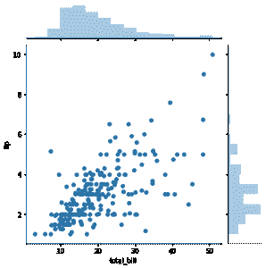
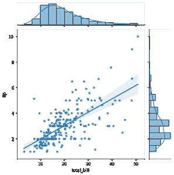
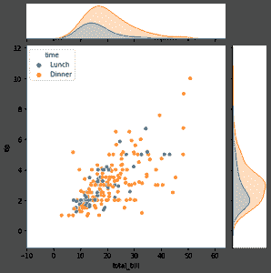

# 带有边缘直方图的散点图，蟒蛇皮

> 原文:[https://www . geesforgeks . org/带有边缘直方图的散点图-python-in-seaborn/](https://www.geeksforgeeks.org/scatter-plot-with-marginal-histograms-in-python-with-seaborn/)

**先决条件** : [海伯恩](https://www.geeksforgeeks.org/introduction-to-seaborn-python/)

边缘直方图散点图基本上是两个变量的边缘分布的联合分布图。在数据可视化中，我们经常绘制两个随机变量(双变量分布)或任意数量的随机变量的联合行为。但是如果数据太大，重叠可能是一个问题。因此，为了区分变量，将每个变量的概率分布放在联合图上是有用的。随机变量的这种个体概率分布被称为其边际概率分布。

在 seaborn，这可以通过 **jointplot()** 来实现。使用**散点图()**表示双变量分布，使用**历史图()**表示边际分布。

### 方法

*   导入 seaborn 库
*   加载您选择的数据集
*   对数据集的变量使用 jointplot()

**例 1:**

## 蟒蛇 3

```py
# importing and creating alias for seaborn
import seaborn as sns

# loading tips dataset
tips = sns.load_dataset("tips")

# plotting scatterplot with histograms for features total bill and tip.
sns.jointplot(data=tips, x="total_bill", y="tip")
```

**输出:**

<seaborn.axisgrid.jointgrid at=""></seaborn.axisgrid.jointgrid>



jointplot _ with _ 直方图

**示例 2:** 使用 kind =“reg”属性，可以添加线性回归拟合和单变量 KDE 曲线。

## 蟒蛇 3

```py
import seaborn as sns

tips = sns.load_dataset("tips")

# here "*" is used as a marker for scatterplot
sns.jointplot(data=tips, x="total_bill", y="tip", kind="reg", marker="*")
```

**输出:**



线性回归拟合的散点图

**示例 3:** 要向散点图添加条件颜色，可以使用色调属性，但它会在边缘轴上绘制单独的密度曲线(使用 kdeplot())。

## 蟒蛇 3

```py
import seaborn as sns

tips = sns.load_dataset("tips")

sns.jointplot(data=tips, x="total_bill", y="tip", hue="time")
```

**输出:**



散点图 3