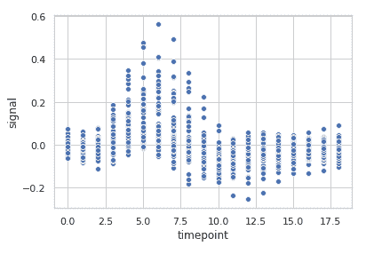
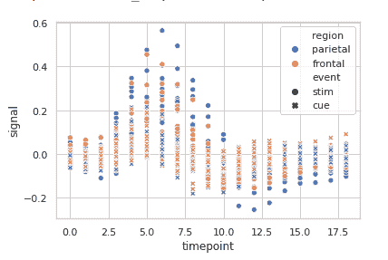

# 使用 Python 中的 Seaborn 进行散点图

> 原文:[https://www . geesforgeks . org/distribute plot-use-seaborn-in-python/](https://www.geeksforgeeks.org/scatterplot-using-seaborn-in-python/)

[**Seaborn**](https://www.geeksforgeeks.org/introduction-to-seaborn-python/) 是一个用 Python 进行统计图形绘制的惊人可视化库。它提供了漂亮的默认样式和调色板，使统计图更有吸引力。它建立在 matplotlib 库的顶部，也与熊猫的数据结构紧密结合。

## 散点图

**散点图**可以与几个语义分组一起使用，这有助于很好地理解图形。他们可以绘制二维图形，在使用色调、大小和样式参数的语义时，通过映射多达三个额外的变量可以增强二维图形。所有参数控制用于识别不同子集的视觉语义。使用冗余语义有助于使图形更易于访问。

> **语法:** seaborn .散点图(x =无，y =无，色相=无，样式=无，大小=无，数据=无，调色板=无，色相 _ 顺序=无，色相 _ 范数=无，大小=无，大小 _ 顺序=无，大小 _ 范数=无，标记=真，样式 _ 顺序=无，x _ bins =无，y _ bins =无，单位=无，估计器=无，ci=95，n_boot=1000，alpha='auto '，x _ jitter =无，y
> 
> **数据**:数据帧，其中每一列是一个变量，每一行是一个观察值。
> 
> **大小**:将产生不同大小点的分组变量。
> 
> **样式**:分组变量，将产生具有不同标记的点。
> 
> **调色板**:分组变量，将产生具有不同标记的点。
> 
> **标记**:确定如何为不同级别绘制标记的对象。
> 
> **alpha** :点的比例不透明度。
> 
> **返回:**该方法返回绘制了绘图的坐标轴对象。

## **创建散点图**

让我们使用 seaborn .散点图()函数来可视化“fmri”数据集。我们将只使用函数的 x，y 参数。

**代码:**

## 蟒蛇 3

```
import seaborn

seaborn.set(style='whitegrid')
fmri = seaborn.load_dataset("fmri")

seaborn.scatterplot(x="timepoint",
                    y="signal",
                    data=fmri)
```

**输出:**



**根据类别对数据点进行分组，这里是区域和事件。**

## 蟒蛇 3

```
import seaborn

seaborn.set(style='whitegrid')
fmri = seaborn.load_dataset("fmri")

seaborn.scatterplot(x="timepoint",
                    y="signal",
                    hue="region",
                    style="event",
                    data=fmri)
```

**输出:**



**使用散点图对“tips”数据集进行基本可视化。**

## 蟒蛇 3

```
import seaborn

seaborn.set(style='whitegrid')
tip = seaborn.load_dataset('tips')

seaborn.scatterplot(x='day', y='tip', data=tip)
```