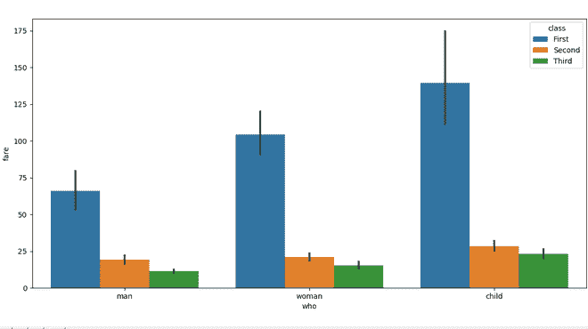
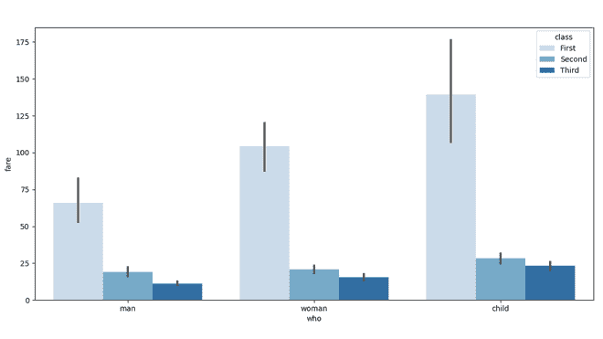
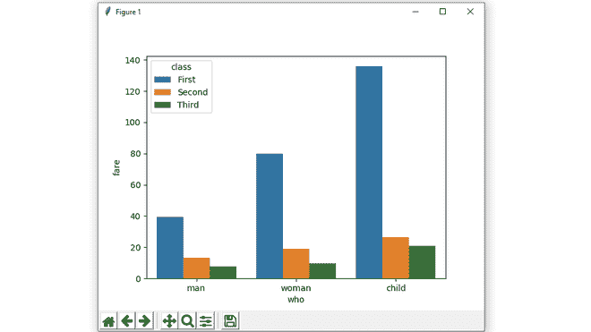

# Python 中的 Seaborn.barplot()方法

> 原文:[https://www . geesforgeks . org/seaborn-bar plot-method in-python/](https://www.geeksforgeeks.org/seaborn-barplot-method-in-python/)

[**Seaborn**](https://www.geeksforgeeks.org/plotting-graph-using-seaborn-python/) 是一个基于 Matplotlib 的 Python 数据可视化库。它提供了一个高级界面，用于绘制吸引人且信息丰富的统计图形。精心设计的可视化有一些特别之处。颜色突出，各层很好地融合在一起，轮廓贯穿始终，整体包装不仅具有良好的美学品质，而且也为我们提供了有意义的见解。

## seaborn.barplot()方法

条形图基本上用于根据某些方法汇总分类数据，默认情况下是平均值。它也可以被理解为通过行动对群体的可视化。为了使用这个图，我们为 x 轴选择一个分类列，为 y 轴选择一个数字列，我们看到它创建了一个为每个分类列取平均值的图。

> **语法:**seaborn . barplot(x =无，y =无，色调=无，数据=无，顺序=无，色调 _ 顺序=无，估计器= <函数平均值为 0x000002BC3EB5C4C8 >，ci=95，n_boot=1000，单位=无，方向=无，颜色=无，调色板=无，饱和度=0.75，errcolor='.26 '，errwidth =无，倾覆=无，躲闪=真，ax =无，* * *

**参数:**

<figure class="table">

| **论据** | **值** | **描述** |
| --- | --- | --- |
| x，y，色调 | “数据”或矢量数据中的变量名称，可选 | 用于绘制长格式数据的输入。参见示例进行解释。 |
| 数据 | 数据框、数组或数组列表，可选 | 用于绘图的数据集。如果没有“x”和“y”，这被解释为宽形。否则它应该是长格式的。 |
| 顺序，色调 _ 顺序 | 字符串列表，可选 | 在中绘制分类级别的顺序，否则级别是从数据对象中推断出来的。 |
| 估计量 | 可调用，映射向量->标量，可选 | 在每个分类箱内进行估计的统计函数。 |
| 铸铁 | 浮动或“标清”或无，可选 | 估计值周围的置信区间大小。如果是“sd”，跳过自举，画出观察值的标准差。如果为“无”，将不执行引导，也不会绘制误差线。 |
| n _ 开机 | int，可选 | 计算置信区间时使用的引导迭代次数。 |
| 单位 | “数据”或矢量数据中的变量名称，可选 | 采样单位的标识符，将用于执行多级自举并考虑重复测量设计。 |
| 东方 | “v”&#124;“h”，可选 | 图的方向(垂直或水平)。这通常是从输入变量的数据类型中推断出来的，但是可以用来指定“分类”变量是数字还是绘制宽格式数据。 |
| 颜色 | 颜色马图利布，可选 | 所有元素的颜色，或渐变调色板的种子。 |
| 调色板 | 调色板名称、列表或字典，可选 | 用于“色调”变量不同级别的颜色。应该是可以通过以下方式解释的东西:func:`color_palette `,或者是将色调级别映射到 matplotlib 颜色的字典。 |
| 浸透 | 浮动，可选 | 用于绘制颜色的原始饱和度的比例。较大的色标通常使用稍微不饱和的颜色会更好看，但是如果您希望绘图颜色与输入颜色规格完全匹配，请将此值设置为“1”。 |
| 错误颜色 | matplotlib color | 代表置信区间的线条的颜色。 |
| 错误宽度 | 浮动，可选 | 误差线(和帽)的厚度。 |
| 翻 | 浮动，可选 | 误差线“大写”的宽度。 |
| 躲避 | 布尔，可选 | 当使用色调嵌套时，元素是否应该沿着分类轴移动。 |
| 削减 | matplotlib Axes(可选) | 要在其上绘制绘图的轴对象，否则使用当前轴。 |
| 夸格斯 | 值映射 | 其他关键字参数在绘制时传递到“plt.bar”。 |

</figure>

使用以下步骤:

*   进口海鸟
*   从 Seaborn 加载数据集，因为它包含大量数据集。
*   使用 seaborn.barplot()方法绘制条形图。

下面是实现:

**例 1:**

## 蟒蛇 3

```
# importing the required library
import seaborn as sns
import matplotlib.pyplot as plt

# read a titanic.csv file
# from seaborn library
df = sns.load_dataset('titanic')

# who v/s fare barplot
sns.barplot(x = 'who',
            y = 'fare',
            data = df)

# Show the plot
plt.show()
```

**输出:**


**例 2:**

## 蟒蛇 3

```
# importing the required library
import seaborn as sns
import matplotlib.pyplot as plt

# read a titanic.csv file
# from seaborn library
df = sns.load_dataset('titanic')

# who v/s fare barplot
sns.barplot(x = 'who',
            y = 'fare',
            hue = 'class',
            data = df)

# Show the plot
plt.show()
```

**输出:**



**例 3:**

## 蟒蛇 3

```
# importing the required library
import seaborn as sns
import matplotlib.pyplot as plt

# read a titanic.csv file
# from seaborn library
df = sns.load_dataset('titanic')

# who v/s fare barplot
sns.barplot(x = 'who',
            y = 'fare',
            hue = 'class',
            data = df,
            palette = "Blues")

# Show the plot
plt.show()
```

**输出:**



**例 4:**

## 蟒蛇 3

```
# importing the required library
import seaborn as sns
import matplotlib.pyplot as plt
import numpy as np

# read a titanic.csv file
# from seaborn library
df = sns.load_dataset('titanic')

# who v/s fare barplot
sns.barplot(x = 'who',
            y = 'fare',
            hue = 'class',
            data = df,
            estimator = np.median,
            ci = 0)

# Show the plot
plt.show()
```

**输出:**

