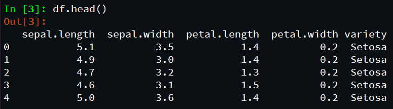
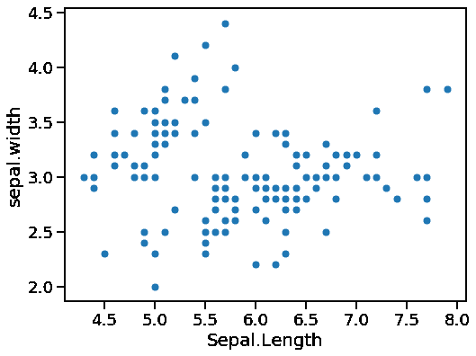
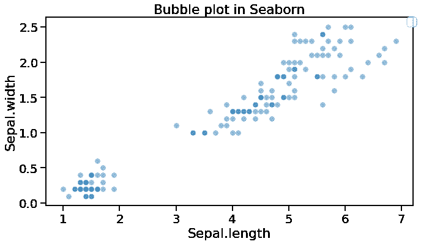
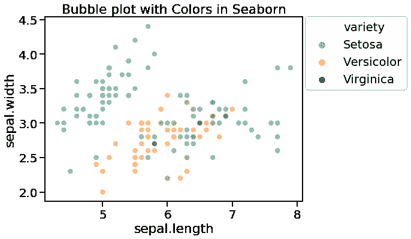

# 海底-气泡图

> 原文:[https://www.geeksforgeeks.org/seaborn-bubble-plot/](https://www.geeksforgeeks.org/seaborn-bubble-plot/)

**Seaborn** 是一个用 Python 绘制统计图形的惊人可视化库。它提供了漂亮的默认样式和调色板，使统计图更有吸引力。它建立在 [matplotlib](https://www.geeksforgeeks.org/python-introduction-matplotlib/) 库的基础上，也与 [熊猫](https://www.geeksforgeeks.org/introduction-to-pandas-in-python/) 的数据结构紧密结合。

**散点图**用来观察变量之间的 关系 ，用点来表示变量之间的关系。 **气泡图**是带有气泡的散点图(彩色填充圆圈)，而不是信息焦点。气泡的大小取决于数据中的另一个变量。同样，气泡可以是各种颜色，取决于数据集中的另一个变量。

让我们将所需模块和简化的 Iris 数据作为 Pandas 数据框加载:

## 蟒蛇 3

```py
# import all important libraries
import matplotlib.pyplot as plt
import pandas as pd
import seaborn as sns

# load dataset
data= "https://gist.githubusercontent.com/netj/8836201/raw/6f9306ad21398ea43cba4f7d537619d0e07d5ae3/iris.csv"

# convert to dataframe
df = pd.read_csv(data)

# display top most rows
df.head()
```

**输出:**



### Seaborn 散点图:

如前所述，气泡是散点图的一种独特形式，与散点图中的简单事实点相反。让我们首先制作一个简单的散点图 *Seaborn* 的*散点图()*功能的用法。

## 蟒蛇 3

```py
# import all important libraries
import matplotlib.pyplot as plt
import pandas as pd
import seaborn as sns

# load dataset
data = "https://gist.githubusercontent.com/netj/8836201/raw/6f9306ad21398ea43cba4f7d537619d0e07d5ae3/iris.csv"

# convert to dataframe
df = pd.read_csv(data)

# display top most rows
df.head()

# depict scatterplot illustration
sns.set_context("talk", font_scale=1.1)
plt.figure(figsize=(8, 6))
sns.scatterplot(x="sepal.length",
                y="sepal.width",
                data=df)

# assign labels
plt.xlabel("Sepal.Length")
plt.ylabel("sepal.width")
```

**输出:**



### 带有 Seaborn 散点图()的气泡图:

要在 *Seaborn* 中制作气泡图，我们可以在 *Seaborn* 中使用*散点图()*函数，除了散点图的 x 轴和 y 轴变量外，还可以使用指定*大小*参数的变量。

在这个气泡图实例中，我们有*length =“body _ mass _ g”*。这将创建一个基于身体长度变量的独特气泡尺寸的气泡图。

## 蟒蛇 3

```py
# import all important libraries
import matplotlib.pyplot as plt
import pandas as pd
import seaborn as sns

# load dataset
data = "https://gist.githubusercontent.com/netj/8836201/raw/6f9306ad21398ea43cba4f7d537619d0e07d5ae3/iris.csv"

# convert to dataframe
df = pd.read_csv(data)

# display top most rows
df.head()

# depict scatter plot illustration
sns.set_context("talk", font_scale=1.1)
plt.figure(figsize=(10, 6))
sns.scatterplot(x="petal.length",
                y="petal.width",
                data=df)
# Put the legend out of the figure
plt.legend(bbox_to_anchor=(1.01, 1), borderaxespad=0)
plt.xlabel("petal.length")
plt.ylabel("petal.width")
plt.tight_layout()
plt.savefig("Bubble_plot_Seaborn_scatterplot.png",
            format='png', dpi=150)
```

**输出:**


以下示例描绘了具有彩色气泡的气泡图:

## 蟒蛇 3

```py
# import all important libraries
import matplotlib.pyplot as plt
import pandas as pd
import seaborn as sns

# load dataset
data= "https://gist.githubusercontent.com/netj/8836201/raw/6f9306ad21398ea43cba4f7d537619d0e07d5ae3/iris.csv"

# convert to dataframe
df = pd.read_csv(data)

# display top most rows
df.head()

# depict bubble plot illustration
sns.set_context("talk", font_scale=1.2)
plt.figure(figsize=(10,6))
sns.scatterplot(x='petal.length',  
               y='petal.width',
               sizes=(20,500),
               alpha=0.5,
               data= df)
# Put the legend out of the figure
plt.legend(bbox_to_anchor=(1.01, 1),borderaxespad=0)

# assign labels
plt.xlabel("Sepal.length")
plt.ylabel("Sepal.width")

# assign title
plt.title("Bubble plot in Seaborn")

# adjust layout
plt.tight_layout()
```

**输出:**



### 带有明确尺寸范围的气泡图 Seaborn 散点图()

我们可以毫无问题地修改用 *Seaborn* 制作的气泡图。我们从上面的气泡图中注意到，气泡的大小范围很小。如果我们能够区分最小和最大的泡沫大小，那将是非同寻常的。

随着*海伯恩*的*散点图()*工作中*大小*的争论，我们可以指出气泡大小的范围。在下面这个气穴图模型中，我们使用了*尺寸=(20，500)。*

## 蟒蛇 3

```py
# import all important libraries
import matplotlib.pyplot as plt
import pandas as pd
import seaborn as sns

# load dataset
data = "https://gist.githubusercontent.com/netj/8836201/raw/6f9306ad21398ea43cba4f7d537619d0e07d5ae3/iris.csv"

# convert to dataframe
df = pd.read_csv(data)

# display top most rows
df.head()

# depict bubble plot illustration
sns.set_context("talk", font_scale=1.2)
plt.figure(figsize=(10, 6))
sns.scatterplot(x='sepal.length',
                y='sepal.width',
                # size="body_mass_g",
                sizes=(20, 500),
                alpha=0.5,
                hue='variety',
                data=df)

# Put the legend out of the figure
plt.legend(bbox_to_anchor=(1.01, 1), borderaxespad=0)

# Put the legend out of the figure
plt.xlabel("sepal.length")
plt.ylabel("sepal.width")
plt.title("Bubble plot with Colors in Seaborn")
plt.tight_layout()
```

**输出:**



目前，我们的气泡图看起来更好，最低的气泡与最低的重量相比，最大的气泡与最大的重量相关。当信息中有更多因素时，我们可以用第四个因素来掩盖泡沫。为了用变量给气泡图着色，我们确定*音调*争用。