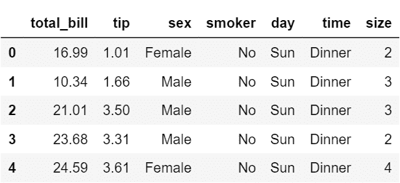
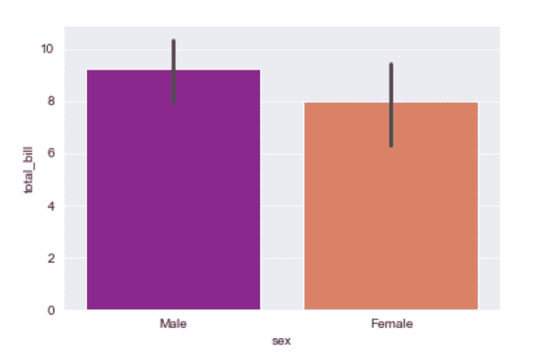
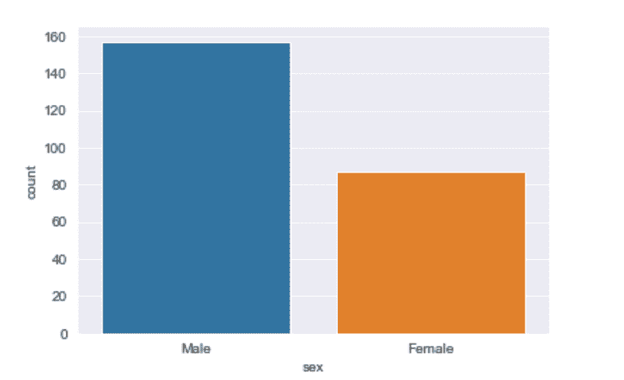
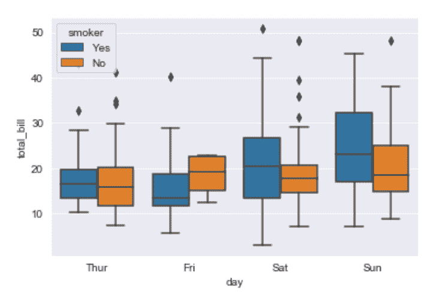
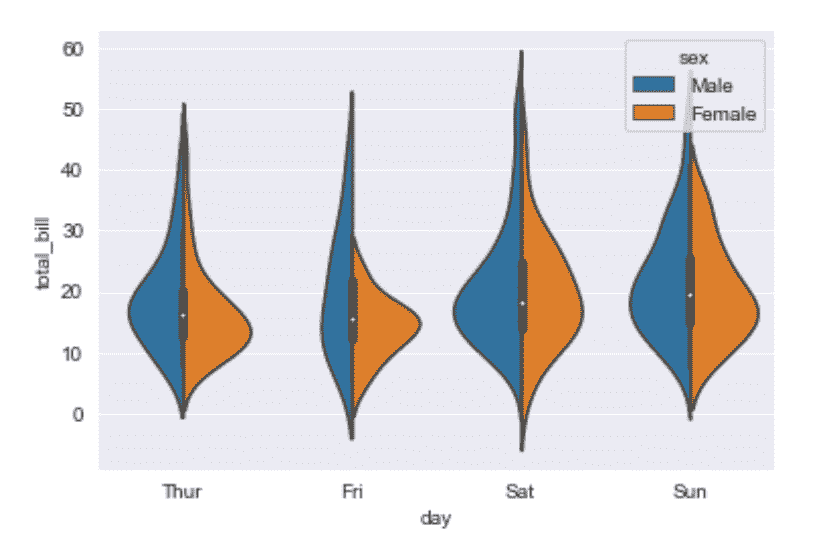
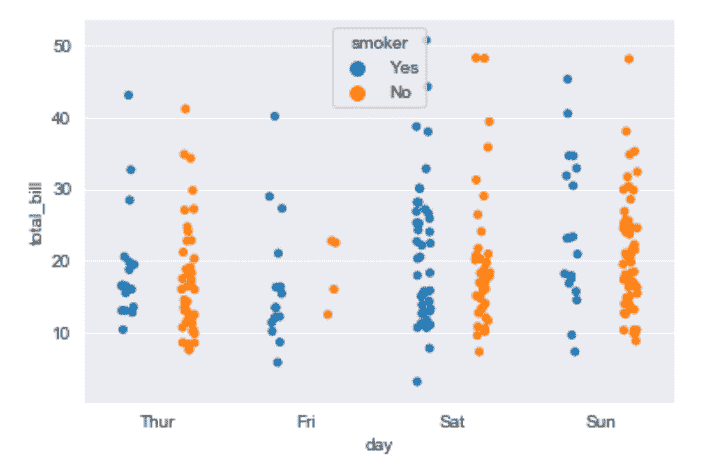
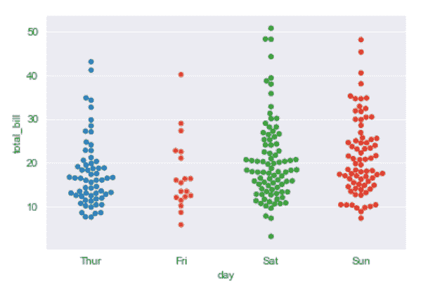
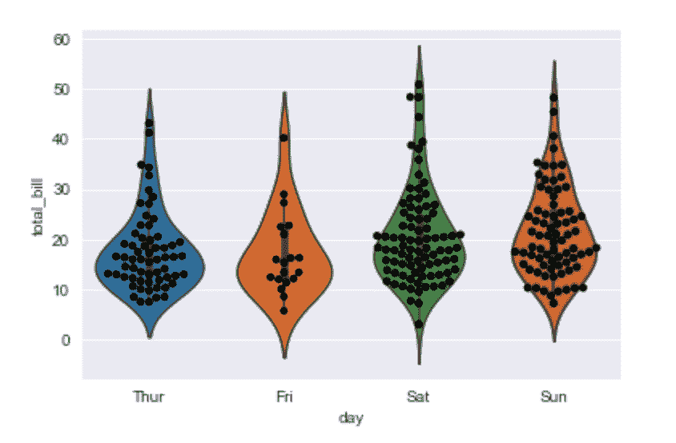
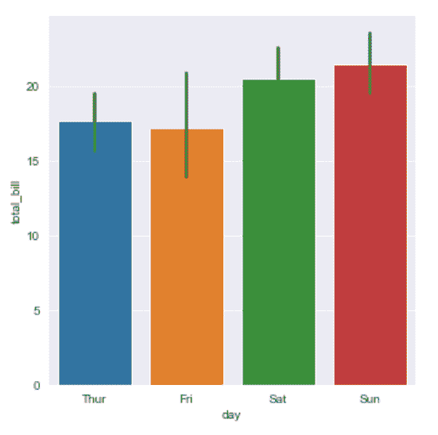

# 海鸟|分类地块

> 原文:[https://www.geeksforgeeks.org/seaborn-categorical-plots/](https://www.geeksforgeeks.org/seaborn-categorical-plots/)

图基本上用于可视化变量之间的关系。这些变量可以是完全数字的，也可以是一个类别，如组、类或部门。本文讨论了分类变量以及如何使用 Python 提供的 **Seaborn 库**来可视化它们。

**Seaborn** 除了是统计标绘库外，还提供了一些默认数据集。我们将使用一个名为“提示”的默认数据集。“小费”数据集包含了可能在餐馆吃过饭的人的信息，以及他们是否给服务员留过小费、他们的性别、他们是否吸烟等等。
让我们来看看 tips 数据集。

**代码**

## 蟒蛇 3

```
# import the seaborn library
import seaborn as sns

# import done to avoid warnings
from warnings import filterwarnings

# reading the dataset
df = sns.load_dataset('tips')

# first five entries if the dataset
df.head()
```



现在让我们继续到图中，这样我们就可以看到这些分类变量。

## Barplot(打印)

一个**柱状图**基本上是用来根据一些方法汇总分类数据，默认为平均值。它也可以被理解为通过行动对群体的可视化。为了使用这个图，我们为 x 轴选择了一个分类列，为 y 轴选择了一个数字列，我们看到它创建了一个为每个分类列取平均值的图。

**语法:**

```
barplot([x, y, hue, data, order, hue_order, …])
```

**示例:**

## 蟒蛇 3

```
# set the background style of the plot
sns.set_style('darkgrid')

# plot the graph using the default estimator mean
sns.barplot(x ='sex', y ='total_bill', data = df, palette ='plasma')

# or
import numpy as np

# change the estimator from mean to standard deviation
sns.barplot(x ='sex', y ='total_bill', data = df,
            palette ='plasma', estimator = np.std)
```

**输出:**



**解释/分析**
看剧情可以说男性的平均总 _ 账单比女性多。

*   调色板用于设置绘图的颜色
*   估计器用作统计函数，用于每个分类仓内的估计。

## 计数图

countplot 基本上对类别进行计数，并返回它们出现的次数。这是由西伯恩图书馆提供的最简单的地块之一。

**语法:**

```
countplot([x, y, hue, data, order, …])
```

**示例:**

## 蟒蛇 3

```
sns.countplot(x ='sex', data = df)
```

**输出:**



**解释/分析**
看图我们可以说数据集中男性数量多于女性数量。因为它只返回基于分类列的计数，所以我们只需要指定 x 参数。

## 箱线图

方块图有时被称为方块和触须图。它显示了代表变量之间比较的定量数据的分布。boxplot 显示数据集的四分位数，而晶须延伸显示分布的其余部分，即指示异常值存在的点。

**语法:**

```
boxplot([x, y, hue, data, order, hue_order, …])
```

**示例:**

## 蟒蛇 3

```
sns.boxplot(x ='day', y ='total_bill', data = df, hue ='smoker')
```

**输出:**



**解释/分析–**
x 取范畴列，y 为数值列。因此，我们可以看到每天花费的总账单。“色调”参数用于进一步增加分类分离。通过看情节，我们可以说不吸烟的人在周五比吸烟的人有更高的账单。

## 小提琴情节

它类似于 boxplot，只是它提供了更高、更高级的可视化，并使用核密度估计来更好地描述数据分布。

**语法:**

```
violinplot([x, y, hue, data, order, …])
```

**示例:**

## 蟒蛇 3

```
sns.violinplot(x ='day', y ='total_bill', data = df, hue ='sex', split = True)
```

**输出:**



**解释/分析–**

*   色调用于使用性别类别进一步分离数据
*   设置 split=True 将为每个级别绘制半把小提琴。这可以使直接比较分布更加容易。

## 脱衣舞场

它基本上根据类别创建散点图。

**语法:**

```
stripplot([x, y, hue, data, order, …])
```

**示例:**

## 蟒蛇 3

```
sns.stripplot(x ='day', y ='total_bill', data = df,
              jitter = True, hue ='smoker', dodge = True)
```

**输出:**



**解释/分析–**

*   带状图的一个问题是，你无法真正分辨出哪些点是堆叠在彼此之上的，因此我们使用抖动参数来添加一些随机噪声。
*   抖动参数用于增加抖动量(仅沿分类轴),当您有许多点并且它们重叠时，这可能很有用，因此更容易看到分布。
*   色调用于提供附加分类分离
*   设置 split=True 用于根据色调参数指定的类别绘制单独的带状图。

## 蜂群图

除了调整点使其不重叠之外，它与脱衣舞场非常相似。有些人也喜欢把小提琴情节和脱衣舞娘情节结合起来形成这个情节。使用群集图的一个缺点是，有时它们不能很好地扩展到非常大的数字，并且需要大量的计算来排列它们。所以如果我们想正确地想象一个群体图，我们可以把它画在一个小提琴的上面。

**语法:**

```
swarmplot([x, y, hue, data, order, …])
```

**示例:**

## 蟒蛇 3

```
sns.swarmplot(x ='day', y ='total_bill', data = df)
```

**输出:**



**示例:**

## 蟒蛇 3

```
sns.violinplot(x ='day', y ='total_bill', data = df)
sns.swarmplot(x ='day', y ='total_bill', data = df, color ='black')
```

**输出:**



## 因子图

它是所有这些图中最通用的，并提供了一个名为 kind 的参数来选择我们想要的图的类型，从而免除了我们单独编写这些图的麻烦。种类参数可以是小节、小提琴、群组等。

**语法:**

```
sns.factorplot([x, y, hue, data, row, col, …])
```

**示例:**

## 蟒蛇 3

```
sns.factorplot(x ='day', y ='total_bill', data = df, kind ='bar')
```

**输出:**

