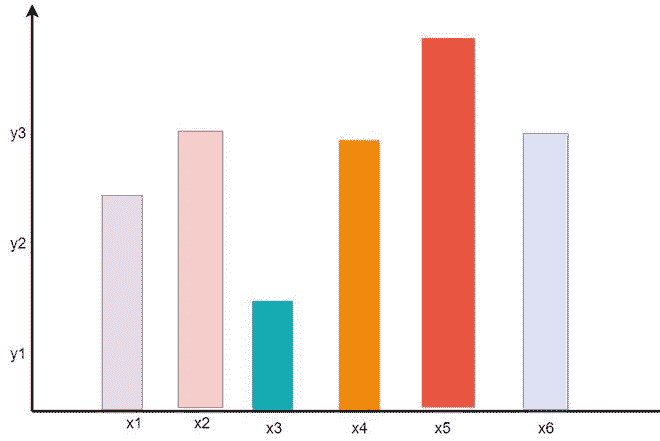
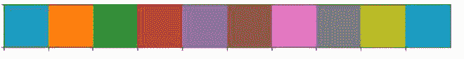
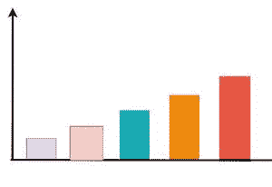
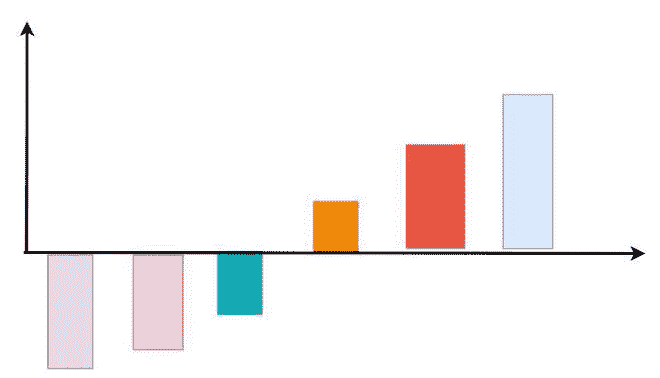
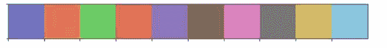
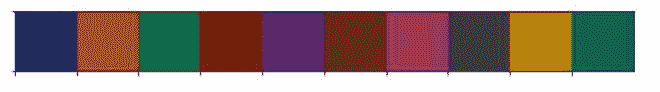

# seaborn–color palette

> 原文:[https://www.geeksforgeeks.org/seaborn-color-palette/](https://www.geeksforgeeks.org/seaborn-color-palette/)

在本文中，我们将看到 seaborn **color_palette()，**可用于为剧情着色。使用调色板我们可以生成具有不同 [颜色](https://seaborn.pydata.org/generated/seaborn.color_palette.html#seaborn.color_palette) 的点。在下面这个例子中，我们可以看到调色板可以负责生成不同的颜色映射值。

> **语法:**seaborn . color _ palette(*palette = None*， *n_colors=None* ， *desat=None)*
> 
> **参数:**
> 
> *   **调色板:** 调色板名称或无返回当前调色板。
> *   **n_colors:** 调色板中的颜色数量。
> *   **去饱和:**比例去饱和每种颜色。
> 
> **返回:**RGB 元组或 matplotlib.colors.Colormap 的列表

我们将对使用**调色板()**类型的不同方式进行分类

*   定性的
*   连续的
*   分歧

## **定性**

当变量本质上是分类的，分配给每个组的颜色需要不同时，使用定性调色板。如图所示，图中的定性调色板为变量的每个可能值分配一种颜色。



**例:**

## 蟒蛇 3

```py
from matplotlib import pyplot as plt
import seaborn as sns
current_palette = sns.color_palette()
sns.palplot(current_palette)
plt.show()
```

**输出:**



## 连续的

依次 调色板的颜色从浅到深依次移动。 当分配给被着色的变量是数字或具有固有的有序值时，可以用如图所示的顺序调色板来描述它。



**示例:**

## 蟒蛇 3

```py
from matplotlib import pyplot as plt
import seaborn as sns
current_palette = sns.color_palette()
sns.palplot(sns.color_palette("Greys"))
plt.show()
```

**输出:**


## 分歧

当我们处理像+ve 和-ve( 低值和高值)这样的混合值时，发散调色板是可视化的最佳选择。



**示例:**

## 蟒蛇 3

```py
from matplotlib import pyplot as plt
import seaborn as sns
current_palette = sns.color_palette()
sns.palplot(sns.color_palette("terrain_r", 7))
plt.show()
```

**输出:**


**用一些例子来理解一下:**

**例 1:**

在这个例子中，我们使用了 sns.color_palette()来构建一个颜色图，并且使用了 sns .触须()来显示颜色图中具有“深”属性的颜色。

## 蟒蛇 3

```py
# import module
import pandas as pd
import seaborn as sns

sns.palplot(sns.color_palette("deep", 10))
```

**输出:**


**调色板的可能值为:**

> 重音'，' Accent_r '，' Blues '，' Blues_r '，' BrBG_r '，' BuGn_r '，' BuPu '，' BuPu_r '，' CMRmap '，' CMRmap_r '，' Dark2 '，' Dark2_r '，' GnBu '，' GnBu_r '，' Greens '，' Greens_r '，' Greys_r '，' OrRd '，' Oranges_r '，' PRGn '，' PRGn_r '，' paitten _ r '，' palette 1 _ r '，' palette 2 _ r '，' PiYG ' ' bone_r '，' brg '，' brg_r '，' bwr_r '，' civic dis '，' cividis _ r '，' coolwarm '，' coolwarm_r '，' copper_r '，' cubehelix '，' cubehelix_r '，' flag_r '，' gist_earth '，' gist_gray '，' gist_gray_r '，' gist_heat_r '，' gist_ncar '，' gist_rainbow '，' gist_rainbow_r '，' gist_stern '，' gist_stern_r '

**例 2:**

在本例中，我们使用了 sns.color_palette()来构建一个颜色映射，并使用 sns .触须()来显示颜色映射中具有“静音”属性的颜色。

## 蟒蛇 3

```py
import pandas as pd
import seaborn as sns

sns.palplot(sns.color_palette("muted", 10))
```

**输出:**



**例 3:**

在这个例子中，我们使用了 sns.color_palette()来构建一个颜色图，并且使用了 sns .触须()来显示颜色图中具有“亮”属性的颜色。

## 蟒蛇 3

```py
import pandas as pd
import seaborn as sns

sns.palplot(sns.color_palette("bright", 10))
```

**输出:**


**例 4:**

在这个例子中，我们使用了 sns.color_palette()来构建一个颜色图，并且使用了 sns .触须()来显示颜色图中具有“暗”属性的颜色。

## 蟒蛇 3

```py
import pandas as pd
import seaborn as sns

sns.palplot(sns.color_palette("dark", 10))
```

**输出:**



**例 5:**

在本例中，我们使用了 sns.color_palette()来构建一个颜色映射，并使用了 sns .触须()来显示带有“BuGn_r”属性的颜色映射中存在的颜色。

## 蟒蛇 3

```py
import pandas as pd
import seaborn as sns

sns.palplot(sns.color_palette("BuGn_r", 10))
```

**输出:**


**例 6:**

在本例中，创建一个自己的调色板，并将其设置为当前调色板

## 蟒蛇 3

```py
import pandas as pd
import seaborn as sns

color = ["green", "White", "Red", "Yellow", "Green", "Grey"]
sns.set_palette(color)
sns.palplot(sns.color_palette())
```

**输出:**

