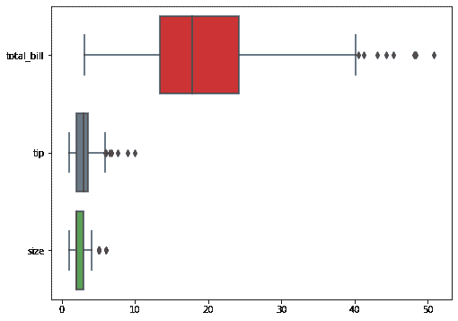

# 海鸟-用调色板给箱型图着色

> 原文:[https://www . geesforgeks . org/seaborn-coloring-box plots-with-palettes/](https://www.geeksforgeeks.org/seaborn-coloring-boxplots-with-palettes/)

在数据可视化中添加合适的颜色集会使其更令人印象深刻，可读性更强， *seaborn* 调色板使您可以轻松地在可视化中使用颜色。在这篇文章中，我们将看到如何使用*海博恩*调色板为*箱型地块*上色。还将学习*海博恩*调色板的用法，它也可以应用于其他地块。

**分步方法:**

**第 1 步:**加载着色*箱线图*所需的 python 包和库。

## 蟒蛇 3

```py
# import libraries
import seaborn as sns 
import matplotlib.pyplot as plt
```

**步骤 2:** 加载数据集生成*箱线图*。

## 蟒蛇 3

```py
# loading dataset
ds = sns.load_dataset('iris')
```

**步骤 3:** 使用*箱线图()*方法生成*箱线图*。

## 蟒蛇 3

```py
# create boxplot object
ax = sns.boxplot(data=tips, orient="h")
```

**第 4 步:** *海鸟* *boxplot()* 函数有调色板参数，在这个例子中我们已经设置了*调色板=“Set1”，*它使用定性颜色*更细的 Set3* 给 *boxpolot* 中的盒子上色。所以在*箱线图*方法中增加调色板参数。

## 蟒蛇 3

```py
# use palette method
ax = sns.boxplot(data=ds, orient="h", palette="Set1")
```

**以下是基于上述方法的完整程序:**

## 蟒蛇 3

```py
# import libraries
import seaborn as sns
import matplotlib.pyplot as plt

# load dataset
ds = sns.load_dataset("tips")

plt.figure(figsize=(8, 6))

# use palette method
ax = sns.boxplot(data=ds, orient="h", palette="Set1")
```

#### 输出:



用海底调色板给箱型图着色